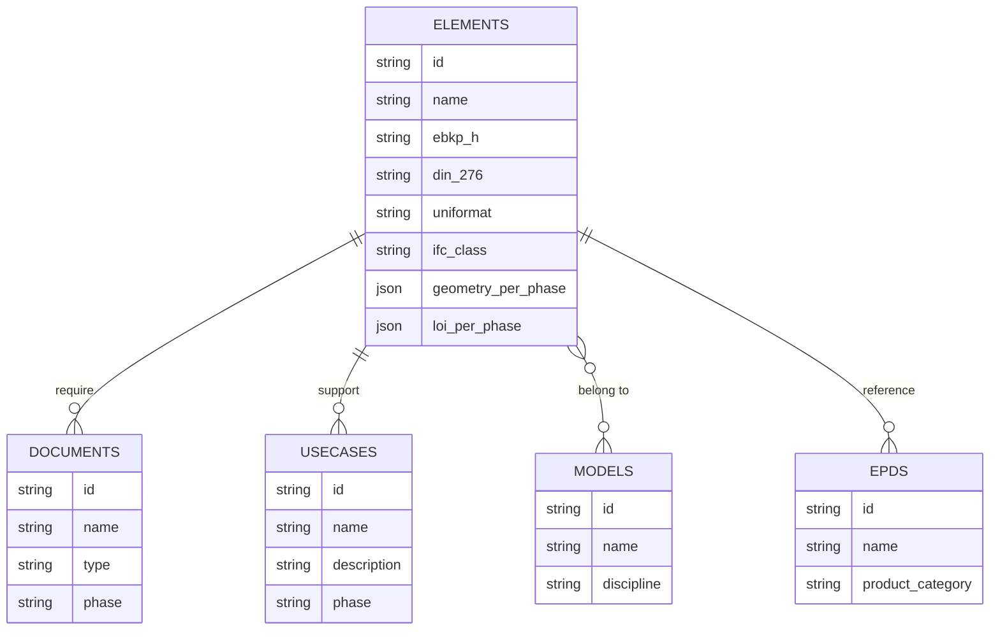

# KBOB BIM-Fachdatenkatalog

**BIM data requirements. Defined once. Used everywhere.**


[](LICENSE)
[](https://davras5.github.io/kbob-fdk/)
[](https://www.bk.admin.ch/bk/de/home/digitale-transformation-ikt-lenkung/bundesweb/styleguide.html)

---

## Overview

The KBOB BIM-Fachdatenkatalog is a web-based reference catalog for BIM data requirements in Swiss public construction. It provides building element classifications, LOI specifications per project phase, and IFC mappings — all in one place.

The catalog is developed as a **demonstration and reference implementation** to show what a unified, cross-organizational approach to BIM data requirements could look like. It supports KBOB's coordination role for public builders across Switzerland.

> **Status:** This is currently a demonstration. For it to become an official KBOB resource, organizational commitment for content coordination and maintenance is required.

**Live demo:** [davras5.github.io/kbob-fdk](https://davras5.github.io/kbob-fdk/)

<p align="center">
  
  &nbsp;&nbsp;
  
</p>

---

## Why It Matters

The Swiss Federal Council mandates BIM for federal buildings since 2021 and infrastructure since 2025. Public builders across Switzerland are digitizing their construction processes.

But here's the problem: **everyone built their own catalog.**

Cantons, federal offices, transport operators — each defining data requirements differently. Same building elements, different attribute names. Same project phases, different expectations. The result is confusion, rework, and friction at every handover.

KBOB coordinates Switzerland's public builders. A shared catalog can:

- **Reduce ambiguity** — One definition, understood by all
- **Enable interoperability** — Data flows across organizations and lifecycle phases
- **Lower barriers** — Small municipalities get the same clarity as large federal offices

This is what coordination looks like in practice.

---

## Strategic Context

This catalog supports key federal digitalization initiatives:

| Initiative | Connection |
|------------|------------|
| **Aktionsplan Digitale Schweiz** | BIM measure to simplify construction through better data interoperability |
| **Strategie digitale Methoden BLO/ASTRA** | Unified approach for federal building and infrastructure organizations |
| **eCH-0279 Architekturvision 2050** | Interoperability as architectural principle across government levels |
| **Datenökosystem Schweiz** | Semantic harmonization, "Once Only" principle for data |
| **KBOB Empfehlungen** | Lifecycle data management for public construction |

The goal: data defined once, reused everywhere — from initial planning through decades of operation.

---

## Features

| Feature | Description |
|---------|-------------|
| **Multiple Catalogs** | Building elements, document types, BIM use cases, professional models, EPD data |
| **Grid & List Views** | Toggle between card grid and table layouts |
| **Search & Filter** | Real-time search with tag-based filtering (discipline, classification, phase) |
| **Detail Pages** | Classifications, IFC mappings, geometry and LOI requirements per phase (1–6) |
| **Shareable URLs** | Filter states preserved in URL hash |
| **Swiss Federal Design** | Compliant with Swiss Confederation design guidelines |
| **Responsive** | Desktop, tablet, and mobile |

---

## Classifications & Standards

The catalog maps building elements across multiple classification systems:

| System | Origin | Purpose |
|--------|--------|---------|
| **eBKP-H** | Switzerland | Element-based cost planning (SN 506 511) |
| **DIN 276** | Germany | Cost groups for German-speaking markets |
| **Uniformat II** | North America | Functional element classification |
| **KBOB** | Switzerland | Public builder element codes |
| **IFC 4.3** | buildingSMART | Open standard for BIM data exchange |

Why multiple systems? Different stakeholders use different tools. Architects think in eBKP-H. Facility managers think in CAFM codes. International teams need IFC. The catalog bridges these worlds.

---

## Data Model



| Entity | Description |
|--------|-------------|
| **Elements** | Building components (walls, windows, HVAC systems) with classifications and LOI requirements per project phase |
| **Documents** | Deliverables like plans, reports, certificates, and technical documentation |
| **Use Cases** | BIM applications such as clash detection, quantity takeoff, energy simulation |
| **Models** | Professional discipline models (architecture, structure, MEP, site) |
| **EPDs** | Environmental Product Declarations for sustainability and LCA assessment |

---

## Quick Start

**Option 1: View Online**

→ [davras5.github.io/kbob-fdk](https://davras5.github.io/kbob-fdk/)

**Option 2: VS Code Live Server**
```bash
git clone https://github.com/davras5/kbob-fdk.git
cd kbob-fdk
# Open in VS Code → Go Live
```

**Option 3: Python Server**
```bash
python -m http.server 8000
# Open http://localhost:8000
```

> **Note:** Local development requires a web server due to CORS policy on JSON files.

---

## Project Structure

```
kbob-fdk/
├── index.html          # Single-page application
├── data/
│   ├── elements.json   # Building elements with LOI specs
│   ├── documents.json  # Document types
│   ├── usecases.json   # BIM use cases
│   ├── models.json     # Professional BIM models
│   └── epds.json       # Environmental product declarations
├── assets/
│   └── img/            # Element images
└── util/               # Data processing utilities
```

---

## Tech Stack

| Technology | Purpose |
|------------|---------|
| HTML5 | Single-page application |
| CSS3 | Swiss Federal Design, Flexbox/Grid |
| Vanilla JavaScript | Zero dependencies (~3,000 lines) |
| Lucide Icons | SVG icon library |
| JSON | Static data storage |

No build step. No framework lock-in. Runs anywhere.

---

## Principles

- **Harmonized, not prescriptive** — We consolidate what's common, not dictate what's required
- **Phase-aware** — LOI requirements follow SIA project phases (1–6)
- **Standard-aligned** — eBKP-H, IFC 4.3, Swiss federal design
- **Zero dependencies** — Vanilla JS, no framework, no build step
- **Open by default** — Code, data, methodology — all public

---

## References

### Federal Strategies
- [Aktionsplan Digitale Schweiz — BIM Massnahme](https://digital.swiss/de/aktionsplan/massnahme/vereinfachung-des-bauens-durch-bessere-dateninteroperabilitat)
- [Strategie Digitale Bundesverwaltung](https://www.bk.admin.ch/bk/de/home/digitale-transformation-ikt-lenkung/digitale-bundesverwaltung.html)
- [Strategie digitale Methoden der BLO und des ASTRA](https://www.kbob.admin.ch/de/digitalisierung-und-bim)

### eCH Standards
- [eCH-0279 Architekturvision 2050](https://www.ech.ch/de/ech/ech-0279/1.0.0)
- [eCH-0122 Architektur E-Government Schweiz](https://www.ech.ch/de/ech/ech-0122/2.0.0)

### KBOB Publications
- [KBOB Digitalisierung und BIM](https://www.kbob.admin.ch/de/digitalisierung-und-bim)
- [KBOB Musterverträge und Publikationen](https://www.kbob.admin.ch/de/mustervertraege-und-publikationen)

### Data Ecosystem
- [I14Y Interoperabilitätsplattform](https://www.i14y.admin.ch/)
- [Datenökosystem Schweiz](https://www.digitale-verwaltung-schweiz.ch/umsetzungsplan/agenda-dvs/foederales-datenmanagement-aufbauen)

---

## License

[MIT License](LICENSE)

---

## About KBOB

The **Koordinationskonferenz der Bau- und Liegenschaftsorgane der öffentlichen Bauherren** (KBOB) coordinates building and property management for Swiss public builders — federal offices, cantons, cities, and municipalities.

KBOB develops contract templates, procurement guidelines, and recommendations that help public organizations work efficiently with the construction industry across the entire building lifecycle.

→ [kbob.admin.ch](https://www.kbob.admin.ch/)

---

*A shared foundation for digital construction. This is what we're building toward.*
