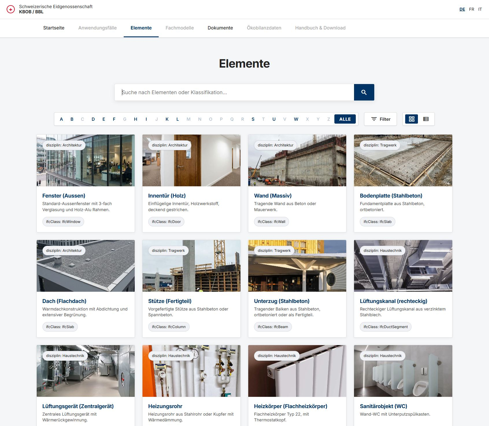
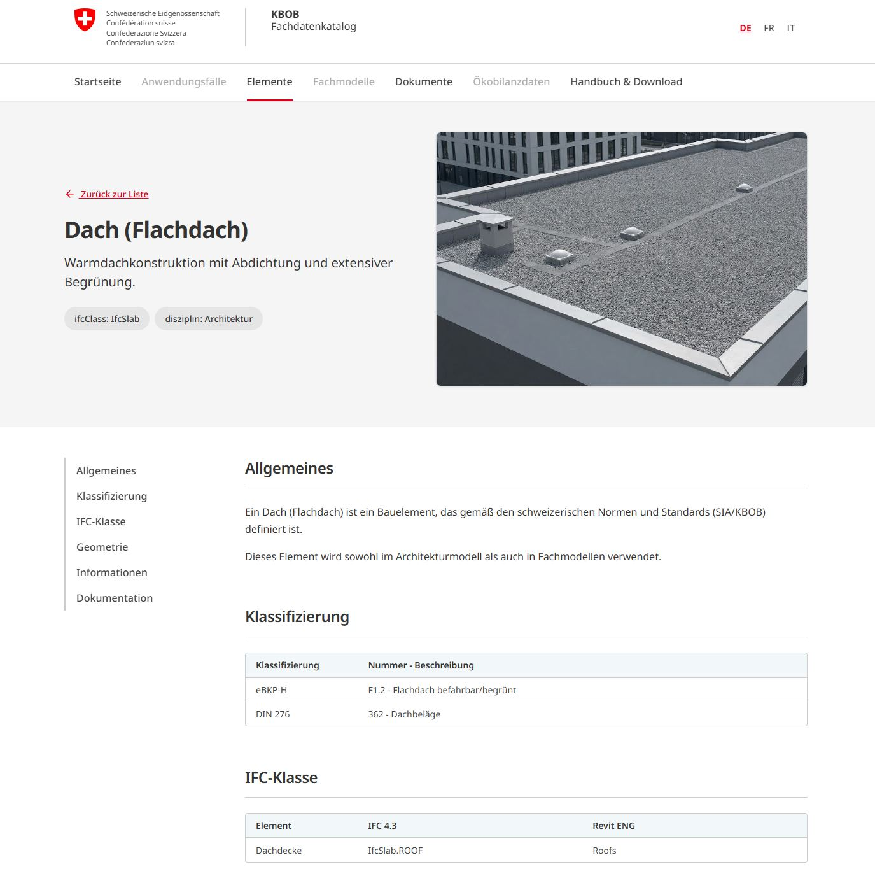
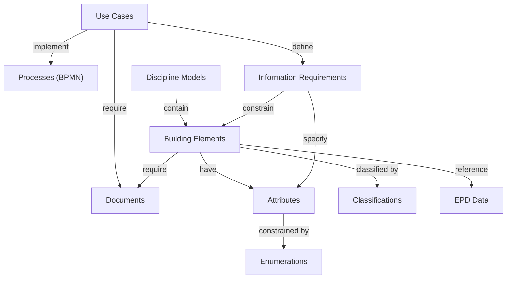
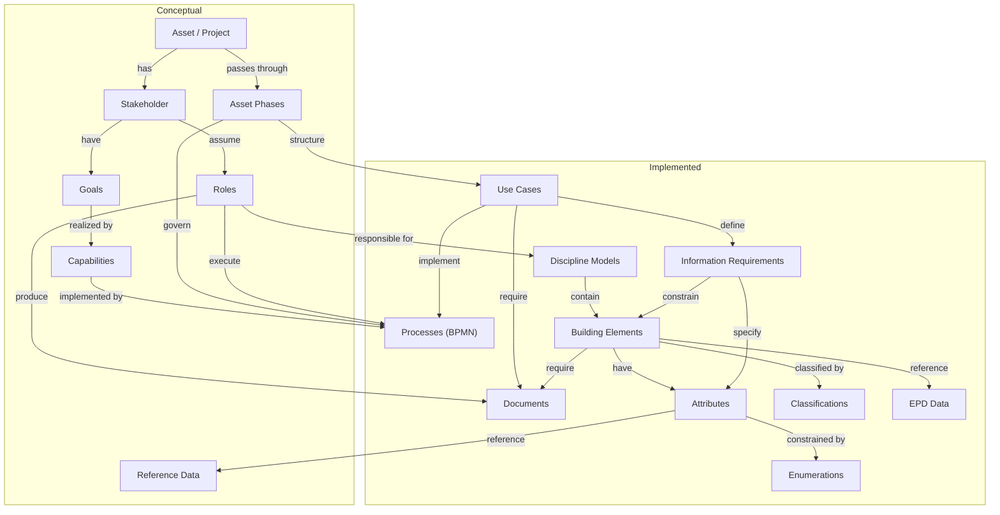

# KBOB BIM Data Catalog

**BIM data requirements defined once. Used everywhere.**


[](LICENSE)
[](https://davras5.github.io/kbob-fdk/)
[](https://www.bk.admin.ch/bk/en/home/digital-transformation-ikt-lenkung/bundesweb/styleguide.html)

---

## Overview

The **KBOB BIM Data Catalog** is a web-based reference for Building Information Modeling (BIM) data requirements used in public construction projects across Switzerland. It provides standardized building element classifications, Level of Information (LOI) requirements per project phase, and IFC mappings — all in one accessible place.

This catalog is published as a **demonstration and reference implementation** of how a coordinated, cross-organizational BIM data reference can support interoperability and consistent data management across federal, cantonal, and municipal builders.

> **Status:** This is a demonstration. Transitioning this catalog into an official KBOB resource would require formal governance, mandate, and long-term content stewardship.

**Live demo:** https://davras5.github.io/kbob-fdk/

<p align="center">
  
  &nbsp;&nbsp;
  
</p>

---

## Why It Matters

Public organizations across Switzerland are increasingly required to use BIM for planning, construction, and asset management. Federal policy under the **Digital Switzerland Strategy** promotes improved digital processes and data interoperability across the construction lifecycle.

In practice, many public authorities have developed BIM data requirements independently. This has led to inconsistent definitions, duplicated effort, and friction at handovers between project phases and organizations.

The KBOB BIM Data Catalog addresses these challenges by providing:

- **Reduced ambiguity** — one shared definition understood by all
- **Improved interoperability** — consistent data flows across organizations and lifecycle phases
- **Lower barriers to adoption** — small municipalities benefit from the same clarity as larger agencies

This catalog demonstrates how coordination can be implemented in practice across public builders.

---

## Principles

| Principle | Description |
|-----------|-------------|
| **Open by default** | Code, data, and methodology are public; no framework lock-in |
| **Linked data & Once-only** | Data requirements are defined once, connected to national reference data and dictionaries, enabling reuse and integration with the Swiss Data Ecosystem |
| **Interoperable by design** | Based on open standards to ensure seamless data exchange and stability |
| **Lifecycle-oriented** | Information requirements follow the building lifecycle from planning through operation and deconstruction |

---

## Features

| Feature | Description |
|---------|-------------|
| **Five Integrated Catalogs** | Elements, documents, BIM use cases, discipline models, and EPD sustainability data |
| **Phase-Based Requirements** | Geometry and information requirements mapped to project phases across the building lifecycle |
| **IFC Mappings** | Direct mapping of elements to IFC 4.3 classes and predefined types |
| **Authoring Software Templates** | Element mappings for BIM authoring tools (Revit, ArchiCAD) alongside exchange format mappings |
| **REST API** | Public API with Swagger UI documentation for programmatic access to all catalog data |
| **BPMN Process Diagrams** | Interactive workflow diagrams for each BIM use case |
| **Multilingual** | Full support for DE, FR, IT, EN |
| **Swiss Federal Design** | Compliant with Swiss Confederation design guidelines |

---

## Strategic Context

This catalog aligns with key Swiss digital transformation and BIM-related initiatives:

| Initiative | Description | URL |
|-----------|-------------|-----|
| **Digital Federal Administration Strategy** | Federal Council's strategy defining objectives for digital transformation in the Federal Administration | https://www.bk.admin.ch/bk/en/home/digitale-transformation-ikt-lenkung/digitale-bundesverwaltung.html |
| **Federal ICT Standards (Vorgaben)** | Binding standards and guidelines for ICT in the Federal Administration | https://www.bk.admin.ch/bk/de/home/digitale-transformation-ikt-lenkung/vorgaben.html |
| **eCH-0279 Architecture Vision 2050** | Interoperability-focused architecture vision for digital administration across all government levels | https://www.ech.ch/de/ech/ech-0279/1.0.0 |
| **eCH-0122 Architecture E-Government Switzerland: Fundamentals** | Foundation standard for e-government architecture providing capability maps and interoperability framework | https://www.ech.ch/de/ech/ech-0122/2.0.0 |
| **Swiss Data Ecosystem** | Federal guidance for interoperable data reuse and the "Once-Only" principle | https://www.bk.admin.ch/bk/en/home/digitale-transformation-ikt-lenkung/datenoekosystem_schweiz.html |
| **BIM – Simplifying Construction through Better Data Interoperability** | Digital Switzerland action plan measure to improve data interoperability in construction | https://digital.swiss/en/action-plan/measures/simplifying-construction-through-better-data-interoperability--bim- |
| **Strategy for Digital Methods (BLO / ASTRA)** | Federal strategy for BIM and digital methods within building and infrastructure authorities of the Swiss Confederation | https://www.kbob.admin.ch/de/digitalisierung-und-bim |
| **KBOB Digitalization & BIM Guidance** | KBOB recommendations for lifecycle-oriented BIM and data management | https://www.kbob.admin.ch/de/digitalisierung-und-bim |

The overarching objective is to define data once and reuse it consistently across planning, construction, operation, and long-term asset management.

---

## Data Model
The catalog comprises five independent entity types, each stored as a standalone JSON file. The model is explicit and technology-agnostic to support reuse across organizations and software systems.

### Implemented Entities



### Full Conceptual Model



**Entities**

| Entity | Description | Status | Reference |
|--------|-------------|--------|-----------|
| **Asset / Project** | Root entity representing a construction or renovation project with defined scope, timeline, and deliverables. | Conceptual | TOGAF, ISO 19650 |
| **Stakeholder** | Individuals or organizations with interests in the project outcome – owners, operators, authorities, users. | Conceptual | TOGAF/ArchiMate, ISO 19650 |
| **Goals** | Strategic objectives the project aims to achieve – quality, cost, sustainability, compliance targets. | Conceptual | TOGAF/ArchiMate |
| **Roles** | Functions assigned to stakeholders – architect, engineer, contractor, BIM coordinator. | Conceptual | TOGAF/ArchiMate, ISO 19650, SIA 2051 |
| **Asset Phases** | Temporal stages of project delivery that govern applicable processes – SIA phases 1–6, HOAI Leistungsphasen, RIBA stages. | Conceptual | TOGAF (Plateau), SIA 112, ISO 19650 |
| **Capabilities** | Organizational abilities required to achieve goals – design, coordination, quality assurance. | Conceptual | TOGAF/ArchiMate, eCH-0122 |
| **Processes** | Defined workflows implementing capabilities, governed by asset phases – information delivery, model coordination, quality assurance, change management. Implemented as BPMN diagrams. | Implemented | TOGAF/ArchiMate, eCH-0073/0074, BPMN 2.0 |
| **Use Cases** | Specific BIM applications – e.g. As-Built Survey, Requirements Planning, Discipline Coordination, Quantity & Cost Estimation, Quality Assurance, Sustainability Certification, Defect Management. | Implemented | ISO 19650, buildingSMART IDM |
| **Information Requirements** | LOIN specifications defining what information is needed, when, and at what detail level. | Implemented | ISO 19650-1, EN 17412 |
| **Attributes** | Properties attached to building elements – material, dimensions, fire rating, U-value. | Implemented | IFC, bSDD |
| **Enumerations** | Controlled vocabularies constraining attribute values – material types, status codes, classifications. | Implemented | IFC, bSDD |
| **Reference Data** | External data sources linked to attributes – standards, regulations, product databases. | Conceptual | DCAT-AP CH, Swiss Data Ecosystem |
| **Discipline Models** | Domain-specific BIM models – architectural, structural, MEP, landscape. | Implemented | ISO 19650, SIA 2051 |
| **Building Elements** | Physical components within models – walls, slabs, doors, HVAC equipment. | Implemented | IFC, eBKP-H, SIA 416 |
| **Classifications** | Coding systems for elements – eBKP-H, DIN 276, Uniformat II, IFC entity types. | Implemented | eBKP-H, IFC, bSDD |
| **EPD Data** | Environmental Product Declarations – embodied carbon, lifecycle impact data per KBOB/Ecobau. | Implemented | EN 15804, KBOB/Ecobau |
| **Documents** | Non-geometric deliverables – reports, specifications, certificates, operation manuals. | Implemented | ISO 19650, KBOB BWD |

---

## Quick Start

### Option 1: View Online

https://davras5.github.io/kbob-fdk/

### Option 2: VS Code Live Server

```bash
git clone https://github.com/davras5/kbob-fdk.git
cd kbob-fdk
# Open in VS Code → Go Live
```

### Option 3: Python Server

```bash
python -m http.server 8000
# Open http://localhost:8000
```

> **Note:** Local development requires a web server due to browser CORS policies for JSON files.

---

## Project Structure

```
kbob-fdk/
├── index.html          # Single-page application
├── data/
│   ├── elements.json   # Building elements with LOI specifications
│   ├── documents.json  # Document types
│   ├── usecases.json   # BIM use cases
│   ├── models.json     # Professional discipline models
│   └── epds.json       # Environmental product declarations
├── assets/
│   └── img/            # Element images
└── util/               # Data processing utilities
```

---

## Tech Stack

| Technology | Purpose |
|------------|---------|
| HTML5 | Single-page application |
| CSS3 | Swiss Federal Design, Flexbox/Grid |
| Vanilla JavaScript | No dependencies |
| Lucide Icons | SVG icon library |
| JSON | Static data storage |

No build step. No framework lock-in. Designed for long-term maintainability.

---

## License

[MIT License](LICENSE)

---

## About KBOB

The **Koordinationskonferenz der Bau- und Liegenschaftsorgane der öffentlichen Bauherren (KBOB)** coordinates building and property management for Swiss public clients, including federal agencies, cantons, cities, and municipalities.

KBOB develops contract templates, procurement guidelines, and recommendations that support efficient and consistent public construction across the entire asset lifecycle.

https://www.kbob.admin.ch/

---

*A shared foundation for digital construction — this is what we are building toward.*
