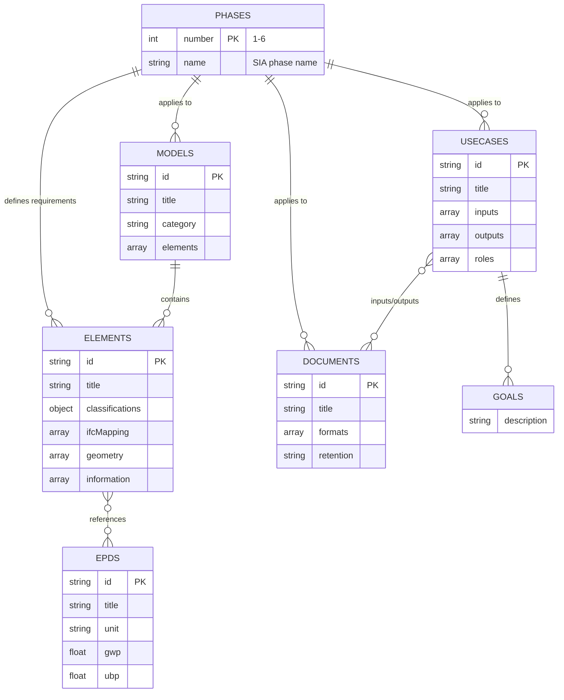

# KBOB BIM Specialist Data Catalog

**BIM data requirements defined once. Used everywhere.**


[](LICENSE)
[](https://davras5.github.io/kbob-fdk/)
[](https://www.bk.admin.ch/bk/en/home/digital-transformation-ikt-lenkung/bundesweb/styleguide.html)

---

## Overview

The **KBOB BIM Specialist Data Catalog** is a web-based reference for Building Information Modeling (BIM) data requirements used in public construction projects across Switzerland. It provides standardized building element classifications, Level of Information (LOI) requirements per project phase, and IFC mappings — all in one accessible place.

This catalog is published as a **demonstration and reference implementation** of how a coordinated, cross-organizational BIM data reference can support interoperability and consistent data management across federal, cantonal, and municipal builders.

> **Status:** This is a demonstration. Transitioning this catalog into an official KBOB resource would require formal governance, mandate, and long-term content stewardship.

**Live demo:** https://davras5.github.io/kbob-fdk/

<p align="center">
  
  &nbsp;&nbsp;
  
</p>

---

## Why It Matters

Public organizations across Switzerland are increasingly required to use BIM for planning, construction, and asset management. Federal policy under the **Digital Switzerland Strategy** promotes improved digital processes and data interoperability across the construction lifecycle.

In practice, many public authorities have developed BIM data requirements independently. This has led to inconsistent definitions, duplicated effort, and friction at handovers between project phases and organizations.

The KBOB BIM Specialist Data Catalog addresses these challenges by providing:

- **Reduced ambiguity** — one shared definition understood by all
- **Improved interoperability** — consistent data flows across organizations and lifecycle phases
- **Lower barriers to adoption** — small municipalities benefit from the same clarity as larger agencies

This catalog demonstrates how coordination can be implemented in practice across public builders.

---

## Strategic Context

This catalog aligns with key Swiss digital transformation and BIM-related initiatives:

| Initiative | Description | URL |
|-----------|-------------|-----|
| **Digital Federal Administration Strategy** | Federal Council's strategy defining objectives for digital transformation in the Federal Administration | https://www.bk.admin.ch/bk/en/home/digitale-transformation-ikt-lenkung/digitale-bundesverwaltung.html |
| **BIM – Simplifying Construction through Better Data Interoperability** | Digital Switzerland action plan measure to improve data interoperability in construction | https://digital.swiss/en/action-plan/measures/simplifying-construction-through-better-data-interoperability--bim- |
| **Strategy for Digital Methods (BLO / ASTRA)** | Federal strategy for BIM and digital methods within building and infrastructure authorities of the Swiss Confederation | https://www.kbob.admin.ch/de/digitalisierung-und-bim |
| **eCH-0279 Architecture Vision 2050** | Interoperability-focused architecture vision for digital administration across all government levels | https://www.ech.ch/de/ech/ech-0279/1.0.0 |
| **eCH-0122 Architecture E-Government Switzerland: Fundamentals** | Foundation standard for e-government architecture providing capability maps and interoperability framework | https://www.ech.ch/de/ech/ech-0122/2.0.0 |
| **Swiss Data Ecosystem** | Federal guidance for interoperable data reuse and the "Once-Only" principle | https://www.bk.admin.ch/bk/en/home/digitale-transformation-ikt-lenkung/datenoekosystem_schweiz.html |
| **KBOB Digitalization & BIM Guidance** | KBOB recommendations for lifecycle-oriented BIM and data management | https://www.kbob.admin.ch/de/digitalisierung-und-bim |

The overarching objective is to define data once and reuse it consistently across planning, construction, operation, and long-term asset management.

---

## Features

| Feature | Description |
|---------|-------------|
| **Five Integrated Catalogs** | Elements, documents, BIM use cases, discipline models, and EPD sustainability data |
| **Phase-Based Requirements** | Geometry and information requirements mapped to SIA phases (1–6) |
| **IFC Mappings** | Direct mapping of elements to IFC 4.3 classes and predefined types |
| **BPMN Process Diagrams** | Interactive workflow diagrams for each BIM use case |
| **Multilingual** | Full support for DE, FR, IT, EN |
| **Swiss Federal Design** | Compliant with Swiss Confederation design guidelines |

---

## Classifications & Standards

The catalog maps building elements across multiple classification systems:

| System | Origin | Purpose |
|-------|--------|---------|
| **eBKP-H** | Switzerland | Element-based cost planning (SN 506 511) |
| **DIN 276** | Germany | Cost grouping for German-speaking markets |
| **Uniformat II** | North America | Functional classification of building elements |
| **KBOB Codes** | Switzerland | Standard element codes for public builders |
| **IFC 4.3** | buildingSMART | Open standard for BIM data exchange |

Multiple systems are supported to reflect the realities of different professional disciplines, tools, and lifecycle stages. The catalog acts as a bridge between them.

---

## Data Model

The catalog comprises five independent entity types, each stored as a standalone JSON file. The model is explicit and technology-agnostic to support reuse across organizations and software systems.



| Entity | Description |
|--------|-------------|
| **Phases** | SIA project phases (1–6) that define when geometry, information, and documents are required |
| **Goals** | Objectives that BIM use cases aim to achieve (e.g., clash detection, quantity verification) |
| **Elements** | Building components with classifications (eBKP-H, DIN 276, Uniformat II), IFC mappings, and phase-specific requirements |
| **Documents** | Deliverables such as plans, reports, and certificates with format specifications and retention periods |
| **Use Cases** | BIM applications (e.g., coordination, quantity takeoff) with inputs/outputs, roles, and quality criteria |
| **Models** | Discipline-specific BIM models (architecture, structure, MEP) containing element definitions |
| **EPDs** | Environmental Product Declarations with sustainability indicators (GWP, UBP) from KBOB lifecycle data |

---

## Quick Start

### Option 1: View Online

https://davras5.github.io/kbob-fdk/

### Option 2: VS Code Live Server

```bash
git clone https://github.com/davras5/kbob-fdk.git
cd kbob-fdk
# Open in VS Code → Go Live
```

### Option 3: Python Server

```bash
python -m http.server 8000
# Open http://localhost:8000
```

> **Note:** Local development requires a web server due to browser CORS policies for JSON files.

---

## Project Structure

```
kbob-fdk/
├── index.html          # Single-page application
├── data/
│   ├── elements.json   # Building elements with LOI specifications
│   ├── documents.json  # Document types
│   ├── usecases.json   # BIM use cases
│   ├── models.json     # Professional discipline models
│   └── epds.json       # Environmental product declarations
├── assets/
│   └── img/            # Element images
└── util/               # Data processing utilities
```

---

## Tech Stack

| Technology | Purpose |
|------------|---------|
| HTML5 | Single-page application |
| CSS3 | Swiss Federal Design, Flexbox/Grid |
| Vanilla JavaScript | No dependencies |
| Lucide Icons | SVG icon library |
| JSON | Static data storage |

No build step. No framework lock-in. Designed for long-term maintainability.

---

## Principles

- **Harmonized, not prescriptive** — consolidates common definitions without mandating use
- **Phase-aware** — LOI requirements follow SIA project phases (1–6)
- **Standard-aligned** — eBKP-H, IFC 4.3, Swiss federal design
- **Zero dependencies** — no frameworks, no build step
- **Open by default** — code, data, and methodology are public

---

## License

[MIT License](LICENSE)

---

## About KBOB

The **Koordinationskonferenz der Bau- und Liegenschaftsorgane der öffentlichen Bauherren (KBOB)** coordinates building and property management for Swiss public clients, including federal agencies, cantons, cities, and municipalities.

KBOB develops contract templates, procurement guidelines, and recommendations that support efficient and consistent public construction across the entire asset lifecycle.

https://www.kbob.admin.ch/

---

*A shared foundation for digital construction — this is what we are building toward.*
