# KBOB Fachdatenkatalog – Data Model Documentation

This document describes the conceptual and logical data model for the KBOB BIM Data Catalog, a web-based interactive catalog for Building Information Modeling (BIM) requirements, classifications, and information specifications for building elements and documents in Switzerland.

## Table of Contents

- [Purpose and Goals](#purpose-and-goals)
  - [Strategic Alignment](#strategic-alignment)
- [Design Principles](#design-principles)
- [Localization](#localization)
- [Entity Overview](#entity-overview)
- [Entity Relationship Diagram](#entity-relationship-diagram)
  - [Design Rationale](#design-rationale)
  - [Relationship Summary](#relationship-summary)
  - [Diagram](#diagram)
  - [Phase Applicability](#phase-applicability)
- [Common Attributes](#common-attributes)
- [Lifecycle Phases](#lifecycle-phases)
- [Tagging System](#tagging-system)
- [Entity Definitions](#entity-definitions)
  - [Element](#element)
  - [Document](#document)
  - [UseCase](#usecase)
  - [Model](#model)
  - [EPD](#epd)
- [Classification Systems](#classification-systems)
- [Business Rules](#business-rules)
- [Glossary](#glossary)

---

## Purpose and Goals

The KBOB Fachdatenkatalog data model serves as the foundation for standardizing BIM requirements across Swiss public construction projects. 

**Primary Goals:**

1. **Standardization** – Provide a consistent structure for defining BIM requirements that can be referenced in Auftraggeber-Informationsanforderungen (AIA) and BIM-Abwicklungspläne (BAP)

2. **Interoperability** – Enable data exchange through alignment with international standards (IFC, ISO 19650) and Swiss e-government architecture, supporting the federal digital transformation agenda

3. **Lifecycle Coverage** – Support all lifecycle phases from development through decommissioning, with phase-specific requirements for geometry, information, and documentation

4. **Traceability** – Maintain version history and change tracking for audit purposes in public procurement contexts

5. **Discoverability** – Enable filtering, searching, and cross-referencing across multiple classification systems and lifecycle phases

### Strategic Alignment

This data model contributes to Swiss federal digitalization initiatives:

| Initiative | Scope | Relevance |
|------------|-------|-----------|
| [Strategie Digitale Bundesverwaltung](https://www.bk.admin.ch/bk/de/home/digitale-transformation-ikt-lenkung/digitale-bundesverwaltung.html) | Federal administration digital transformation | Foundational strategy for digital services |
| [eCH-0279 Architekturvision 2050](https://www.ech.ch/de/ech/ech-0279/1.0.0) | E-government architecture vision | Target architecture for cross-agency data exchange |
| [Strategie Digitale Schweiz – BIM-Massnahme](https://digital.swiss/de/aktionsplan/massnahme/vereinfachung-des-bauens-durch-bessere-dateninteroperabilitat) | Construction data interoperability | Action plan for simplifying construction through better data interoperability (2023–2027) |

The catalog supports the goal of establishing non-discriminatory interoperability principles that benefit all construction stakeholders, from routine task automation to end-to-end data continuity across the building lifecycle.

---

## Design Principles

The data model follows these guiding principles:

| Principle | Description |
|-----------|-------------|
| **Phase-driven requirements** | All requirements (LOG, LOI, documentation) are tied to specific lifecycle phases, allowing progressive detail as projects advance |
| **Multi-classification** | Entities support multiple classification systems simultaneously to bridge Swiss, German, and international standards |
| **Separation of concerns** | Geometry (LOG), information (LOI), and documentation requirements are modeled as distinct concerns with independent phase applicability |
| **Self-describing** | Each entity carries sufficient metadata (version, lastChange, description) to be understood in isolation |
| **Extensible structure** | Nested collections (classifications, attributes, roles) allow entities to grow without schema changes |

---

## Localization

**Current State:** The data model is currently implemented in German (DE) only.

**Future State:** Multi-language support for German (DE), English (EN), French (FR), and Italian (IT) is planned. Localized attributes will include `title`, `description`, enumeration display values, and controlled vocabulary labels.

The underlying data structure and controlled vocabulary codes will remain language-neutral to ensure consistency across locales.

---

## Entity Overview

The catalog manages five main entity types:

| Entity | Purpose | Key Relationships |
|--------|---------|-------------------|
| **Element** | Physical building components with geometry and information requirements | Referenced by Models; linked to Documents |
| **Document** | Project documentation types with format and retention specifications | Referenced by Elements; supports all phases |
| **UseCase** | Standardized BIM processes with roles and responsibilities | References Standards; defines workflows |
| **Model** | BIM discipline and coordination model definitions | Contains Elements; spans phases |
| **EPD** | Environmental impact data for materials (KBOB Ökobilanzdaten) | Supports sustainability analysis |

---

## Entity Relationship Diagram

The data model follows ISO 19650 principles where **UseCase** serves as the central organizing entity. Use cases define both the process (descriptive, via BPMN) and the information requirements (prescriptive), linking to all other entities.

### Design Rationale

| Principle | Implementation |
|-----------|----------------|
| **UseCase-centric** | UseCase aggregates requirements for Elements, Documents, Models, and EPDs (ISO 19650 EIR/AIA pattern) |
| **Dual-purpose UseCase** | Prescriptive (what to deliver) + Descriptive (how to execute, via BPMN) per VDI 2552 Blatt 12.1 |
| **Phase filtering** | All entities except EPD share lifecycle phases, enabling phase-specific views |
| **Multi-system mapping** | Elements map to exchange format (IFC) and authoring tools (Revit, Archicad) |

### Relationship Summary

| Relationship | Cardinality | Description |
|--------------|-------------|-------------|
| UseCase → Element | M:N | Use case defines which elements are required with specific LOG/LOI |
| UseCase → Document | M:N | Use case specifies required deliverables |
| UseCase → Model | M:N | Use case involves contributions from discipline models |
| UseCase → EPD | M:N | Sustainability use cases reference environmental data |
| Element → Document | M:N | Elements have documentation requirements |
| Element → EPD | M:N | Elements linked to environmental product declarations |
| Model → Element | M:N | Models contain/reference element types |
| Element → IFCMapping | 1:N | Element maps to IFC classes (exchange) |
| Element → RevitMapping | 1:N | Element maps to Revit categories (authoring) |
| Element → ArchicadMapping | 1:N | Element maps to Archicad tools (authoring) |

### Diagram

```mermaid
erDiagram
    %% UseCase as central organizing entity (ISO 19650)
    USECASE ||--o{ USECASE_ELEMENT : "requires"
    USECASE ||--o{ USECASE_DOCUMENT : "specifies"
    USECASE ||--o{ USECASE_MODEL : "involves"
    USECASE ||--o{ USECASE_EPD : "references"
    USECASE ||--o| BPMN_DIAGRAM : "described by"
    USECASE ||--o{ ROLE_ASSIGNMENT : "assigns (RACI)"
    
    %% Element relationships
    ELEMENT ||--o{ GEOMETRY_REQUIREMENT : "has LOG"
    ELEMENT ||--o{ INFORMATION_REQUIREMENT : "has LOI"
    ELEMENT ||--o{ DOCUMENTATION_REQUIREMENT : "requires docs"
    ELEMENT }o--o{ CLASSIFICATION : "classified by"
    ELEMENT ||--o{ ELEMENT_DOCUMENT : "documented by"
    ELEMENT ||--o{ ELEMENT_EPD : "linked to"
    
    %% Element software mappings
    ELEMENT ||--o{ IFC_MAPPING : "maps to (exchange)"
    ELEMENT ||--o{ REVIT_MAPPING : "maps to (authoring)"
    ELEMENT ||--o{ ARCHICAD_MAPPING : "maps to (authoring)"
    
    %% Model relationships
    MODEL ||--o{ MODEL_ELEMENT : "contains"
    
    %% Document and EPD classifications
    DOCUMENT }o--o{ CLASSIFICATION : "classified by"
    EPD }o--|| EPD_CATEGORY : "belongs to"

    %% Junction tables
    USECASE_ELEMENT {
        usecase_id identifier FK
        element_id identifier FK
    }
    USECASE_DOCUMENT {
        usecase_id identifier FK
        document_id identifier FK
    }
    USECASE_MODEL {
        usecase_id identifier FK
        model_id identifier FK
    }
    USECASE_EPD {
        usecase_id identifier FK
        epd_id identifier FK
    }
    ELEMENT_DOCUMENT {
        element_id identifier FK
        document_id identifier FK
    }
    ELEMENT_EPD {
        element_id identifier FK
        epd_id identifier FK
    }
    MODEL_ELEMENT {
        model_id identifier FK
        element_id identifier FK
    }

    %% Main entities
    USECASE {
        id identifier PK
        version string
        lastChange date
        title string
        description text
        category enumeration
        tags tag_array
        phases phase_array
        bpmnLink url
        roles raci_array
    }

    ELEMENT {
        id identifier PK
        version string
        lastChange date
        title string
        description text
        category enumeration
        tags tag_array
        phases phase_array
        classifications object
    }
    
    DOCUMENT {
        id identifier PK
        version string
        lastChange date
        title string
        description text
        category enumeration
        tags tag_array
        phases phase_array
        formats format_array
        retention enumeration
    }
    
    MODEL {
        id identifier PK
        version string
        lastChange date
        title string
        description text
        category enumeration
        tags tag_array
        phases phase_array
        abbreviation string
    }
    
    EPD {
        id identifier PK
        uuid identifier UK
        title string
        description text
        category enumeration
        tags tag_array
        unit enumeration
        gwp numeric
        ubp numeric
        penrt numeric
        pert numeric
    }

    %% Mapping entities
    IFC_MAPPING {
        element_id identifier FK
        ifcClass string
        predefinedType string
        ifcVersion string
    }
    
    REVIT_MAPPING {
        element_id identifier FK
        category string
        family string
        type string
    }
    
    ARCHICAD_MAPPING {
        element_id identifier FK
        tool string
        classification string
    }

    %% Process definition
    BPMN_DIAGRAM {
        usecase_id identifier FK
        link url
        version string
    }

    ROLE_ASSIGNMENT {
        usecase_id identifier FK
        role enumeration
        responsibility enumeration
    }
```



### Phase Applicability

All entities share lifecycle phases **except EPD**, which contains phase-neutral reference data:

| Entity | Has Phases | Rationale |
|--------|------------|-----------|
| UseCase | ✓ | Use cases apply to specific lifecycle phases |
| Element | ✓ | LOG/LOI requirements vary by phase |
| Document | ✓ | Delivery timing tied to phases |
| Model | ✓ | Model maturity evolves through phases |
| EPD | ✗ | Environmental data is phase-neutral reference data |

---

## Common Attributes

All entities share a base set of attributes for identification, versioning, and discoverability:

| Attribute | Type | Required | Description |
|-----------|------|----------|-------------|
| `id` | Identifier | ✓ | Unique identifier within entity type |
| `version` | String | ✓ | Version indicator for change tracking |
| `lastChange` | Date | ✓ | Date of last modification (ISO 8601) |
| `title` | String | ✓ | Human-readable display name |
| `image` | String | ✓ | Visual representation reference |
| `category` | Enumeration | ✓ | Primary grouping for filtering |
| `description` | Text | ✓ | Detailed explanation of purpose and scope |
| `tags` | String Collection | ✓ | Keywords for search and filtering (minimum 1) |
| `phases` | Phase Collection | ○ | Applicable lifecycle phases (1–5) |

---

## Lifecycle Phases

All phase-dependent attributes reference the lifecycle phases of a building or asset. The phase model is based on VDI 2552 Blatt 12.2, which aligns with research by Bergische Universität Wuppertal (WUP) and provides a region-neutral framework compatible with national standards.

| Phase | German | French | Italian | English |
|-------|--------|--------|---------|---------|
| 1 | Entwicklung | Développement | Sviluppo | Development |
| 2 | Planung | Planification | Progettazione | Planning |
| 3 | Realisierung | Réalisation | Realizzazione | Construction |
| 4 | Betrieb | Exploitation | Gestione | Operations |
| 5 | Abbruch | Déconstruction | Decostruzione | Demolition |

**Phase Descriptions (per VDI 2552 Blatt 12.2 Anhang B3):**

| Phase | Description |
|-------|-------------|
| Entwicklung | Comprises the main processes of "project development" in the narrower sense and "awarding of planning services" (e.g., feasibility studies for existing buildings) |
| Planung | Consists of basic evaluation, preliminary planning, design planning, approval planning, and execution planning (e.g., object and specialist planning) |
| Realisierung | Includes awarding of construction work, work preparation, construction execution, and construction acceptance (e.g., fabrication and assembly planning) |
| Betrieb | Encompasses the awarding of building services, operations, and use (e.g., operator responsibility) |
| Abbruch | Includes demolition planning and demolition execution (e.g., decommissioning management) |

**References:**

| Standard | Region | Mapping |
|----------|--------|---------|
| VDI 2552 Blatt 12.2 | DE | Primary reference for lifecycle phases |
| WUP BIM-Handlungsempfehlung | DE (region-neutral) | Research foundation |
| SIA 112 | CH | Phases 31, 32, 41–53, 61, 62 |
| HOAI | DE | Leistungsphasen 1–9 map across phases 1–3 |
| ISO 19650 | International | Information delivery stages |

**Phase Usage:**
- Phases are represented as integers 1–5
- Phase collections indicate when an entity or requirement is applicable
- Requirements may span multiple phases or be phase-specific
- Empty phase collection implies applicability across all phases

---

## Tagging System

### Purpose

The tagging system provides a controlled vocabulary for categorizing and filtering entities across the catalog. Unlike free-form keywords, tags are drawn from a standardized set of values to ensure consistency, enable reliable filtering, and support interoperability with external BIM platforms.

### Design Goals

1. **Consistency** – All entities use the same tag vocabulary, enabling cross-entity search and filtering
2. **Interoperability** – Tag values align with VDI 2552 Blatt 12.2 to support exchange with German BIM platforms (e.g., BIM-Portal von BIM Deutschland, buildingSMART UCM)
3. **Discoverability** – Tags complement the primary `category` attribute by providing secondary classification dimensions
4. **Extensibility** – New tags may be added following the extension rules defined in VDI 2552 Blatt 12.2 Section 6.3

### Normative Reference

**VDI/DIN-EE 2552 Blatt 12.2:2024-03** – Building Information Modeling: Metadaten zur Identifikation von BIM-Anwendungsfällen

This standard defines the metadata structure for identifying BIM use cases on platforms. The `Anwendungsfeld` (application field) metadata provides the controlled vocabulary for the tagging system.

### Tag Values (Anwendungsfeld)

The following tag values are derived from VDI 2552 Blatt 12.2 Anhang B1:

| Tag | Description |
|-----|-------------|
| Abnahme | Acceptance and handover processes – Use cases that utilize data for the acceptance of the overall project and/or parts of an overall project (e.g., defect and acceptance management) |
| Änderungsmanagement | Change management – Use cases that utilize data for quantifying and qualifying changes, tracking them, and billing them if necessary (e.g., change tracking) |
| Ausschreibung und Vergabe | Tendering and procurement – Use cases that utilize data for preparing and creating tender and award-relevant information (e.g., specifications for construction work tendering) |
| Bedarfsplanung | Requirements planning – Use cases that utilize data for establishing project requirements and supporting site and procurement variant studies (e.g., plausibility check of quantities and masses in planning) |
| Bestandserfassung | Asset capture – Use cases that capture data from assets and other relevant inventory and make it usable for data-based process steps (e.g., property capture) |
| Betrieb | Operations – Use cases that utilize data to support and/or optimize operations (e.g., energy management) |
| Dokumentation | Documentation – Use cases implemented for documentation purposes (e.g., building documentation) |
| Genehmigung | Approval – Use cases that particularly concern the approval process (e.g., public-law review and approval) |
| Inbetriebnahme | Commissioning – Use cases implemented to support commissioning processes (e.g., commissioning management) |
| Koordination | Coordination – Use cases that support coordination of services, models, project communication, etc. (e.g., coordination and integration of planning) |
| Kosten | Costs – Use cases that utilize data for determining, verifying, and optimizing costs throughout the lifecycle (e.g., cost estimation according to DIN 276) |
| Logistik | Logistics – Use cases that utilize data to support logistics processes (e.g., logistics concept) |
| Machbarkeit | Feasibility – Use cases that utilize data to create a project study (e.g., feasibility study for new construction) |
| Nachhaltigkeit | Sustainability – Use cases that utilize data to assess and/or optimize sustainability aspects (e.g., sustainability certification) |
| Nachweise | Verification/Analysis/Expert reports – Use cases concerning the performance of verifications, expert reports, or calculations, including occupational safety verifications (e.g., dimensioning and verification) |
| Qualitätssicherung | Quality assurance – Use cases that utilize data to ensure quality in a project, including legal quality assurance (e.g., progress recording and control of construction work) |
| Risikomanagement | Risk management – Use cases that utilize data for identifying, assessing, controlling, and tracking risks (e.g., maintenance and inspection management) |
| Termine | Scheduling – Use cases that utilize data for calculating, planning, verifying schedule information and relationships (e.g., execution scheduling) |
| Variantenvergleich | Variant comparison – Use cases that utilize data to compare different variants of a scenario (e.g., planning variant comparison) |
| Versicherung | Insurance – Use cases that support the implementation of insurance processes (e.g., building documentation) |
| Visualisierung | Visualization – Use cases that utilize data for graphical representation and/or analysis (e.g., visualization of object and specialist planning) |
| Sonstiges | Other – Use cases that cannot be assigned to any other application field |

### Application Rules

1. **Minimum Requirement** – Every entity must have at least one tag assigned
2. **Multiple Tags** – Entities may have multiple tags when applicable to several application fields
3. **Primary vs. Secondary** – The `category` attribute defines the primary classification; tags provide supplementary classification
4. **Consistency Across Entities** – The same tag vocabulary applies to Elements, Documents, UseCases, Models, and EPDs
5. **Extension Policy** – Custom tags outside the VDI vocabulary should be avoided; if necessary, use "Sonstiges" or propose additions through governance process

### Relationship to VDI 2552 Metadata

The tagging system implements the `Anwendungsfeld` metadata from VDI 2552 Blatt 12.2. Other VDI metadata map to catalog attributes as follows:

| VDI 2552 Metadata | Catalog Attribute | Notes |
|-------------------|-------------------|-------|
| Bezeichnung | `title` | Display name |
| Beschreibung | `description` | Detailed description |
| Version | `version` | Version indicator |
| Datum der Veröffentlichung | `lastChange` | Last modification date |
| Anwendungsfeld | `tags` | Controlled vocabulary (this section) |
| Lebenszyklusphase | `phases` | Maps to WUP/VDI phases |
| DOI | – | Not implemented (future consideration) |
| Autoren | – | Not implemented |
| Verantwortliche Institution | – | Not implemented |

---

## Entity Definitions

### Element

**Purpose:** Represents physical building components with their geometry requirements (LOG), information requirements (LOI), and documentation needs across project phases.

**Intent:** Enable consistent specification of what geometric detail, attribute data, and supporting documents are required for each building element at each project phase.

#### Core Attributes

| Attribute | Type | Required | Description |
|-----------|------|----------|-------------|
| `id` | Identifier | ✓ | Pattern: letter 'e' followed by number |
| `category` | Enumeration | ✓ | Discipline grouping (see below) |
| `classifications` | Classification Map | ○ | Codes from multiple classification systems |
| `ifcMapping` | IFC Mapping Collection | ○ | Mappings to IFC classes and authoring tools |
| `geometry` | Geometry Requirement Collection | ✓ | LOG specifications per phase |
| `information` | Information Requirement Collection | ✓ | LOI specifications per phase |
| `documentation` | Documentation Requirement Collection | ○ | Required documents per phase |

#### Element Categories

Element categories are organized by discipline/domain to align with typical BIM model structures:

| Category | Description |
|----------|-------------|
| Architektur | Architectural elements (windows, doors, walls, roofs, facades) |
| Tragwerk | Structural elements (columns, beams, slabs, foundations, reinforcement) |
| Gebäudetechnik HLKS | HVAC and plumbing elements (heating, ventilation, cooling, sanitary) |
| Gebäudetechnik Elektro | Electrical elements (power distribution, lighting, building automation) |
| Ausbau | Interior finishing (floors, ceilings, partitions, furnishings) |
| Umgebung | Site elements (landscaping, paving, external infrastructure) |
| Brandschutz | Fire protection elements (fire compartments, fire stops, sprinklers) |
| Transportanlagen | Vertical transport (elevators, escalators, lifts) |

#### IFC Mapping Structure

Maps element variants to IFC classes and authoring software representations:

| Attribute | Type | Description |
|-----------|------|-------------|
| `element` | String | Element variant description |
| `ifc` | String | IFC 4.3 class and predefined type |
| `revit` | String | Revit family/category mapping |
| `archicad` | String | ArchiCAD object mapping (optional) |

#### Geometry Requirement (LOG)

Defines geometric detail requirements per phase:

| Attribute | Type | Description |
|-----------|------|-------------|
| `name` | String | Geometry property name |
| `desc` | String | Description of the requirement |
| `phases` | Phase Collection | Phases where this geometry is required |

#### Information Requirement (LOI)

Defines attribute/property requirements per phase:

| Attribute | Type | Description |
|-----------|------|-------------|
| `name` | String | Property name |
| `desc` | String | Description and purpose |
| `format` | Enumeration | Data type: Real, String, Boolean, Integer, Date |
| `list` | Boolean | Whether value comes from controlled vocabulary |
| `phases` | Phase Collection | Phases where this information is required |
| `ifc` | String | IFC PropertySet and property reference |

#### Documentation Requirement

Defines required documents per phase:

| Attribute | Type | Description |
|-----------|------|-------------|
| `name` | String | Document type name |
| `desc` | String | Description and purpose |
| `phases` | Phase Collection | Phases where this document is required |

---

### Document

**Purpose:** Represents project documentation types with their format requirements and retention policies according to the KBOB/IPB Bauwerksdokumentation im Hochbau standard.

**Intent:** Standardize document management across BIM projects by defining what formats are acceptable, how long documents must be retained, and when in the project lifecycle they are relevant.

**Normative Reference:** KBOB/IPB Empfehlung "Bauwerksdokumentation im Hochbau" – Dokumentationsmodell BWD – Dokumenttypenkatalog (Anhang C), Version 2016-01

#### Core Attributes

| Attribute | Type | Required | Description |
|-----------|------|----------|-------------|
| `id` | Identifier | ✓ | Pattern: category letter + 5-digit number (e.g., O01001, K02003) |
| `category` | Enumeration | ✓ | Document category per KBOB (see below) |
| `formats` | Format Collection | ✓ | Acceptable file formats |
| `retention` | Enumeration | ✓ | Retention policy |
| `classifications` | Classification Map | ○ | Optional classification codes |

#### Document Categories (KBOB Dokumenttypenkatalog)

Document categories follow the KBOB/IPB Bauwerksdokumentation structure:

| Code | Category | German | Description | Subcategories |
|------|----------|--------|-------------|---------------|
| O | Organisation | Organisation | Project and operations organization documents | O01 Stammorganisation, O02 Projektmanagement, O03 Betriebsorganisation, O04 Qualitätsmanagement, O05 Informationsmanagement, O06 Termine, O07 Einsatzpläne, O08–O16 Verzeichnisse/Protokolle/Journale |
| K | Verträge und Kosten | Contracts and Costs | Commercial and contractual documents | K01 Kostenplanung, K02 Ausschreibungsunterlagen, K03 Vertragsunterlagen, K04 Kostenüberwachung, K05 Rechnungsunterlagen, K06 Kostenabrechnung, K07 Garantieunterlagen, K08 Bewertungen, K09 Versicherungspolicen |
| B | Konzepte und Beschriebe | Concepts and Descriptions | Planning concepts and technical descriptions | B01 Rahmenbedingungen, B02 Grundstücksinformationen, B03 Pflichtenhefter, B04 Strategien, B05 Analysen/Studien, B06 Gutachten, B07 Nachweise, B10–B15 Nutzungs-/Betriebs-/Fachkonzepte, B17–B20 Berichte/Anleitungen/Verzeichnisse |
| V | Visualisierungen | Visualizations | Plans, drawings, and visual representations | V01 Kommunale Pläne, V02 Übergeordnete Pläne, V03–V06 Projekt-/Ausschreibungspläne, V07 Architektur/Konstruktion, V08 Technik, V09 Sicherheit, V10–V11 Weitere/Bewirtschaftungspläne |

#### Documentation Types

| Type | German | Description |
|------|--------|-------------|
| PD | Projektdokumentation | Project documentation – documents created during project phases |
| OD | Objektdokumentation | Object documentation – documents maintained for the building lifecycle |
| Prozessdokumentation | Prozessdokumentation | Process documentation – documents describing workflows and procedures |
| Fachdokumentation | Fachdokumentation | Specialist documentation – discipline-specific technical documents |
| Anlagedokumentation | Anlagedokumentation | System documentation – documents for building systems and equipment |

#### Allowed Formats

| Format | Description |
|--------|-------------|
| PDF-A | Archival PDF for long-term preservation |
| PDF | Standard PDF for general documents |
| Office-Format | Editable office documents (Word, Excel, PowerPoint) |
| DWG | CAD drawings (AutoCAD format) |
| IFC | Industry Foundation Classes model files |
| BCF | BIM Collaboration Format for issues |
| Native | Original authoring application format |
| andere | Other formats as specified |

#### Retention Policies

| Policy | German | Description |
|--------|--------|-------------|
| keine Aufbewahrung | No retention | No retention required |
| 5 Jahre | 5 years | 5 years from creation |
| 12 Jahre | 12 years | 12 years from creation (legal requirement) |
| bis Ersatz | Until replacement | Until superseded by newer version |
| bis Bearbeitungszweck entfällt | Until purpose fulfilled | Until processing purpose no longer applies |
| Gebäudelebensdauer | Building lifecycle | Entire building lifecycle |

#### Quality Requirements

Documents may be subject to quality guidelines:

| Guideline | Description |
|-----------|-------------|
| CAD-Richtlinie | CAD standard compliance required |
| CAFM-Richtlinie | CAFM system compatibility required |
| BIM-Richtlinie | BIM standard compliance required |

---

### UseCase

**Purpose:** Defines standardized BIM processes with roles, responsibilities, inputs, outputs, and quality criteria according to VDI 2552 Blatt 12.1 and 12.2.

**Intent:** Provide actionable process definitions that can be adopted in BAP documents, ensuring consistent implementation of BIM workflows across projects with clear accountability through RACI matrices.

**Normative References:**
- VDI/DIN-EE 2552 Blatt 12.1:2022-10 – Building Information Modeling; Struktur zu Beschreibung von BIM-Anwendungsfällen
- VDI/DIN-EE 2552 Blatt 12.2:2024-03 – Building Information Modeling; Metadaten zur Identifikation von BIM-Anwendungsfällen

#### Core Attributes

| Attribute | Type | Required | Description |
|-----------|------|----------|-------------|
| `id` | Identifier | ✓ | Pattern: 'uc' + 3-digit number |
| `category` | Enumeration | ✓ | Use case category per VDI 2552 Blatt 12.2 Anwendungsfeld (see below) |
| `definition` | Text | ✓ | Formal definition of the use case |
| `goals` | String Collection | ✓ | Objectives (minimum 1) |
| `inputs` | String Collection | ✓ | Required inputs and preconditions |
| `outputs` | String Collection | ✓ | Deliverables and results |
| `roles` | Role Definition Collection | ✓ | RACI responsibility matrix |
| `prerequisites` | Prerequisites Structure | ✓ | Requirements for client and contractor |
| `implementation` | String Collection | ✓ | Implementation steps |
| `qualityCriteria` | String Collection | ✓ | Acceptance and quality criteria |
| `standards` | String Collection | ○ | Referenced standards (SIA, ISO) |
| `process_url` | String | ○ | Link to BPMN process diagram |

#### UseCase Categories (VDI 2552 Blatt 12.2 Anwendungsfeld)

Use case categories align with the Anwendungsfeld metadata from VDI 2552 Blatt 12.2:

| Category | German | Description |
|----------|--------|-------------|
| Abnahme | Acceptance | Use cases for project/partial acceptance processes |
| Änderungsmanagement | Change Management | Use cases for change tracking, quantification, and billing |
| Ausschreibung und Vergabe | Tendering and Procurement | Use cases for tender preparation and award processes |
| Bedarfsplanung | Requirements Planning | Use cases for project requirements and variant studies |
| Bestandserfassung | Asset Capture | Use cases for capturing existing conditions and assets |
| Betrieb | Operations | Use cases supporting building operations and optimization |
| Dokumentation | Documentation | Use cases for documentation and archiving purposes |
| Genehmigung | Approval | Use cases concerning approval and permit processes |
| Inbetriebnahme | Commissioning | Use cases supporting commissioning processes |
| Koordination | Coordination | Use cases for coordinating deliverables, models, communication |
| Kosten | Costs | Use cases for cost estimation, verification, optimization |
| Logistik | Logistics | Use cases supporting logistics processes |
| Machbarkeit | Feasibility | Use cases for feasibility studies and project studies |
| Nachhaltigkeit | Sustainability | Use cases for sustainability assessment and optimization |
| Nachweise | Verification | Use cases for analysis, calculations, expert reports |
| Qualitätssicherung | Quality Assurance | Use cases for quality assurance and progress control |
| Risikomanagement | Risk Management | Use cases for risk identification, assessment, tracking |
| Termine | Scheduling | Use cases for schedule planning and verification |
| Variantenvergleich | Variant Comparison | Use cases for comparing design alternatives |
| Versicherung | Insurance | Use cases supporting insurance processes |
| Visualisierung | Visualization | Use cases for graphical representation and analysis |
| Sonstiges | Other | Use cases not fitting other categories |

#### Information Exchange Roles (VDI 2552 Blatt 12.2)

The `informationProvider` and `informationRequester` attributes use the following role values per VDI 2552 Blatt 12.2 Anhang B2:

| Role | German | Description |
|------|--------|-------------|
| Asset Management | Asset Management | Commercial property management |
| Bauausführung | Construction Execution | Contractors responsible for site setup and operations |
| Bauherren-/Eigentümerschaft | Client/Owner | Party commissioning the project economically and technically |
| Controlling | Controlling | Measure planning, actual data capture, variance analysis |
| Fachplanung | Specialist Planning | Planning offices for structure, MEP, building physics, fire protection, etc. |
| Facility Management | Facility Management | Building, system, and facility management and organization |
| Projektmanagement | Project Management | Non-delegable client-side leadership functions |
| Projektsteuerung | Project Control | Delegable client functions per AHO (consulting, coordination, control) |
| Property Management | Property Management | Technical property management |
| Nutzerschaft | Building Users | Parties using the building for their core activities |
| Objektplanung | Object Planning | Architectural services per HOAI Annex 10 |
| Vermessung | Surveying | Measurement capture of areas, plots, or infrastructure |
| Prüfende Instanz | Review Authority | Building authorities, expert reviewers, fire department, etc. |
| Zertifizierung | Certification | Conformity verification with certification systems |

#### Role Definition (RACI)

| Attribute | Type | Description |
|-----------|------|-------------|
| `actor` | String | Role name (e.g., BIM-Manager, Projektleiter) |
| `responsible` | String Collection | Tasks this role performs (R) |
| `contributing` | String Collection | Tasks this role contributes to (A/C) |
| `informed` | String Collection | Information this role receives (I) |

#### Prerequisites Structure

| Attribute | Type | Description |
|-----------|------|-------------|
| `client` | String Collection | Auftraggeber prerequisites |
| `contractor` | String Collection | Auftragnehmer prerequisites |

---

### Model

**Purpose:** Represents BIM model types including discipline models, coordination models, and special-purpose models organized by construction domain.

**Intent:** Define the scope and content of different model types to clarify responsibilities and expected deliverables in multi-discipline BIM projects across various construction domains (building construction, civil engineering, infrastructure).

#### Core Attributes

| Attribute | Type | Required | Description |
|-----------|------|----------|-------------|
| `id` | Identifier | ✓ | Pattern: letter 'm' followed by number |
| `category` | Enumeration | ✓ | Model category (see below) |
| `abbreviation` | String | ✓ | Standard abbreviation (e.g., HOH - ARCH) |
| `elements` | Model Element Collection | ✓ | Element types contained in model |
| `classifications` | Classification Map | ○ | Optional classification codes |

#### Model Categories

Model categories organize BIM models by their purpose and scope:

| Category | German | Description |
|----------|--------|-------------|
| Fachmodelle | Discipline Models | Single-discipline BIM models (architecture, structure, MEP, etc.) |
| Koordination | Coordination | Merged coordination models for clash detection and model integration |
| Spezialmodelle | Special Models | Purpose-specific models (fire protection, excavation, etc.) |
| Bestand | As-Built | Digital twin of completed building for operations and maintenance |

#### Model Types by Construction Domain

Beyond the category, models can be further classified by their construction domain. This reference information describes typical model types used in different construction sectors:


**Allgemein (ALG):**
| Model Type | Description |
|------------|-------------|
| Allgemeines Koordinationsmodell | General coordination model with project origin and georeferencing (WGS84) |
| Geländemodell | Topography model including cadastral data |
| Scanmodell | Point cloud data |
| Umgebungsmodell | Surrounding context (e.g., from 4D city model) |
| Baubereichs-/Bauperimetermodell | Construction area envelope per phasing |

**Hochbau (HOH):**
| Model Type | Description |
|------------|-------------|
| Hochbau Koordinationsmodell | Building coordination model |
| Architekturmodell | Architectural design model |
| Tragwerksmodell | Structural model |
| Aussparungsmodell | Openings and penetrations |
| Raummodell | Room/space model |
| Brandschutzmodell | Fire protection model |
| Lüftungsmodell | Ventilation systems |
| Heizungsmodell | Heating systems |
| Sanitärmodell | Sanitary systems |
| Elektromodell | Electrical systems |

**Werkleitungen (WKL):**
| Model Type | Description |
|------------|-------------|
| Werkleitung Koordinationsmodell | Utility coordination model |
| Wasserversorgungsmodell | Water supply |
| Abwasserleitungsmodell | Sewage/drainage |
| Elektroversorungsmodell | Power distribution |
| Gasversorgungsmodell | Gas supply |
| Fernwärmeversorgungsmodell | District heating |
| Beleuchtungsmodell | Street lighting |

#### Model Element Structure

| Attribute | Type | Description |
|-----------|------|-------------|
| `name` | String | Element type name |
| `description` | String | Element description and scope |
| `phases` | Phase Collection | Phases where element appears in model |

---

### EPD

**Purpose:** Contains environmental impact data for construction materials according to KBOB Ökobilanzdaten standards.

**Intent:** Enable sustainability analysis and life cycle assessment (LCA) by providing standardized environmental indicators for materials, supporting compliance with Swiss sustainability requirements.

#### Core Attributes

| Attribute | Type | Required | Description |
|-----------|------|----------|-------------|
| `id` | Identifier | ✓ | Pattern: 'kbob-' + group + sequence |
| `uuid` | Identifier | ✓ | Universal unique identifier for external reference |
| `category` | Enumeration | ✓ | Material category (see below) |
| `subcategory` | String | ✓ | Specific material group |
| `unit` | Enumeration | ✓ | Functional/reference unit |
| `gwp` | Numeric | ✓ | Global Warming Potential |
| `ubp` | Numeric | ✓ | Umweltbelastungspunkte |
| `penrt` | Numeric | ✓ | Primary Energy Non-Renewable Total |
| `pert` | Numeric | ✓ | Primary Energy Renewable Total |
| `density` | String | ○ | Material density |
| `biogenicCarbon` | Numeric | ○ | Biogenic carbon content |

#### Environmental Indicators

| Indicator | Unit | Description |
|-----------|------|-------------|
| GWP | kg CO₂-eq | Global Warming Potential – climate change impact |
| UBP | Points | Swiss ecological scarcity method – overall environmental impact |
| PENRT | MJ | Primary Energy Non-Renewable Total – fossil energy demand |
| PERT | MJ | Primary Energy Renewable Total – renewable energy demand |

#### Reference Units

| Unit | Description |
|------|-------------|
| kg | Mass (kilograms) |
| m² | Area (square meters) |
| m³ | Volume (cubic meters) |
| m | Length (meters) |
| kWh | Energy (kilowatt-hours) |
| MJ | Energy (megajoules) |
| Stk | Pieces/units |

#### EPD Categories

| Category | Typical Subcategories |
|----------|----------------------|
| Baumaterialien | Beton, Mauerwerk, Holz, Metall, Dämmstoffe, Glas |
| Energie | Strom, Wärme, Kälte |
| Gebäudetechnik | Heizung, Lüftung, Sanitär, Elektro |
| Transporte | LKW, Bahn, Schiff |

---

## Classification Systems

The catalog supports multiple classification systems to enable cross-referencing between Swiss, German, and international standards:

| System | Standard | Region | Primary Use |
|--------|----------|--------|-------------|
| eBKP-H | SN 506 511 | Switzerland | Cost planning for building construction |
| DIN 276 | DIN 276:2018 | Germany/DACH | Cost classification |
| Uniformat II | ASTM E1557 | International | Elemental cost classification |
| KBOB | Federal standard | Switzerland | Swiss federal building classification |
| IFC | ISO 16739-1:2024 | International | Open BIM data exchange |

### eBKP-H Code Structure

```
C 2.1
│ │ └── Detail level (Gliederung)
│ └──── Main group (Hauptgruppe)  
└────── Building part (Bauwerksgruppe)
```

**Building Part Codes (Bauwerksgruppen):**

| Code | German | English |
|------|--------|---------|
| A | Grundstück | Land/site acquisition |
| B | Umgebung | Site/surroundings |
| C | Rohbau | Shell construction |
| D | Technik | Building services |
| E | Äussere Wandbekleidungen | External wall claddings |
| F | Bedachung | Roofing |
| G | Ausbau | Interior finishes |
| I | Ausstattungen | Furnishings/equipment |
| V | Nebenkosten | Ancillary costs |
| W | Baunebenkosten | Construction ancillary costs |
| Y | Reserve | Reserve |
| Z | Mehrwertsteuer | VAT |

---

## Business Rules

### Identification Rules

| Entity | Pattern | Example | Rule |
|--------|---------|---------|------|
| Element | `e` + number | e1, e15 | Unique within Elements |
| Document | Letter + 5 digits | O01001, K02003 | First letter indicates KBOB category |
| UseCase | `uc` + 3 digits | uc001, uc030 | Sequential numbering |
| Model | `m` + number | m1, m10 | Unique within Models |
| EPD | `kbob-` + group + sequence | kbob-01-042 | Aligned with KBOB database |

### Integrity Rules

1. **Version Consistency** – When an entity is modified, `version` and `lastChange` must both be updated

2. **Phase Validity** – All phase values must be integers between 1 and 5 inclusive

3. **Phase Inheritance** – Nested requirements (geometry, information, documentation) may only reference phases that are included in the parent entity's phase collection

4. **Tag Requirement** – Every entity must have at least one tag from the controlled vocabulary (see [Tagging System](#tagging-system))

5. **Classification Consistency** – Classification codes should be valid within their respective systems (e.g., eBKP-H codes should follow SN 506 511 structure)

6. **IFC Mapping Validity** – IFC class references should conform to IFC 4.3 schema

7. **Document Category Alignment** – Document IDs must use the correct category letter prefix (O, K, B, V) matching the assigned category

8. **UseCase Category Alignment** – UseCase categories must be valid Anwendungsfeld values per VDI 2552 Blatt 12.2

### Referential Guidelines

1. **Model-Element Relationship** – Model element names should correspond to defined Element titles where applicable

2. **Document References** – Element documentation requirements should align with defined Document types

3. **Role Consistency** – UseCase role names should be consistent across use cases to enable cross-referencing

4. **Standard References** – Referenced standards should use official designations (e.g., "SIA 2051", "ISO 19650-1", "VDI 2552 Blatt 12.2")

5. **Model Category Consistency** – Model category values must be one of the defined categories (Fachmodelle, Koordination, Spezialmodelle, Bestand)

---

## Glossary

| Term | German | Definition |
|------|--------|------------|
| AIA | Auftraggeber-Informationsanforderungen | Client information requirements document |
| BAP | BIM-Abwicklungsplan | BIM execution plan |
| eCH | eCH E-Government Standards | Swiss e-government standardization body |
| EPD | Umweltproduktdeklaration | Environmental Product Declaration |
| GWP | Treibhauspotenzial | Global Warming Potential |
| HOAI | Honorarordnung für Architekten und Ingenieure | German fee structure for architects and engineers, defines service phases (Leistungsphasen) |
| IFC | Industry Foundation Classes | Open standard for BIM data exchange |
| KBOB | Koordinationskonferenz der Bau- und Liegenschaftsorgane der öffentlichen Bauherren | Coordination Conference of Swiss Public Sector Construction and Property Services |
| LOG | Level of Geometry | Geometric detail requirements |
| LOI | Level of Information | Attribute/property requirements |
| RACI | Responsible, Accountable, Consulted, Informed | Responsibility assignment matrix |
| SIA | Schweizerischer Ingenieur- und Architektenverein | Swiss Society of Engineers and Architects, defines Swiss lifecycle phases (SIA 112) |
| UBP | Umweltbelastungspunkte | Swiss environmental impact points |
| VDI 2552 | VDI-Richtlinie 2552 | German BIM standard series by Verein Deutscher Ingenieure |
| WUP | Bergische Universität Wuppertal | Source of region-neutral lifecycle phases used in this model |
| Anwendungsfeld | Application field | VDI 2552 Blatt 12.2 metadata for categorizing BIM use cases |
| Informationsbereitstellende | Information provider | Role providing use case/project-relevant information (ISO 19650-1) |
| Informationsbestellende | Information requester | Role commissioning and receiving use case/project-relevant information (ISO 19650-1) |

---

## Changelog

| Version | Date | Changes |
|---------|------|---------|
| 1.4 | – | Changed Model entity attribute from `domain` to `category` for consistency with shared attributes across all entities; Updated Model Categories to match actual data values (Fachmodelle, Koordination, Spezialmodelle, Bestand); Retained construction domain reference information as supplementary classification |
| 1.3 | – | Updated Document categories to KBOB/IPB Dokumenttypenkatalog structure (O, K, B, V); Updated UseCase categories to VDI 2552 Blatt 12.2 Anwendungsfeld values (22 categories); Added VDI 2552 information exchange roles (Informationsbereitstellende/Informationsbestellende); Updated Model entity to use domain-based categorization with 14 construction domains; Enhanced lifecycle phases section with VDI 2552 Blatt 12.2 descriptions; Expanded tagging system descriptions per VDI 2552 Blatt 12.2 Anhang B1; Added documentation types and quality requirements for Documents |
| 1.2 | – | Added Tagging System section based on VDI 2552 Blatt 12.2; renamed Project Phases to Lifecycle Phases with WUP/SIA/HOAI references and multi-language support; added Localization section; added Strategic Alignment with Swiss digital transformation initiatives; expanded eBKP-H codes to complete list; comprehensive Entity Relationship Diagram update with ISO 19650-aligned UseCase-centric model, software mappings (IFC, Revit, Archicad), and relationship documentation |
| 1.1 | – | Restructured as conceptual model; added goals, principles, business rules |
| 1.0 | – | Initial documentation |
