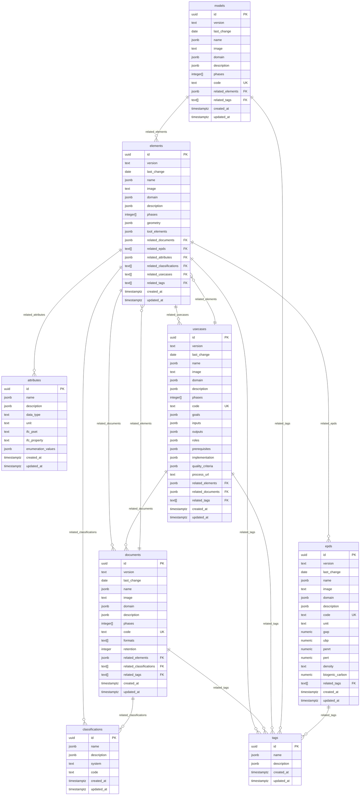

# KBOB Fachdatenkatalog – Database Schema

> **Repository:** [kbob-fdk](https://github.com/davras5/kbob-fdk)
> **Database:** PostgreSQL on Supabase
> **Schema Version:** 2.3.0  

---

## 1. Overview

### Purpose

Interactive catalog for BIM requirements, classifications, and information specifications for building elements and documents in Switzerland.

### Design Principles

- **Multilingual:** All user-facing text supports de/fr/it/en via JSONB
- **Phase-aware:** Core entities track applicability across 5 lifecycle phases
- **Relationship-rich:** JSONB arrays store typed references with optional metadata
- **Read-optimized:** GIN indexes support browse and filter patterns; no junction tables

### API Endpoints

| Endpoint | Description |
|----------|-------------|
| `/rest/v1/elements` | Building elements with LOG |
| `/rest/v1/documents` | Document types per KBOB/IPB |
| `/rest/v1/usecases` | BIM use cases per VDI 2552 |
| `/rest/v1/models` | BIM model definitions |
| `/rest/v1/epds` | Environmental product data |
| `/rest/v1/attributes` | Reusable property definitions |
| `/rest/v1/classifications` | Classification codes |
| `/rest/v1/tags` | Anwendungsfeld keywords |

---

## 2. Data Model

### Entity Summary

| Entity | Type | Purpose | Has Phases | Has Code |
|--------|------|---------|:----------:|:--------:|
| `elements` | Core | Physical building components with LOG requirements | ✓ | – |
| `documents` | Core | Project documentation types per KBOB/IPB | ✓ | ✓ |
| `usecases` | Core | Standardized BIM processes per VDI 2552 | ✓ | ✓ |
| `models` | Core | BIM discipline and coordination model definitions | ✓ | ✓ |
| `epds` | Reference | Environmental impact data (KBOB Ökobilanzdaten) | – | ✓ |
| `attributes` | Reference | Reusable property definitions (LOI) | – | – |
| `classifications` | Reference | Classification codes (eBKP-H, DIN 276, etc.) | – | ✓ |
| `tags` | Reference | Anwendungsfeld keywords per VDI 2552 Blatt 12.2 | – | – |

> **Core vs Reference:** Core entities represent project deliverables with lifecycle phases. Reference entities are phase-neutral lookup data; phase applicability is defined in the relationship.

### Entity-Relationship Diagram



---

## 3. Common Attributes

All core entities share these attributes for identification, versioning, and discoverability.

| Column | Type | Required | Description |
|--------|------|:--------:|-------------|
| `id` | `uuid` | ✓ | Primary key (UUID v4, auto-generated) |
| `version` | `text` | | Version indicator, format: `MAJOR.MINOR` (e.g., "2.1") |
| `last_change` | `date` | | Date of last content modification (ISO 8601) |
| `name` | `jsonb` | ✓ | Display name with i18n: `{"de": "...", "fr": "...", "it": "...", "en": "..."}` |
| `image` | `text` | | URL or path to visual representation |
| `domain` | `jsonb` | ✓ | Primary grouping with i18n |
| `description` | `jsonb` | | Detailed explanation with i18n |
| `related_tags` | `text[]` | | Tag UUIDs: `["<uuid>", ...]` (default: `{}`) |
| `phases` | `integer[]` | | Applicable lifecycle phases: 1–5 (core entities only) |
| `created_at` | `timestamptz` | ✓ | Record creation timestamp (auto-set) |
| `updated_at` | `timestamptz` | ✓ | Record modification timestamp (auto-updated) |

> **Reference entities** (`attributes`, `classifications`, `tags`) use a simplified subset: `id`, `name`, `description`, `created_at`, `updated_at`.

### Internationalization (i18n)

All user-facing text fields use JSONB with language keys:

```json
{
  "de": "Aussenwand",
  "fr": "Mur extérieur",
  "it": "Parete esterna",
  "en": "External wall"
}
```

---

## 4. Entity Definitions

### 4.1 elements

Physical building components with geometry (LOG) requirements.

| Column | Type | Required | Description |
|--------|------|:--------:|-------------|
| `geometry` | `jsonb` | | LOG specifications per phase (see §6.1) |
| `tool_elements` | `jsonb` | | Mappings to IFC classes and authoring tools (see §6.2) |
| `related_documents` | `jsonb` | | Links to documents: `[{"id": "<uuid>", "phases": [3,4,5]}]` |
| `related_epds` | `text[]` | | EPD UUIDs: `["<uuid>", ...]` |
| `related_attributes` | `jsonb` | | Links to attributes: `[{"id": "<uuid>", "phases": [3,4,5]}]` |
| `related_classifications` | `text[]` | | Classification UUIDs: `["<uuid>", ...]` |
| `related_usecases` | `text[]` | | Use case UUIDs: `["<uuid>", ...]` |

**Domain values:** Architektur, Tragwerk, Gebäudetechnik HLKS, Gebäudetechnik Elektro, Ausbau, Umgebung, Brandschutz, Transportanlagen

---

### 4.2 documents

Project documentation types with format requirements and retention policies per KBOB/IPB Bauwerksdokumentation.

| Column | Type | Required | Description |
|--------|------|:--------:|-------------|
| `code` | `text` | | Unique human-readable code (e.g., O01001, K02003) |
| `formats` | `text[]` | | Acceptable file formats (PDF-A, Office-Format, DWG, IFC, etc.) |
| `retention` | `integer` | | Retention period in years (see note below) |
| `related_elements` | `jsonb` | | Links to elements: `[{"id": "<uuid>"}]` |
| `related_classifications` | `text[]` | | Classification UUIDs: `["<uuid>", ...]` |

**Retention semantics:**
- `0` = retain indefinitely
- `NULL` = not specified / not applicable
- `> 0` = retention period in years

**Domain values:** Organisation, Verträge und Kosten, Konzepte und Beschriebe, Visualisierungen

---

### 4.3 usecases

Standardized BIM processes with roles, responsibilities, and quality criteria per VDI 2552 Blatt 12.1/12.2.

| Column | Type | Required | Description |
|--------|------|:--------:|-------------|
| `code` | `text` | | Unique human-readable code (e.g., uc000, uc280) |
| `goals` | `jsonb` | | Objectives as i18n array |
| `inputs` | `jsonb` | | Required inputs/preconditions as i18n array |
| `outputs` | `jsonb` | | Deliverables/results as i18n array |
| `roles` | `jsonb` | | RACI responsibility matrix (see §6.3) |
| `prerequisites` | `jsonb` | | Requirements for client/contractor (see §6.4) |
| `implementation` | `jsonb` | | Implementation steps as i18n array |
| `quality_criteria` | `jsonb` | | Acceptance criteria as i18n array |
| `process_url` | `text` | | Link to BPMN process diagram |
| `related_elements` | `jsonb` | | Required elements: `[{"id": "<uuid>", "phases": [2,3]}]` |
| `related_documents` | `jsonb` | | Required documents: `[{"id": "<uuid>", "required": true}]` |

**Domain values:** See §7.5 (22 Anwendungsfeld values per VDI 2552 Blatt 12.2)

---

### 4.4 models

BIM model types including discipline models, coordination models, and special-purpose models.

| Column | Type | Required | Description |
|--------|------|:--------:|-------------|
| `code` | `text` | | Unique human-readable code (e.g., arch-01, coord-01) |
| `related_elements` | `jsonb` | | Element types in model: `[{"id": "<uuid>", "phases": [2,3,4]}]` |

**Domain values:** Fachmodelle, Koordination, Spezialmodelle, Bestand

---

### 4.5 epds

Environmental impact data for construction materials per KBOB Ökobilanzdaten.

> **Note:** No `phases` column — EPD data is phase-neutral reference data.

| Column | Type | Required | Constraints | Description |
|--------|------|:--------:|-------------|-------------|
| `code` | `text` | | `UNIQUE` | KBOB code (e.g., kbob-01-042) |
| `unit` | `text` | | | Functional unit (kg, m², m³, kWh, etc.) |
| `gwp` | `numeric(12,4)` | | | Global Warming Potential (kg CO₂-eq) — can be negative |
| `ubp` | `numeric(12,2)` | | `>= 0` | Umweltbelastungspunkte (Swiss ecological scarcity) |
| `penrt` | `numeric(12,4)` | | `>= 0` | Primary Energy Non-Renewable Total (MJ) |
| `pert` | `numeric(12,4)` | | `>= 0` | Primary Energy Renewable Total (MJ) |
| `density` | `text` | | | Material density (display only) |
| `biogenic_carbon` | `numeric(12,6)` | | | Biogenic carbon content (kg C) |

> **GWP can be negative** for carbon-sequestering materials (timber, bio-based) per EN 15804.

**Domain values:** Baumaterialien, Energie, Gebäudetechnik, Transporte

---

### 4.6 attributes

Reusable property definitions for LOI (Level of Information) requirements.

| Column | Type | Required | Description |
|--------|------|:--------:|-------------|
| `data_type` | `text` | | Property data type: string, number, boolean, enum |
| `unit` | `text` | | Unit of measurement (m, kg, °C, etc.) |
| `ifc_pset` | `text` | | IFC property set name |
| `ifc_property` | `text` | | IFC property name within the pset |
| `enumeration_values` | `jsonb` | | Allowed values for enum types as i18n array |

---

### 4.7 classifications

Classification codes from multiple systems.

| Column | Type | Required | Constraints | Description |
|--------|------|:--------:|-------------|-------------|
| `system` | `text` | | See below | Classification system |
| `code` | `text` | | `UNIQUE(system, code)` | Code within the system |

**Supported systems:**

| System | Standard | Description |
|--------|----------|-------------|
| `eBKP-H` | SN 506 511:2020 | Swiss cost planning codes |
| `DIN276` | DIN 276:2018 | German cost classification |
| `Uniformat II` | ASTM E1557 | International elemental classification |
| `KBOB` | KBOB | Swiss federal building classification |

> **Composite uniqueness:** The same code value (e.g., "C02") may exist in different systems.

---

### 4.8 tags

Anwendungsfeld keywords per VDI 2552 Blatt 12.2. Used for filtering and categorizing entities across the catalog.

> **Design rationale:** By normalizing tags into a reference table, translations are managed centrally. Adding or correcting a translation only requires updating one record instead of every entity that uses the tag.

---

## 5. Relationships

### Overview

Relationships between entities are stored on the parent entity, avoiding junction tables for this read-heavy catalog. Complex relationships with metadata use JSONB arrays; simple references use `text[]` arrays of UUIDs.

| Source | Field | Target | Structure |
|--------|-------|--------|-----------|
| `elements` | `related_documents` | documents | `[{"id": "<uuid>", "phases": [3,4,5]}]` |
| `elements` | `related_epds` | epds | `["<uuid>", ...]` |
| `elements` | `related_attributes` | attributes | `[{"id": "<uuid>", "phases": [3,4,5]}]` |
| `elements` | `related_classifications` | classifications | `["<uuid>", ...]` |
| `elements` | `related_usecases` | usecases | `["<uuid>", ...]` |
| `elements` | `related_tags` | tags | `["<uuid>", ...]` |
| `documents` | `related_elements` | elements | `[{"id": "<uuid>"}]` |
| `documents` | `related_classifications` | classifications | `["<uuid>", ...]` |
| `documents` | `related_tags` | tags | `["<uuid>", ...]` |
| `usecases` | `related_elements` | elements | `[{"id": "<uuid>", "phases": [2,3]}]` |
| `usecases` | `related_documents` | documents | `[{"id": "<uuid>", "required": true}]` |
| `usecases` | `related_tags` | tags | `["<uuid>", ...]` |
| `models` | `related_elements` | elements | `[{"id": "<uuid>", "phases": [2,3,4]}]` |
| `models` | `related_tags` | tags | `["<uuid>", ...]` |
| `epds` | `related_tags` | tags | `["<uuid>", ...]` |

### Bidirectional Relationships

Some relationships exist on both sides (e.g., `elements.related_usecases` and `usecases.related_elements`). 

**Source of truth:** The entity that "owns" the relationship contextually:
- Use cases define which elements they require → `usecases.related_elements` is authoritative
- Elements reference which use cases they support → `elements.related_usecases` is a convenience denormalization

Application layer is responsible for synchronization.

### Design Trade-offs

**JSONB vs Junction Tables**

GIN indexes support efficient containment queries:

```sql
-- Find elements linked to a specific document
SELECT * FROM elements 
WHERE related_documents @> '[{"id": "550e8400-..."}]';
```

However, queries filtering on relationship metadata require `jsonb_array_elements()` and won't use indexes efficiently:

```sql
-- Find elements linked to document X in phase 3 (slower)
SELECT e.* FROM elements e, jsonb_array_elements(e.related_documents) ref
WHERE ref->>'id' = '550e8400-...' AND ref->'phases' @> '3';
```

For this browse-oriented catalog, JSONB is pragmatic. Junction tables would be warranted if relationship metadata queries become a bottleneck.

**Referential Integrity**

JSONB relationships do not enforce foreign key constraints. Orphaned references may occur when a referenced entity is deleted. This is intentional — the application layer handles validation, and a scheduled cleanup function can detect orphans:

```sql
-- Find orphaned document references in elements
SELECT e.id, ref->>'id' AS orphaned_doc_id
FROM elements e, jsonb_array_elements(e.related_documents) AS ref
WHERE NOT EXISTS (SELECT 1 FROM documents d WHERE d.id::text = ref->>'id');
```

---

## 6. JSONB Structures

### 6.1 elements.geometry (LOG)

Level of Geometry specifications per lifecycle phase.

```json
[
  {
    "name": {"de": "Symbol", "fr": "Symbole", "it": "Simbolo", "en": "Symbol"},
    "desc": {"de": "Schematische Darstellung...", "fr": "Représentation schématique...", "it": "...", "en": "..."},
    "phases": [3]
  },
  {
    "name": {"de": "Länge", "fr": "Longueur", "it": "Lunghezza", "en": "Length"},
    "desc": {"de": "Ausdehnung in Metern", "fr": "Extension en mètres", "it": "...", "en": "..."},
    "phases": [4, 5]
  }
]
```

| Field | Type | Required | Description |
|-------|------|:--------:|-------------|
| `name` | jsonb | ✓ | Geometry property name (i18n) |
| `desc` | jsonb | ✓ | Requirement description (i18n) |
| `phases` | integer[] | ✓ | Phases where required (1–5) |

---

### 6.2 elements.tool_elements

Mappings to authoring tools and IFC. Extensible for additional tools.

```json
[
  {
    "element": {"de": "Rollladenmotor", "fr": "Moteur de volet roulant", "it": "...", "en": "Roller shutter motor"},
    "ifc": "IfcActuator.ELECTRICACTUATOR",
    "revit": "Spezialisierte Ausrüstung",
    "archicad": null
  }
]
```

| Field | Type | Required | Description |
|-------|------|:--------:|-------------|
| `element` | jsonb | ✓ | Element variant description (i18n) |
| `ifc` | string | ✓ | IFC class and predefined type (e.g., "IfcWall.PARTITIONING") |
| `revit` | string | | Revit family/category mapping |
| `archicad` | string | | ArchiCAD object mapping |
| `...` | string | | Additional tools as needed |

> **IFC notation:** Combined class and predefined type matches IFC schema conventions and simplifies data entry.

---

### 6.3 usecases.roles (RACI)

Responsibility assignment matrix with i18n support.

```json
[
  {
    "actor": {"de": "BIM-Manager", "fr": "Gestionnaire BIM", "it": "...", "en": "BIM Manager"},
    "responsible": [
      {"de": "Erstellung AIA und BAP", "fr": "Création AIA et PAB", "it": "...", "en": "Creation of EIR and BEP"}
    ],
    "contributing": [
      {"de": "Abstimmung mit Stakeholdern", "fr": "Coordination...", "it": "...", "en": "Coordination with stakeholders"}
    ],
    "informed": [
      {"de": "Projektänderungen", "fr": "Modifications du projet", "it": "...", "en": "Project changes"}
    ]
  }
]
```

| Field | Type | Required | Description |
|-------|------|:--------:|-------------|
| `actor` | jsonb | ✓ | Role name (i18n) |
| `responsible` | jsonb[] | | Tasks this role performs (R) |
| `contributing` | jsonb[] | | Tasks this role contributes to (A/C) |
| `informed` | jsonb[] | | Information this role receives (I) |

---

### 6.4 usecases.prerequisites

Requirements split by stakeholder.

```json
{
  "client": [
    {"de": "Grundsatzentscheid zur digitalen Projektabwicklung", "fr": "...", "it": "...", "en": "Decision for digital project execution"},
    {"de": "Bereitstellung von Ressourcen", "fr": "...", "it": "...", "en": "Provision of resources"}
  ],
  "contractor": [
    {"de": "Grundkenntnisse in digitaler Zusammenarbeit", "fr": "...", "it": "...", "en": "Basic digital collaboration knowledge"}
  ]
}
```

---

### 6.5 i18n Arrays

Used for `goals`, `inputs`, `outputs`, `implementation`, `quality_criteria`:

```json
[
  {"de": "Digitale Koordination", "fr": "Coordination numérique", "it": "...", "en": "Digital coordination"},
  {"de": "Modellbasierte Kommunikation", "fr": "...", "it": "...", "en": "Model-based communication"}
]
```

---

## 7. Reference Values

Controlled vocabularies for domains, phases, tags, and classification systems.

### 7.1 Lifecycle Phases

Per VDI 2552 Blatt 12.2:

| Phase | DE | FR | IT | EN | Description |
|:-----:|----|----|----|----|-------------|
| 1 | Entwicklung | Développement | Sviluppo | Development | Project development and feasibility |
| 2 | Planung | Planification | Progettazione | Planning | Basic evaluation through execution planning |
| 3 | Realisierung | Réalisation | Realizzazione | Construction | Tendering, construction, acceptance |
| 4 | Betrieb | Exploitation | Gestione | Operations | Operations and maintenance |
| 5 | Abbruch | Déconstruction | Decostruzione | Demolition | Demolition and deconstruction |

---

### 7.2 Element Domains

| DE | EN | Description |
|----|----|----|
| Architektur | Architecture | Windows, doors, walls, roofs |
| Tragwerk | Structure | Columns, beams, slabs, foundations |
| Gebäudetechnik HLKS | MEP HVAC | HVAC and plumbing |
| Gebäudetechnik Elektro | MEP Electrical | Power, lighting, automation |
| Ausbau | Interior Finishes | Floors, ceilings, partitions |
| Umgebung | Site | Landscaping, paving |
| Brandschutz | Fire Protection | Fire protection elements |
| Transportanlagen | Vertical Transport | Elevators, escalators, lifts |

---

### 7.3 Document Domains

Per KBOB/IPB Dokumenttypenkatalog:

| Code | DE | EN | Description |
|------|----|----|-------------|
| O | Organisation | Organisation | Project and operations organization |
| K | Verträge und Kosten | Contracts and Costs | Commercial and contractual |
| B | Konzepte und Beschriebe | Concepts and Descriptions | Planning concepts, technical descriptions |
| V | Visualisierungen | Visualizations | Plans, drawings, visual representations |

---

### 7.4 Model Domains

| DE | EN | Description |
|----|----|----|
| Fachmodelle | Discipline Models | Single-discipline BIM models |
| Koordination | Coordination | Merged coordination models |
| Spezialmodelle | Special Models | Purpose-specific models |
| Bestand | As-Built | Digital twin for operations |

---

### 7.5 Tags Reference Table Values (Anwendungsfeld)

Per VDI 2552 Blatt 12.2 Anhang B1 — stored in the `tags` reference table, referenced via `related_tags` by all core entities:

| DE | EN |
|----|----|
| Abnahme | Acceptance |
| Änderungsmanagement | Change Management |
| Ausschreibung und Vergabe | Tendering and Procurement |
| Bedarfsplanung | Requirements Planning |
| Bestandserfassung | Asset Capture |
| Betrieb | Operations |
| Dokumentation | Documentation |
| Genehmigung | Approval |
| Inbetriebnahme | Commissioning |
| Koordination | Coordination |
| Kosten | Costs |
| Logistik | Logistics |
| Machbarkeit | Feasibility |
| Nachhaltigkeit | Sustainability |
| Nachweise | Verification |
| Qualitätssicherung | Quality Assurance |
| Risikomanagement | Risk Management |
| Termine | Scheduling |
| Variantenvergleich | Variant Comparison |
| Versicherung | Insurance |
| Visualisierung | Visualization |
| Sonstiges | Other |

> **Note:** The `usecases.domain` field also uses these values (as i18n objects), providing the primary Anwendungsfeld for a use case.

---

### 7.6 EPD Domains

| DE | EN | Typical subcategories |
|----|----|-----------------------|
| Baumaterialien | Building Materials | Beton, Mauerwerk, Holz, Metall, Dämmstoffe |
| Energie | Energy | Strom, Wärme, Kälte, Brennstoffe |
| Gebäudetechnik | Building Services | Heizung, Lüftung, Sanitär, Elektro |
| Transporte | Transport | LKW, Bahn, Schiff |

---

### 7.7 EPD Units

Common functional/reference units (not constrained in database):

| Unit | Description |
|------|-------------|
| `kg` | Mass |
| `m²` | Area |
| `m³` | Volume |
| `m` | Length |
| `kWh` | Energy (kilowatt-hour) |
| `MJ` | Energy (megajoule) |
| `Stk` | Piece (Stück) |
| `tkm` | Transport (tonne-kilometer) |

---

## 8. Example Queries

Common access patterns validating the indexing strategy.

### Basic Filters

```sql
-- Find elements in Architektur domain, phase 3
SELECT * FROM elements 
WHERE domain->>'de' = 'Architektur' 
  AND phases @> ARRAY[3];

-- Full-text search for "Wand" in German
SELECT * FROM elements 
WHERE to_tsvector('german', name->>'de') @@ to_tsquery('german', 'Wand');

-- List all eBKP-H classifications
SELECT code, name->>'de' AS name_de 
FROM classifications 
WHERE system = 'eBKP-H'
ORDER BY code;
```

### Relationship Queries

```sql
-- Find all documents related to a specific element
SELECT d.* FROM documents d
WHERE related_elements @> '[{"id": "550e8400-e29b-41d4-a716-446655440000"}]';

-- Find elements with a specific classification
SELECT e.* FROM elements e
WHERE related_classifications @> ARRAY['classification-uuid-here'];

-- Find use cases requiring a specific document
SELECT u.code, u.name->>'de' AS name
FROM usecases u
WHERE related_documents @> '[{"id": "document-uuid-here"}]';
```

### Tag Filtering

```sql
-- Find elements with a specific tag by UUID (uses GIN index)
SELECT * FROM elements
WHERE related_tags @> ARRAY['tag-uuid-here'];

-- Find elements with multiple tags (both must be present)
SELECT e.* FROM elements e
WHERE related_tags @> ARRAY['tag-uuid-1', 'tag-uuid-2'];

-- List all tags for an element with their translations
SELECT t.id, t.name->>'de' AS name_de, t.name->>'en' AS name_en
FROM tags t
WHERE t.id::text = ANY(
  SELECT unnest(related_tags) FROM elements
  WHERE id = '550e8400-e29b-41d4-a716-446655440000'
);
```

### Cross-Entity Queries

```sql
-- Find EPDs linked to elements in Tragwerk domain
SELECT DISTINCT ep.*
FROM epds ep
JOIN elements e ON ep.id::text = ANY(e.related_epds)
WHERE e.domain->>'de' = 'Tragwerk';

-- Find documents required by use cases in phase 2
SELECT DISTINCT d.code, d.name->>'de' AS name
FROM documents d
JOIN usecases u ON u.related_documents @> jsonb_build_array(jsonb_build_object('id', d.id::text))
WHERE u.phases @> ARRAY[2];
```

---

## 9. SQL Implementation

### Tables

```sql
-- =============================================================================
-- KBOB Fachdatenkatalog - Database Schema
-- PostgreSQL on Supabase
-- Version: 2.3.0
-- =============================================================================

-- -----------------------------------------------------------------------------
-- CORE ENTITIES
-- -----------------------------------------------------------------------------

-- ELEMENTS: Physical building components with LOG requirements
CREATE TABLE public.elements (
    id uuid PRIMARY KEY DEFAULT gen_random_uuid(),
    version text,
    last_change date,
    name jsonb NOT NULL,
    image text,
    domain jsonb NOT NULL,
    description jsonb,
    phases integer[],
    geometry jsonb DEFAULT '[]',
    tool_elements jsonb DEFAULT '[]',
    related_documents jsonb DEFAULT '[]',
    related_epds text[] DEFAULT '{}',
    related_attributes jsonb DEFAULT '[]',
    related_classifications text[] DEFAULT '{}',
    related_usecases text[] DEFAULT '{}',
    related_tags text[] DEFAULT '{}',
    created_at timestamptz NOT NULL DEFAULT now(),
    updated_at timestamptz NOT NULL DEFAULT now(),
    CONSTRAINT elements_phases_valid CHECK (phases IS NULL OR phases <@ ARRAY[1,2,3,4,5])
);

-- DOCUMENTS: Project documentation types per KBOB/IPB
CREATE TABLE public.documents (
    id uuid PRIMARY KEY DEFAULT gen_random_uuid(),
    version text,
    last_change date,
    name jsonb NOT NULL,
    image text,
    domain jsonb NOT NULL,
    description jsonb,
    phases integer[],
    code text UNIQUE,
    formats text[],
    retention integer,
    related_elements jsonb DEFAULT '[]',
    related_classifications text[] DEFAULT '{}',
    related_tags text[] DEFAULT '{}',
    created_at timestamptz NOT NULL DEFAULT now(),
    updated_at timestamptz NOT NULL DEFAULT now(),
    CONSTRAINT documents_phases_valid CHECK (phases IS NULL OR phases <@ ARRAY[1,2,3,4,5]),
    CONSTRAINT documents_retention_valid CHECK (retention IS NULL OR retention >= 0)
);

-- USECASES: Standardized BIM processes per VDI 2552
CREATE TABLE public.usecases (
    id uuid PRIMARY KEY DEFAULT gen_random_uuid(),
    version text,
    last_change date,
    name jsonb NOT NULL,
    image text,
    domain jsonb NOT NULL,
    description jsonb,
    phases integer[],
    code text UNIQUE,
    goals jsonb DEFAULT '[]',
    inputs jsonb DEFAULT '[]',
    outputs jsonb DEFAULT '[]',
    roles jsonb DEFAULT '[]',
    prerequisites jsonb DEFAULT '{}',
    implementation jsonb DEFAULT '[]',
    quality_criteria jsonb DEFAULT '[]',
    process_url text,
    related_elements jsonb DEFAULT '[]',
    related_documents jsonb DEFAULT '[]',
    related_tags text[] DEFAULT '{}',
    created_at timestamptz NOT NULL DEFAULT now(),
    updated_at timestamptz NOT NULL DEFAULT now(),
    CONSTRAINT usecases_phases_valid CHECK (phases IS NULL OR phases <@ ARRAY[1,2,3,4,5])
);

-- MODELS: BIM discipline and coordination model definitions
CREATE TABLE public.models (
    id uuid PRIMARY KEY DEFAULT gen_random_uuid(),
    version text,
    last_change date,
    name jsonb NOT NULL,
    image text,
    domain jsonb NOT NULL,
    description jsonb,
    phases integer[],
    code text UNIQUE,
    related_elements jsonb DEFAULT '[]',
    related_tags text[] DEFAULT '{}',
    created_at timestamptz NOT NULL DEFAULT now(),
    updated_at timestamptz NOT NULL DEFAULT now(),
    CONSTRAINT models_phases_valid CHECK (phases IS NULL OR phases <@ ARRAY[1,2,3,4,5])
);

-- -----------------------------------------------------------------------------
-- REFERENCE ENTITIES
-- -----------------------------------------------------------------------------

-- EPDS: Environmental impact data (KBOB Ökobilanzdaten)
CREATE TABLE public.epds (
    id uuid PRIMARY KEY DEFAULT gen_random_uuid(),
    version text,
    last_change date,
    name jsonb NOT NULL,
    image text,
    domain jsonb NOT NULL,
    description jsonb,
    code text UNIQUE,
    unit text,
    gwp numeric(12,4),
    ubp numeric(12,2),
    penrt numeric(12,4),
    pert numeric(12,4),
    density text,
    biogenic_carbon numeric(12,6),
    related_tags text[] DEFAULT '{}',
    created_at timestamptz NOT NULL DEFAULT now(),
    updated_at timestamptz NOT NULL DEFAULT now(),
    CONSTRAINT epds_ubp_positive CHECK (ubp IS NULL OR ubp >= 0),
    CONSTRAINT epds_penrt_positive CHECK (penrt IS NULL OR penrt >= 0),
    CONSTRAINT epds_pert_positive CHECK (pert IS NULL OR pert >= 0)
);

-- ATTRIBUTES: Reusable property definitions (LOI)
CREATE TABLE public.attributes (
    id uuid PRIMARY KEY DEFAULT gen_random_uuid(),
    name jsonb NOT NULL,
    description jsonb,
    data_type text,
    unit text,
    ifc_pset text,
    ifc_property text,
    enumeration_values jsonb DEFAULT '[]',
    created_at timestamptz NOT NULL DEFAULT now(),
    updated_at timestamptz NOT NULL DEFAULT now()
);

-- CLASSIFICATIONS: Classification codes from multiple systems
CREATE TABLE public.classifications (
    id uuid PRIMARY KEY DEFAULT gen_random_uuid(),
    name jsonb NOT NULL,
    description jsonb,
    system text,
    code text,
    created_at timestamptz NOT NULL DEFAULT now(),
    updated_at timestamptz NOT NULL DEFAULT now(),
    CONSTRAINT classifications_system_valid CHECK (system IS NULL OR system IN ('eBKP-H', 'DIN276', 'Uniformat II', 'KBOB')),
    CONSTRAINT classifications_system_code_unique UNIQUE (system, code)
);

-- TAGS: Anwendungsfeld keywords per VDI 2552 Blatt 12.2
CREATE TABLE public.tags (
    id uuid PRIMARY KEY DEFAULT gen_random_uuid(),
    name jsonb NOT NULL,
    description jsonb,
    created_at timestamptz NOT NULL DEFAULT now(),
    updated_at timestamptz NOT NULL DEFAULT now()
);
```

### Indexes

```sql
-- -----------------------------------------------------------------------------
-- FULL-TEXT SEARCH INDEXES
-- -----------------------------------------------------------------------------

-- German
CREATE INDEX elements_name_de_idx ON elements USING gin(to_tsvector('german', name->>'de'));
CREATE INDEX documents_name_de_idx ON documents USING gin(to_tsvector('german', name->>'de'));
CREATE INDEX usecases_name_de_idx ON usecases USING gin(to_tsvector('german', name->>'de'));
CREATE INDEX models_name_de_idx ON models USING gin(to_tsvector('german', name->>'de'));
CREATE INDEX epds_name_de_idx ON epds USING gin(to_tsvector('german', name->>'de'));
CREATE INDEX attributes_name_de_idx ON attributes USING gin(to_tsvector('german', name->>'de'));
CREATE INDEX classifications_name_de_idx ON classifications USING gin(to_tsvector('german', name->>'de'));
CREATE INDEX tags_name_de_idx ON tags USING gin(to_tsvector('german', name->>'de'));

-- French
CREATE INDEX elements_name_fr_idx ON elements USING gin(to_tsvector('french', name->>'fr'));
CREATE INDEX documents_name_fr_idx ON documents USING gin(to_tsvector('french', name->>'fr'));
CREATE INDEX usecases_name_fr_idx ON usecases USING gin(to_tsvector('french', name->>'fr'));
CREATE INDEX models_name_fr_idx ON models USING gin(to_tsvector('french', name->>'fr'));
CREATE INDEX epds_name_fr_idx ON epds USING gin(to_tsvector('french', name->>'fr'));
CREATE INDEX attributes_name_fr_idx ON attributes USING gin(to_tsvector('french', name->>'fr'));
CREATE INDEX classifications_name_fr_idx ON classifications USING gin(to_tsvector('french', name->>'fr'));
CREATE INDEX tags_name_fr_idx ON tags USING gin(to_tsvector('french', name->>'fr'));

-- Italian
CREATE INDEX elements_name_it_idx ON elements USING gin(to_tsvector('italian', name->>'it'));
CREATE INDEX documents_name_it_idx ON documents USING gin(to_tsvector('italian', name->>'it'));
CREATE INDEX usecases_name_it_idx ON usecases USING gin(to_tsvector('italian', name->>'it'));
CREATE INDEX models_name_it_idx ON models USING gin(to_tsvector('italian', name->>'it'));
CREATE INDEX epds_name_it_idx ON epds USING gin(to_tsvector('italian', name->>'it'));
CREATE INDEX attributes_name_it_idx ON attributes USING gin(to_tsvector('italian', name->>'it'));
CREATE INDEX classifications_name_it_idx ON classifications USING gin(to_tsvector('italian', name->>'it'));
CREATE INDEX tags_name_it_idx ON tags USING gin(to_tsvector('italian', name->>'it'));

-- English
CREATE INDEX elements_name_en_idx ON elements USING gin(to_tsvector('english', name->>'en'));
CREATE INDEX documents_name_en_idx ON documents USING gin(to_tsvector('english', name->>'en'));
CREATE INDEX usecases_name_en_idx ON usecases USING gin(to_tsvector('english', name->>'en'));
CREATE INDEX models_name_en_idx ON models USING gin(to_tsvector('english', name->>'en'));
CREATE INDEX epds_name_en_idx ON epds USING gin(to_tsvector('english', name->>'en'));
CREATE INDEX attributes_name_en_idx ON attributes USING gin(to_tsvector('english', name->>'en'));
CREATE INDEX classifications_name_en_idx ON classifications USING gin(to_tsvector('english', name->>'en'));
CREATE INDEX tags_name_en_idx ON tags USING gin(to_tsvector('english', name->>'en'));

-- -----------------------------------------------------------------------------
-- FILTER INDEXES
-- -----------------------------------------------------------------------------

-- Domain filters
CREATE INDEX elements_domain_idx ON elements((domain->>'de'));
CREATE INDEX documents_domain_idx ON documents((domain->>'de'));
CREATE INDEX usecases_domain_idx ON usecases((domain->>'de'));
CREATE INDEX models_domain_idx ON models((domain->>'de'));
CREATE INDEX epds_domain_idx ON epds((domain->>'de'));

-- Classification lookup
CREATE UNIQUE INDEX classifications_system_code_idx ON classifications(system, code);
CREATE INDEX classifications_system_idx ON classifications(system);

-- Code lookup
CREATE INDEX documents_code_idx ON documents(code);
CREATE INDEX usecases_code_idx ON usecases(code);
CREATE INDEX models_code_idx ON models(code);
CREATE INDEX epds_code_idx ON epds(code);

-- Phase filters (GIN for array containment)
CREATE INDEX elements_phases_idx ON elements USING gin(phases);
CREATE INDEX documents_phases_idx ON documents USING gin(phases);
CREATE INDEX usecases_phases_idx ON usecases USING gin(phases);
CREATE INDEX models_phases_idx ON models USING gin(phases);

-- -----------------------------------------------------------------------------
-- RELATIONSHIP INDEXES
-- -----------------------------------------------------------------------------

-- JSONB relationships (with metadata)
CREATE INDEX elements_related_documents_idx ON elements USING gin(related_documents);
CREATE INDEX elements_related_attributes_idx ON elements USING gin(related_attributes);
CREATE INDEX documents_related_elements_idx ON documents USING gin(related_elements);
CREATE INDEX usecases_related_elements_idx ON usecases USING gin(related_elements);
CREATE INDEX usecases_related_documents_idx ON usecases USING gin(related_documents);
CREATE INDEX models_related_elements_idx ON models USING gin(related_elements);

-- Simple text[] relationships (UUID arrays)
CREATE INDEX elements_related_epds_idx ON elements USING gin(related_epds);
CREATE INDEX elements_related_classifications_idx ON elements USING gin(related_classifications);
CREATE INDEX elements_related_usecases_idx ON elements USING gin(related_usecases);
CREATE INDEX elements_related_tags_idx ON elements USING gin(related_tags);
CREATE INDEX documents_related_classifications_idx ON documents USING gin(related_classifications);
CREATE INDEX documents_related_tags_idx ON documents USING gin(related_tags);
CREATE INDEX usecases_related_tags_idx ON usecases USING gin(related_tags);
CREATE INDEX models_related_tags_idx ON models USING gin(related_tags);
CREATE INDEX epds_related_tags_idx ON epds USING gin(related_tags);
```

### Triggers

```sql
-- -----------------------------------------------------------------------------
-- AUTO-UPDATE TIMESTAMPS
-- -----------------------------------------------------------------------------

CREATE OR REPLACE FUNCTION update_updated_at()
RETURNS TRIGGER AS $$
BEGIN
    NEW.updated_at = now();
    RETURN NEW;
END;
$$ LANGUAGE plpgsql;

CREATE TRIGGER elements_updated_at BEFORE UPDATE ON elements FOR EACH ROW EXECUTE FUNCTION update_updated_at();
CREATE TRIGGER documents_updated_at BEFORE UPDATE ON documents FOR EACH ROW EXECUTE FUNCTION update_updated_at();
CREATE TRIGGER usecases_updated_at BEFORE UPDATE ON usecases FOR EACH ROW EXECUTE FUNCTION update_updated_at();
CREATE TRIGGER models_updated_at BEFORE UPDATE ON models FOR EACH ROW EXECUTE FUNCTION update_updated_at();
CREATE TRIGGER epds_updated_at BEFORE UPDATE ON epds FOR EACH ROW EXECUTE FUNCTION update_updated_at();
CREATE TRIGGER attributes_updated_at BEFORE UPDATE ON attributes FOR EACH ROW EXECUTE FUNCTION update_updated_at();
CREATE TRIGGER classifications_updated_at BEFORE UPDATE ON classifications FOR EACH ROW EXECUTE FUNCTION update_updated_at();
CREATE TRIGGER tags_updated_at BEFORE UPDATE ON tags FOR EACH ROW EXECUTE FUNCTION update_updated_at();
```

### Row Level Security

```sql
-- -----------------------------------------------------------------------------
-- ROW LEVEL SECURITY
-- -----------------------------------------------------------------------------
-- Access model:
--   SELECT: Public (anonymous) read access for all tables
--   INSERT/UPDATE/DELETE: Service role only (bypasses RLS)
-- -----------------------------------------------------------------------------

ALTER TABLE elements ENABLE ROW LEVEL SECURITY;
ALTER TABLE documents ENABLE ROW LEVEL SECURITY;
ALTER TABLE usecases ENABLE ROW LEVEL SECURITY;
ALTER TABLE models ENABLE ROW LEVEL SECURITY;
ALTER TABLE epds ENABLE ROW LEVEL SECURITY;
ALTER TABLE attributes ENABLE ROW LEVEL SECURITY;
ALTER TABLE classifications ENABLE ROW LEVEL SECURITY;
ALTER TABLE tags ENABLE ROW LEVEL SECURITY;

-- Public read access
CREATE POLICY "Public read access" ON elements FOR SELECT USING (true);
CREATE POLICY "Public read access" ON documents FOR SELECT USING (true);
CREATE POLICY "Public read access" ON usecases FOR SELECT USING (true);
CREATE POLICY "Public read access" ON models FOR SELECT USING (true);
CREATE POLICY "Public read access" ON epds FOR SELECT USING (true);
CREATE POLICY "Public read access" ON attributes FOR SELECT USING (true);
CREATE POLICY "Public read access" ON classifications FOR SELECT USING (true);
CREATE POLICY "Public read access" ON tags FOR SELECT USING (true);

-- Note: No INSERT/UPDATE/DELETE policies - writes require service_role
```

### Table Comments

```sql
-- -----------------------------------------------------------------------------
-- TABLE AND COLUMN COMMENTS
-- -----------------------------------------------------------------------------

COMMENT ON TABLE elements IS 'Physical building components with LOG (Level of Geometry) requirements';
COMMENT ON TABLE documents IS 'Project documentation types per KBOB/IPB Bauwerksdokumentation standard';
COMMENT ON TABLE usecases IS 'Standardized BIM processes per VDI 2552 Blatt 12.1/12.2';
COMMENT ON TABLE models IS 'BIM discipline, coordination, and special-purpose model definitions';
COMMENT ON TABLE epds IS 'Environmental Product Declarations - KBOB Ökobilanzdaten';
COMMENT ON TABLE attributes IS 'Reusable property definitions (LOI attributes)';
COMMENT ON TABLE classifications IS 'Classification codes from eBKP-H, DIN 276, Uniformat II, KBOB';
COMMENT ON TABLE tags IS 'Anwendungsfeld keywords per VDI 2552 Blatt 12.2 - used for filtering across entities';

COMMENT ON COLUMN elements.geometry IS 'LOG specifications per lifecycle phase (JSONB array with i18n)';
COMMENT ON COLUMN elements.tool_elements IS 'Mappings to IFC classes and authoring tools (Revit, ArchiCAD)';
COMMENT ON COLUMN epds.gwp IS 'Global Warming Potential in kg CO₂-eq; can be negative for bio-based materials';
COMMENT ON COLUMN epds.ubp IS 'Umweltbelastungspunkte - Swiss ecological scarcity method';
COMMENT ON COLUMN usecases.roles IS 'RACI responsibility matrix with i18n support';
```

---

## Appendix A: Glossary

| Acronym | EN | DE | Description |
|---------|----|----|-------------|
| AIA | Client Information Requirements | Auftraggeber-Informationsanforderungen | Client information requirements document |
| BAP | BIM Execution Plan | BIM-Abwicklungsplan | BIM execution plan |
| EPD | Environmental Product Declaration | Umweltproduktdeklaration | Standardized environmental impact data |
| GWP | Global Warming Potential | Treibhauspotenzial | Climate change impact (kg CO₂-eq) |
| IFC | Industry Foundation Classes | – | Open standard for BIM data exchange |
| KBOB | – | Koordinationskonferenz der Bau- und Liegenschaftsorgane | Swiss federal building coordination body |
| LOG | Level of Geometry | – | Geometric detail requirements |
| LOI | Level of Information | – | Attribute/property requirements |
| RACI | Responsible, Accountable, Consulted, Informed | – | Responsibility assignment matrix |
| UBP | Environmental Impact Points | Umweltbelastungspunkte | Swiss ecological scarcity indicator |

---

## Appendix B: Changelog

| Version | Date | Changes |
|---------|------|---------|
| 2.3.0 | 2025-12 | **Tags normalization:** Added `tags` reference table for Anwendungsfeld keywords; replaced embedded `tags` JSONB arrays with `related_tags` relationship on all core entities; centralized i18n for tags enabling single-point translation management |
| 2.2.0 | 2025-12 | Major restructure: reordered sections for conceptual→implementation flow; added Example Queries section (§8); clarified bidirectional relationship source of truth; documented retention semantics; consolidated reference values; split SQL into logical subsections |
| 2.1.13 | 2025-12 | Added `code` to models; added Required column to attribute tables |
| 2.1.12 | 2025-12 | Changed `classifications.code` to composite unique; added numeric precision to EPD values; standardized `related_*` to NOT NULL DEFAULT '[]' |
| 2.1.11 | 2025-12 | Restructured Reference Values; added `epd_unit` and `classification_system` |
| 2.1.10 | 2025-12 | Added `Has Code` column; fixed `classifications.code` constraints |
| 2.1.9 | 2025-12 | Changed all IDs to UUID v4; added `code` field to documents, usecases, epds |
| 2.1.0 | 2025-12 | Added i18n support; added `attributes` and `classifications` tables; renamed `title` → `name` |
| 2.0.0 | 2025-01 | Complete restructure for Supabase migration |
| 1.x | 2024 | JSON file-based data model |
