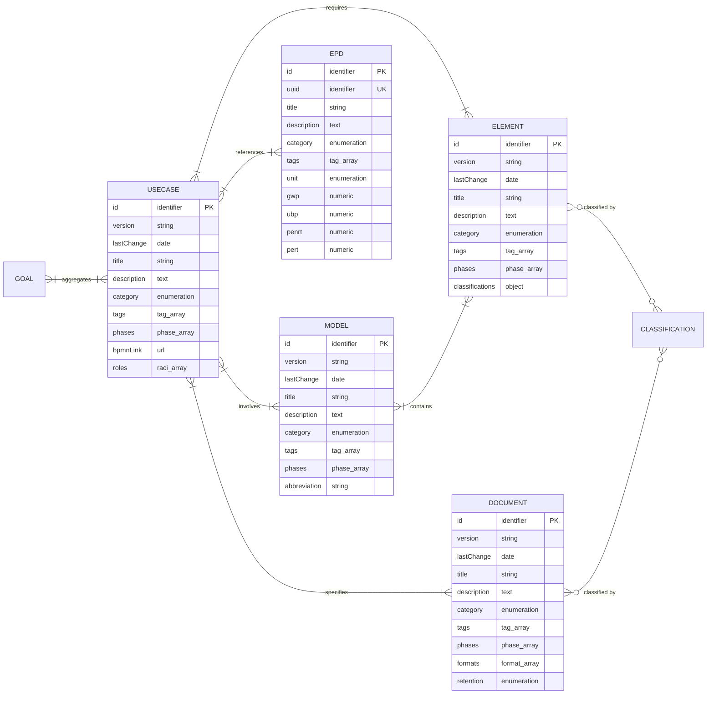

# KBOB Fachdatenkatalog – Data Model Documentation

This document describes the conceptual and logical data model for the KBOB BIM Data Catalog, a web-based interactive catalog for Building Information Modeling (BIM) requirements, classifications, and information specifications for building elements and documents in Switzerland.

---

# Table of Contents

- [1. Introduction](#1-introduction)
  - [1.1 Purpose and Goals](#11-purpose-and-goals)
  - [1.2 Strategic Alignment](#12-strategic-alignment)
  - [1.3 Design Principles](#13-design-principles)
  - [1.4 Localization](#14-localization)
- [2. Conceptual Model](#2-conceptual-model)
  - [2.1 Entity Overview](#21-entity-overview)
  - [2.2 Entity Relationships](#22-entity-relationships)
  - [2.3 Design Rationale](#23-design-rationale)
- [3. Shared Concepts](#3-shared-concepts)
  - [3.1 Common Attributes](#31-common-attributes)
  - [3.2 Lifecycle Phases](#32-lifecycle-phases)
  - [3.3 Classification Systems](#33-classification-systems)
  - [3.4 Tagging System](#34-tagging-system)
- [4. Entity Specifications](#4-entity-specifications)
  - [4.1 Element](#41-element)
  - [4.2 Document](#42-document)
  - [4.3 UseCase](#43-usecase)
  - [4.4 Model](#44-model)
  - [4.5 EPD](#45-epd)
- [5. Constraints and Rules](#5-constraints-and-rules)
  - [5.1 Identification Rules](#51-identification-rules)
  - [5.2 Integrity Rules](#52-integrity-rules)
  - [5.3 Referential Guidelines](#53-referential-guidelines)
- [Appendix A: Glossary](#appendix-a-glossary)
- [Appendix B: Changelog](#appendix-b-changelog)

---

# 1. Introduction

## 1.1 Purpose and Goals

The KBOB Fachdatenkatalog data model serves as the foundation for standardizing BIM requirements across Swiss public construction projects.

**Primary Goals:**

1. **Standardization** – Provide a consistent structure for defining BIM requirements that can be referenced in Auftraggeber-Informationsanforderungen (AIA) and BIM-Abwicklungspläne (BAP)

2. **Interoperability** – Enable data exchange through alignment with international standards (IFC, ISO 19650) and Swiss e-government architecture, supporting the federal digital transformation agenda

3. **Lifecycle Coverage** – Support all lifecycle phases from development through decommissioning, with phase-specific requirements for geometry, information, and documentation

4. **Traceability** – Maintain version history and change tracking for audit purposes in public procurement contexts

5. **Discoverability** – Enable filtering, searching, and cross-referencing across multiple classification systems and lifecycle phases

## 1.2 Strategic Alignment

This data model contributes to Swiss federal digitalization initiatives:

| Initiative | Scope | Relevance |
|------------|-------|-----------|
| [Strategie Digitale Bundesverwaltung](https://www.bk.admin.ch/bk/de/home/digitale-transformation-ikt-lenkung/digitale-bundesverwaltung.html) | Federal administration digital transformation | Foundational strategy for digital services |
| [eCH-0279 Architekturvision 2050](https://www.ech.ch/de/ech/ech-0279/1.0.0) | E-government architecture vision | Target architecture for cross-agency data exchange |
| [Strategie Digitale Schweiz – BIM-Massnahme](https://digital.swiss/de/aktionsplan/massnahme/vereinfachung-des-bauens-durch-bessere-dateninteroperabilitat) | Construction data interoperability | Action plan for simplifying construction through better data interoperability (2023–2027) |

The catalog supports the goal of establishing non-discriminatory interoperability principles that benefit all construction stakeholders, from routine task automation to end-to-end data continuity across the building lifecycle.

## 1.3 Design Principles

The data model follows these guiding principles:

| Principle | Description |
|-----------|-------------|
| **Phase-driven requirements** | All requirements (LOG, LOI, documentation) are tied to specific lifecycle phases, allowing progressive detail as projects advance |
| **Multi-classification** | Entities support multiple classification systems simultaneously to bridge Swiss, German, and international standards |
| **Separation of concerns** | Geometry (LOG), information (LOI), and documentation requirements are modeled as distinct concerns with independent phase applicability |
| **Self-describing** | Each entity carries sufficient metadata (version, lastChange, description) to be understood in isolation |
| **Extensible structure** | Nested collections (classifications, attributes, roles) allow entities to grow without schema changes |

## 1.4 Localization

**Current State:** The data model is currently implemented in German (DE) only.

**Future State:** Multi-language support for German (DE), English (EN), French (FR), and Italian (IT) is planned. Localized attributes will include `title`, `description`, controlled vocabulary values, and labels.

The underlying data structure and controlled vocabulary codes will remain language-neutral to ensure consistency across locales.

---

# 2. Conceptual Model

## 2.1 Entity Overview

The catalog manages five main entity types:

| Entity | Purpose | Key Relationships |
|--------|---------|-------------------|
| **Element** | Physical building components with geometry and information requirements | Referenced by Models; linked to Documents |
| **Document** | Project documentation types with format and retention specifications | Referenced by Elements; supports all phases |
| **UseCase** | Standardized BIM processes with roles and responsibilities | References Standards; defines workflows |
| **Model** | BIM discipline and coordination model definitions | Contains Elements; spans phases |
| **EPD** | Environmental impact data for materials (KBOB Ökobilanzdaten) | Supports sustainability analysis |

## 2.2 Entity Relationships

The data model follows ISO 19650 principles where **UseCase** serves as the central organizing entity. Use cases define both the process (descriptive, via BPMN) and the information requirements (prescriptive), linking to all other entities.

### Relationship Summary

| Relationship | Cardinality | Description |
|--------------|-------------|-------------|
| UseCase → Element | M:N | Use case defines which elements are required with specific LOG/LOI |
| UseCase → Document | M:N | Use case specifies required deliverables |
| UseCase → Model | M:N | Use case involves contributions from discipline models |
| UseCase → EPD | M:N | Sustainability use cases reference environmental data |
| Element → Document | M:N | Elements have documentation requirements |
| Element → EPD | M:N | Elements linked to environmental product declarations |
| Model → Element | M:N | Models contain/reference element types |
| Element → IFCMapping | 1:N | Element maps to IFC classes (exchange) |
| Element → RevitMapping | 1:N | Element maps to Revit categories (authoring) |
| Element → ArchicadMapping | 1:N | Element maps to Archicad tools (authoring) |

### Phase Applicability

All entities share lifecycle phases **except EPD**, which contains phase-neutral reference data:

| Entity | Has Phases | Rationale |
|--------|------------|-----------|
| UseCase | ✓ | Use cases apply to specific lifecycle phases |
| Element | ✓ | LOG/LOI requirements vary by phase |
| Document | ✓ | Delivery timing tied to phases |
| Model | ✓ | Model maturity evolves through phases |
| EPD | ✗ | Environmental data is phase-neutral reference data |

### Entity Relationship Diagram

## 2.3 Design Rationale

| Principle | Implementation |
|-----------|----------------|
| **UseCase-centric** | UseCase aggregates requirements for Elements, Documents, Models, and EPDs (ISO 19650 EIR/AIA pattern) |
| **Dual-purpose UseCase** | Prescriptive (what to deliver) + Descriptive (how to execute, via BPMN) per VDI 2552 Blatt 12.1 |
| **Phase filtering** | All entities except EPD share lifecycle phases, enabling phase-specific views |
| **Multi-system mapping** | Elements map to exchange format (IFC) and authoring tools (Revit, Archicad) |

---

# 3. Shared Concepts

## 3.1 Common Attributes

All entities share a base set of attributes for identification, versioning, and discoverability:

| Attribute | Format | Constraint | Required | Description |
|-----------|--------|------------|----------|-------------|
| `id` | String | Entity-specific pattern | ✓ | Unique identifier within entity type |
| `version` | String | – | ✓ | Version indicator for change tracking |
| `lastChange` | Date | ISO 8601 | ✓ | Date of last modification |
| `title` | String | – | ✓ | Human-readable display name |
| `image` | String | – | ✓ | Visual representation reference |
| `category` | String | Entity-specific vocabulary | ✓ | Primary grouping for filtering |
| `description` | String | – | ✓ | Detailed explanation of purpose and scope |
| `tags` | Collection[String] | Anwendungsfeld; min. 1 | ✓ | Keywords for search and filtering |
| `phases` | Collection[Integer] | 1–5 | ○ | Applicable lifecycle phases |

## 3.2 Lifecycle Phases

All phase-dependent attributes reference the lifecycle phases of a building or asset. The phase model is based on VDI 2552 Blatt 12.2, which aligns with research by Bergische Universität Wuppertal (WUP) and provides a region-neutral framework compatible with national standards.

| Phase | English | German | French | Italian | Description |
|-------|---------|--------|--------|---------|-------------|
| 1 | Development | Entwicklung | Développement | Sviluppo | Comprises project development and awarding of planning services (e.g., feasibility studies for existing buildings) |
| 2 | Planning | Planung | Planification | Progettazione | Consists of basic evaluation, preliminary planning, design planning, approval planning, and execution planning (e.g., object and specialist planning) |
| 3 | Construction | Realisierung | Réalisation | Realizzazione | Includes awarding of construction work, work preparation, construction execution, and construction acceptance (e.g., fabrication and assembly planning) |
| 4 | Operations | Betrieb | Exploitation | Gestione | Encompasses awarding of building services, operations, and use (e.g., operator responsibility) |
| 5 | Demolition | Abbruch | Déconstruction | Decostruzione | Includes demolition planning and demolition execution (e.g., decommissioning management) |

### Phase Standard Mappings

| Standard | Region | Mapping |
|----------|--------|---------|
| VDI 2552 Blatt 12.2 | DE | Primary reference for lifecycle phases |
| WUP BIM-Handlungsempfehlung | DE (region-neutral) | Research foundation |
| SIA 112 | CH | Phases 31, 32, 41–53, 61, 62 |
| HOAI | DE | Leistungsphasen 1–9 map across phases 1–3 |
| ISO 19650 | International | Information delivery stages |

### Phase Usage Rules

- Phases are represented as integers 1–5
- Phase collections indicate when an entity or requirement is applicable
- Requirements may span multiple phases or be phase-specific
- Empty phase collection implies applicability across all phases

## 3.3 Classification Systems

The catalog supports multiple classification systems to enable cross-referencing between Swiss, German, and international standards:

| System | Standard | Region | Primary Use |
|--------|----------|--------|-------------|
| eBKP-H | SN 506 511 | Switzerland | Cost planning for building construction |
| DIN 276 | DIN 276:2018 | Germany/DACH | Cost classification |
| Uniformat II | ASTM E1557 | International | Elemental cost classification |
| KBOB | Federal standard | Switzerland | Swiss federal building classification |
| IFC | ISO 16739-1:2024 | International | Open BIM data exchange |

### eBKP-H Codes

This is only an overview of the main standard.

| Code | Value (EN) | Value (DE) |
|------|------------|------------|
| A | Land/site acquisition | Grundstück |
| B | Site/surroundings | Umgebung |
| C | Shell construction | Rohbau |
| D | Building services | Technik |
| E | External wall claddings | Äussere Wandbekleidungen |
| F | Roofing | Bedachung |
| G | Interior finishes | Ausbau |
| I | Furnishings/equipment | Ausstattungen |
| V | Ancillary costs | Nebenkosten |
| W | Construction ancillary costs | Baunebenkosten |
| Y | Reserve | Reserve |
| Z | VAT | Mehrwertsteuer |

### DIN 276 Codes

This is only an overview of the main standard.
- TBD

### Uniformat II Codes

This is only an overview of the main standard.
- TBD

## 3.4 Tagging System

### Purpose

The tagging system provides a controlled vocabulary for categorizing and filtering entities across the catalog. Unlike free-form keywords, tags are drawn from a standardized set of values to ensure consistency, enable reliable filtering, and support interoperability with external BIM platforms.

### Design Goals

1. **Consistency** – All entities use the same tag vocabulary, enabling cross-entity search and filtering
2. **Interoperability** – Tag values align with VDI 2552 Blatt 12.2 to support exchange with German BIM platforms (e.g., BIM-Portal von BIM Deutschland, buildingSMART UCM)
3. **Discoverability** – Tags complement the primary `category` attribute by providing secondary classification dimensions
4. **Extensibility** – New tags may be added following the extension rules defined in VDI 2552 Blatt 12.2 Section 6.3

### Normative Reference

**VDI/DIN-EE 2552 Blatt 12.2:2024-03** – Building Information Modeling: Metadaten zur Identifikation von BIM-Anwendungsfällen

This standard defines the metadata structure for identifying BIM use cases on platforms. The `Anwendungsfeld` (application field) metadata provides the controlled vocabulary for the tagging system.

### Tag Values (Anwendungsfeld)

The following tag values are derived from VDI 2552 Blatt 12.2 Anhang B1:

| Value (EN) | Value (DE) | Description |
|------------|------------|-------------|
| Acceptance | Abnahme | Acceptance and handover processes – Use cases that utilize data for the acceptance of the overall project and/or parts of an overall project (e.g., defect and acceptance management) |
| Change Management | Änderungsmanagement | Change management – Use cases that utilize data for quantifying and qualifying changes, tracking them, and billing them if necessary (e.g., change tracking) |
| Tendering and Procurement | Ausschreibung und Vergabe | Tendering and procurement – Use cases that utilize data for preparing and creating tender and award-relevant information (e.g., specifications for construction work tendering) |
| Requirements Planning | Bedarfsplanung | Requirements planning – Use cases that utilize data for establishing project requirements and supporting site and procurement variant studies (e.g., plausibility check of quantities and masses in planning) |
| Asset Capture | Bestandserfassung | Asset capture – Use cases that capture data from assets and other relevant inventory and make it usable for data-based process steps (e.g., property capture) |
| Operations | Betrieb | Operations – Use cases that utilize data to support and/or optimize operations (e.g., energy management) |
| Documentation | Dokumentation | Documentation – Use cases implemented for documentation purposes (e.g., building documentation) |
| Approval | Genehmigung | Approval – Use cases that particularly concern the approval process (e.g., public-law review and approval) |
| Commissioning | Inbetriebnahme | Commissioning – Use cases implemented to support commissioning processes (e.g., commissioning management) |
| Coordination | Koordination | Coordination – Use cases that support coordination of services, models, project communication, etc. (e.g., coordination and integration of planning) |
| Costs | Kosten | Costs – Use cases that utilize data for determining, verifying, and optimizing costs throughout the lifecycle (e.g., cost estimation according to DIN 276) |
| Logistics | Logistik | Logistics – Use cases that utilize data to support logistics processes (e.g., logistics concept) |
| Feasibility | Machbarkeit | Feasibility – Use cases that utilize data to create a project study (e.g., feasibility study for new construction) |
| Sustainability | Nachhaltigkeit | Sustainability – Use cases that utilize data to assess and/or optimize sustainability aspects (e.g., sustainability certification) |
| Verification | Nachweise | Verification/Analysis/Expert reports – Use cases concerning the performance of verifications, expert reports, or calculations, including occupational safety verifications (e.g., dimensioning and verification) |
| Quality Assurance | Qualitätssicherung | Quality assurance – Use cases that utilize data to ensure quality in a project, including legal quality assurance (e.g., progress recording and control of construction work) |
| Risk Management | Risikomanagement | Risk management – Use cases that utilize data for identifying, assessing, controlling, and tracking risks (e.g., maintenance and inspection management) |
| Scheduling | Termine | Scheduling – Use cases that utilize data for calculating, planning, verifying schedule information and relationships (e.g., execution scheduling) |
| Variant Comparison | Variantenvergleich | Variant comparison – Use cases that utilize data to compare different variants of a scenario (e.g., planning variant comparison) |
| Insurance | Versicherung | Insurance – Use cases that support the implementation of insurance processes (e.g., building documentation) |
| Visualization | Visualisierung | Visualization – Use cases that utilize data for graphical representation and/or analysis (e.g., visualization of object and specialist planning) |
| Other | Sonstiges | Other – Use cases that cannot be assigned to any other application field |

### Application Rules

1. **Minimum Requirement** – Every entity must have at least one tag assigned
2. **Multiple Tags** – Entities may have multiple tags when applicable to several application fields
3. **Primary vs. Secondary** – The `category` attribute defines the primary classification; tags provide supplementary classification
4. **Consistency Across Entities** – The same tag vocabulary applies to Elements, Documents, UseCases, Models, and EPDs
5. **Extension Policy** – Custom tags outside the VDI vocabulary should be avoided; if necessary, use "Sonstiges" or propose additions through governance process

### Relationship to VDI 2552 Metadata

The tagging system implements the `Anwendungsfeld` metadata from VDI 2552 Blatt 12.2. Other VDI metadata map to catalog attributes as follows:

| VDI 2552 Metadata | Catalog Attribute | Notes |
|-------------------|-------------------|-------|
| Bezeichnung | `title` | Display name |
| Beschreibung | `description` | Detailed description |
| Version | `version` | Version indicator |
| Datum der Veröffentlichung | `lastChange` | Last modification date |
| Anwendungsfeld | `tags` | Controlled vocabulary (this section) |
| Lebenszyklusphase | `phases` | Maps to WUP/VDI phases |
| DOI | – | Not implemented (future consideration) |
| Autoren | – | Not implemented |
| Verantwortliche Institution | – | Not implemented |

---

# 4. Entity Specifications

## 4.1 Element

### Overview

**Purpose:** Represents physical building components with their geometry requirements (LOG), information requirements (LOI), and documentation needs across project phases.

**Intent:** Enable consistent specification of what geometric detail, attribute data, and supporting documents are required for each building element at each project phase.

### Attributes

| Attribute | Format | Constraint | Required | Description |
|-----------|--------|------------|----------|-------------|
| `id` | String | `e{n}` | ✓ | Unique identifier (e.g., e1, e15) |
| `version` | String | – | ✓ | Version indicator for change tracking |
| `lastChange` | Date | ISO 8601 | ✓ | Date of last modification |
| `title` | String | – | ✓ | Human-readable display name |
| `image` | String | – | ✓ | Visual representation reference |
| `category` | String | ElementCategory | ✓ | Discipline grouping |
| `description` | String | – | ✓ | Detailed explanation of purpose and scope |
| `tags` | Collection[String] | Anwendungsfeld; min. 1 | ✓ | Keywords for search and filtering |
| `phases` | Collection[Integer] | 1–5 | ○ | Applicable lifecycle phases |
| `classifications` | Object | – | ○ | Codes from multiple classification systems |
| `ifcMapping` | Collection[IFCMapping] | – | ○ | Mappings to IFC classes and authoring tools |
| `geometry` | Collection[GeometryRequirement] | – | ✓ | LOG specifications per phase |
| `information` | Collection[InformationRequirement] | – | ✓ | LOI specifications per phase |
| `documentation` | Collection[DocumentationRequirement] | – | ○ | Required documents per phase |

### Nested Structures

#### IFC Mapping

| Attribute | Format | Constraint | Required | Description |
|-----------|--------|------------|----------|-------------|
| `element` | String | – | ✓ | Element variant description |
| `ifc` | String | IFC 4.3 schema | ✓ | IFC class and predefined type |
| `revit` | String | – | ○ | Revit family/category mapping |
| `archicad` | String | – | ○ | ArchiCAD object mapping |

#### Geometry Requirement (LOG)

| Attribute | Format | Constraint | Required | Description |
|-----------|--------|------------|----------|-------------|
| `name` | String | – | ✓ | Geometry property name |
| `desc` | String | – | ✓ | Description of the requirement |
| `phases` | Collection[Integer] | 1–5 | ✓ | Phases where this geometry is required |

#### Information Requirement (LOI)

| Attribute | Format | Constraint | Required | Description |
|-----------|--------|------------|----------|-------------|
| `name` | String | – | ✓ | Property name |
| `desc` | String | – | ✓ | Description and purpose |
| `format` | String | DataFormat | ✓ | Data type |
| `list` | Boolean | – | ✓ | Whether value comes from controlled vocabulary |
| `phases` | Collection[Integer] | 1–5 | ✓ | Phases where this information is required |
| `ifc` | String | IFC 4.3 schema | ○ | IFC PropertySet and property reference |

#### Documentation Requirement

| Attribute | Format | Constraint | Required | Description |
|-----------|--------|------------|----------|-------------|
| `name` | String | – | ✓ | Document type name |
| `desc` | String | – | ✓ | Description and purpose |
| `phases` | Collection[Integer] | 1–5 | ✓ | Phases where this document is required |

### Controlled Vocabularies

#### ElementCategory

Element categories are organized by discipline/domain to align with typical BIM model structures:

| Value (EN) | Value (DE) | Description |
|------------|------------|-------------|
| Architecture | Architektur | Architectural elements (windows, doors, walls, roofs, facades) |
| Structure | Tragwerk | Structural elements (columns, beams, slabs, foundations, reinforcement) |
| MEP HVAC | Gebäudetechnik HLKS | HVAC and plumbing elements (heating, ventilation, cooling, sanitary) |
| MEP Electrical | Gebäudetechnik Elektro | Electrical elements (power distribution, lighting, building automation) |
| Interior Finishes | Ausbau | Interior finishing (floors, ceilings, partitions, furnishings) |
| Site | Umgebung | Site elements (landscaping, paving, external infrastructure) |
| Fire Protection | Brandschutz | Fire protection elements (fire compartments, fire stops, sprinklers) |
| Vertical Transport | Transportanlagen | Vertical transport (elevators, escalators, lifts) |

#### DataFormat

| Value | Description |
|-------|-------------|
| Real | Floating-point number |
| String | Text value |
| Boolean | True/false value |
| Integer | Whole number |
| Date | Date value |

---

## 4.2 Document

### Overview

**Purpose:** Represents project documentation types with their format requirements and retention policies according to the KBOB/IPB Bauwerksdokumentation im Hochbau standard.

**Intent:** Standardize document management across BIM projects by defining what formats are acceptable, how long documents must be retained, and when in the project lifecycle they are relevant.

**Normative Reference:** KBOB/IPB Empfehlung "Bauwerksdokumentation im Hochbau" – Dokumentationsmodell BWD – Dokumenttypenkatalog (Anhang C), Version 2016-01

### Attributes

| Attribute | Format | Constraint | Required | Description |
|-----------|--------|------------|----------|-------------|
| `id` | String | `{O\|K\|B\|V}{nnnnn}` | ✓ | Unique identifier (e.g., O01001, K02003) |
| `version` | String | – | ✓ | Version indicator for change tracking |
| `lastChange` | Date | ISO 8601 | ✓ | Date of last modification |
| `title` | String | – | ✓ | Human-readable display name |
| `image` | String | – | ✓ | Visual representation reference |
| `category` | String | DocumentCategory | ✓ | Document category per KBOB |
| `description` | String | – | ✓ | Detailed explanation of purpose and scope |
| `tags` | Collection[String] | Anwendungsfeld; min. 1 | ✓ | Keywords for search and filtering |
| `phases` | Collection[Integer] | 1–5 | ○ | Applicable lifecycle phases |
| `formats` | Collection[String] | FileFormat | ✓ | Acceptable file formats |
| `retention` | String | RetentionPolicy | ✓ | Retention policy |
| `documentationType` | String | DocumentationType | ○ | Type of documentation |
| `qualityGuideline` | String | QualityGuideline | ○ | Applicable quality standard |
| `classifications` | Object | – | ○ | Optional classification codes |

### Controlled Vocabularies

#### DocumentCategory

Document categories follow the KBOB/IPB Bauwerksdokumentation structure:

| Code | Value (EN) | Value (DE) | Description |
|------|------------|------------|-------------|
| O | Organisation | Organisation | Project and operations organization documents |
| K | Contracts and Costs | Verträge und Kosten | Commercial and contractual documents |
| B | Concepts and Descriptions | Konzepte und Beschriebe | Planning concepts and technical descriptions |
| V | Visualizations | Visualisierungen | Plans, drawings, and visual representations |

#### FileFormat

| Value (EN) | Value (DE) | Description |
|------------|------------|-------------|
| PDF-A | PDF-A | Archival PDF for long-term preservation |
| PDF | PDF | Standard PDF for general documents |
| Office Format | Office-Format | Editable office documents (Word, Excel, PowerPoint) |
| DWG | DWG | CAD drawings (AutoCAD format) |
| IFC | IFC | Industry Foundation Classes model files |
| BCF | BCF | BIM Collaboration Format for issues |
| Native | Native | Original authoring application format |
| Other | andere | Other formats as specified |

#### RetentionPolicy

| Value (EN) | Value (DE) | Description |
|------------|------------|-------------|
| No retention | keine Aufbewahrung | No retention required |
| 5 years | 5 Jahre | 5 years from creation |
| 12 years | 12 Jahre | 12 years from creation (legal requirement) |
| Until replacement | bis Ersatz | Until superseded by newer version |
| Until purpose fulfilled | bis Bearbeitungszweck entfällt | Until processing purpose no longer applies |
| Building lifecycle | Gebäudelebensdauer | Entire building lifecycle |

#### QualityGuideline

| Value (EN) | Value (DE) | Description |
|------------|------------|-------------|
| CAD Guideline | CAD-Richtlinie | CAD standard compliance required |
| CAFM Guideline | CAFM-Richtlinie | CAFM system compatibility required |
| BIM Guideline | BIM-Richtlinie | BIM standard compliance required |

---

## 4.3 UseCase

### Overview

**Purpose:** Defines standardized BIM processes with roles, responsibilities, inputs, outputs, and quality criteria according to VDI 2552 Blatt 12.1 and 12.2.

**Intent:** Provide actionable process definitions that can be adopted in BAP documents, ensuring consistent implementation of BIM workflows across projects with clear accountability through RACI matrices.

**Normative References:**
- VDI/DIN-EE 2552 Blatt 12.1:2022-10 – Building Information Modeling; Struktur zu Beschreibung von BIM-Anwendungsfällen
- VDI/DIN-EE 2552 Blatt 12.2:2024-03 – Building Information Modeling; Metadaten zur Identifikation von BIM-Anwendungsfällen

### Attributes

| Attribute | Format | Constraint | Required | Description |
|-----------|--------|------------|----------|-------------|
| `id` | String | `uc{nnn}` | ✓ | Unique identifier (e.g., uc001, uc030) |
| `version` | String | – | ✓ | Version indicator for change tracking |
| `lastChange` | Date | ISO 8601 | ✓ | Date of last modification |
| `title` | String | – | ✓ | Human-readable display name |
| `image` | String | – | ✓ | Visual representation reference |
| `category` | String | UseCaseCategory | ✓ | Use case category per VDI 2552 Blatt 12.2 |
| `description` | String | – | ✓ | Detailed explanation of purpose and scope |
| `tags` | Collection[String] | Anwendungsfeld; min. 1 | ✓ | Keywords for search and filtering |
| `phases` | Collection[Integer] | 1–5 | ○ | Applicable lifecycle phases |
| `definition` | String | – | ✓ | Formal definition of the use case |
| `goals` | Collection[String] | min. 1 | ✓ | Objectives |
| `inputs` | Collection[String] | – | ✓ | Required inputs and preconditions |
| `outputs` | Collection[String] | – | ✓ | Deliverables and results |
| `roles` | Collection[RoleDefinition] | – | ✓ | RACI responsibility matrix |
| `prerequisites` | Object | – | ✓ | Requirements for client and contractor |
| `implementation` | Collection[String] | – | ✓ | Implementation steps |
| `qualityCriteria` | Collection[String] | – | ✓ | Acceptance and quality criteria |
| `standards` | Collection[String] | – | ○ | Referenced standards (SIA, ISO) |
| `process_url` | String | URL | ○ | Link to BPMN process diagram |

### Nested Structures

#### Role Definition (RACI)

| Attribute | Format | Constraint | Required | Description |
|-----------|--------|------------|----------|-------------|
| `actor` | String | – | ✓ | Role name (e.g., BIM-Manager, Projektleiter) |
| `responsible` | Collection[String] | – | ○ | Tasks this role performs (R) |
| `contributing` | Collection[String] | – | ○ | Tasks this role contributes to (A/C) |
| `informed` | Collection[String] | – | ○ | Information this role receives (I) |

#### Prerequisites

| Attribute | Format | Constraint | Required | Description |
|-----------|--------|------------|----------|-------------|
| `client` | Collection[String] | – | ✓ | Client prerequisites |
| `contractor` | Collection[String] | – | ✓ | Contractor prerequisites |

### Controlled Vocabularies

#### UseCaseCategory

Use case categories align with the Anwendungsfeld metadata from VDI 2552 Blatt 12.2:

| Value (EN) | Value (DE) | Description |
|------------|------------|-------------|
| Acceptance | Abnahme | Use cases for project/partial acceptance processes |
| Change Management | Änderungsmanagement | Use cases for change tracking, quantification, and billing |
| Tendering and Procurement | Ausschreibung und Vergabe | Use cases for tender preparation and award processes |
| Requirements Planning | Bedarfsplanung | Use cases for project requirements and variant studies |
| Asset Capture | Bestandserfassung | Use cases for capturing existing conditions and assets |
| Operations | Betrieb | Use cases supporting building operations and optimization |
| Documentation | Dokumentation | Use cases for documentation and archiving purposes |
| Approval | Genehmigung | Use cases concerning approval and permit processes |
| Commissioning | Inbetriebnahme | Use cases supporting commissioning processes |
| Coordination | Koordination | Use cases for coordinating deliverables, models, communication |
| Costs | Kosten | Use cases for cost estimation, verification, optimization |
| Logistics | Logistik | Use cases supporting logistics processes |
| Feasibility | Machbarkeit | Use cases for feasibility studies and project studies |
| Sustainability | Nachhaltigkeit | Use cases for sustainability assessment and optimization |
| Verification | Nachweise | Use cases for analysis, calculations, expert reports |
| Quality Assurance | Qualitätssicherung | Use cases for quality assurance and progress control |
| Risk Management | Risikomanagement | Use cases for risk identification, assessment, tracking |
| Scheduling | Termine | Use cases for schedule planning and verification |
| Variant Comparison | Variantenvergleich | Use cases for comparing design alternatives |
| Insurance | Versicherung | Use cases supporting insurance processes |
| Visualization | Visualisierung | Use cases for graphical representation and analysis |
| Other | Sonstiges | Use cases not fitting other categories |

#### InformationExchangeRole

The `informationProvider` and `informationRequester` attributes use the following role values per VDI 2552 Blatt 12.2 Anhang B2:

| Value (EN) | Value (DE) | Description |
|------------|------------|-------------|
| Asset Management | Asset Management | Commercial property management |
| Construction Execution | Bauausführung | Contractors responsible for site setup and operations |
| Client/Owner | Bauherren-/Eigentümerschaft | Party commissioning the project economically and technically |
| Controlling | Controlling | Measure planning, actual data capture, variance analysis |
| Specialist Planning | Fachplanung | Planning offices for structure, MEP, building physics, fire protection, etc. |
| Facility Management | Facility Management | Building, system, and facility management and organization |
| Project Management | Projektmanagement | Non-delegable client-side leadership functions |
| Project Control | Projektsteuerung | Delegable client functions per AHO (consulting, coordination, control) |
| Property Management | Property Management | Technical property management |
| Building Users | Nutzerschaft | Parties using the building for their core activities |
| Object Planning | Objektplanung | Architectural services per HOAI Annex 10 |
| Surveying | Vermessung | Measurement capture of areas, plots, or infrastructure |
| Review Authority | Prüfende Instanz | Building authorities, expert reviewers, fire department, etc. |
| Certification | Zertifizierung | Conformity verification with certification systems |

---

## 4.4 Model

### Overview

**Purpose:** Represents BIM model types including discipline models, coordination models, and special-purpose models organized by construction domain.

**Intent:** Define the scope and content of different model types to clarify responsibilities and expected deliverables in multi-discipline BIM projects across various construction domains (building construction, civil engineering, infrastructure).

### Attributes

| Attribute | Format | Constraint | Required | Description |
|-----------|--------|------------|----------|-------------|
| `id` | String | `m{n}` | ✓ | Unique identifier (e.g., m1, m10) |
| `version` | String | – | ✓ | Version indicator for change tracking |
| `lastChange` | Date | ISO 8601 | ✓ | Date of last modification |
| `title` | String | – | ✓ | Human-readable display name |
| `image` | String | – | ✓ | Visual representation reference |
| `category` | String | ModelCategory | ✓ | Model category |
| `description` | String | – | ✓ | Detailed explanation of purpose and scope |
| `tags` | Collection[String] | Anwendungsfeld; min. 1 | ✓ | Keywords for search and filtering |
| `phases` | Collection[Integer] | 1–5 | ○ | Applicable lifecycle phases |
| `abbreviation` | String | – | ✓ | Standard abbreviation (e.g., HOH - ARCH) |
| `elements` | Collection[ModelElement] | – | ✓ | Element types contained in model |
| `classifications` | Object | – | ○ | Optional classification codes |

### Nested Structures

#### Model Element

| Attribute | Format | Constraint | Required | Description |
|-----------|--------|------------|----------|-------------|
| `name` | String | – | ✓ | Element type name |
| `description` | String | – | ○ | Element description and scope |
| `phases` | Collection[Integer] | 1–5 | ○ | Phases where element appears in model |

### Controlled Vocabularies

#### ModelCategory

Model categories organize BIM models by their purpose and scope:

| Value (EN) | Value (DE) | Description |
|------------|------------|-------------|
| Discipline Models | Fachmodelle | Single-discipline BIM models (architecture, structure, MEP, etc.) |
| Coordination | Koordination | Merged coordination models for clash detection and model integration |
| Special Models | Spezialmodelle | Purpose-specific models (fire protection, excavation, etc.) |
| As-Built | Bestand | Digital twin of completed building for operations and maintenance |

### Reference: Model Types by Construction Domain

Beyond the category, models can be further classified by their construction domain. This reference information describes typical model types used in different construction sectors:

#### General (Allgemein)

| Value (EN) | Value (DE) | Description |
|------------|------------|-------------|
| General Coordination Model | Allgemeines Koordinationsmodell | General coordination model with project origin and georeferencing (WGS84) |
| Terrain Model | Geländemodell | Topography model including cadastral data |
| Scan Model | Scanmodell | Point cloud data |
| Context Model | Umgebungsmodell | Surrounding context (e.g., from 4D city model) |
| Construction Area Model | Baubereichs-/Bauperimetermodell | Construction area envelope per phasing |

#### Building Construction (Hochbau)

| Value (EN) | Value (DE) | Description |
|------------|------------|-------------|
| Building Coordination Model | Hochbau Koordinationsmodell | Building coordination model |
| Architectural Model | Architekturmodell | Architectural design model |
| Structural Model | Tragwerksmodell | Structural model |
| Openings Model | Aussparungsmodell | Openings and penetrations |
| Room Model | Raummodell | Room/space model |
| Fire Protection Model | Brandschutzmodell | Fire protection model |
| Ventilation Model | Lüftungsmodell | Ventilation systems |
| Heating Model | Heizungsmodell | Heating systems |
| Sanitary Model | Sanitärmodell | Sanitary systems |
| Electrical Model | Elektromodell | Electrical systems |

#### Utilities (Werkleitungen)

| Value (EN) | Value (DE) | Description |
|------------|------------|-------------|
| Utility Coordination Model | Werkleitung Koordinationsmodell | Utility coordination model |
| Water Supply Model | Wasserversorgungsmodell | Water supply |
| Sewage Model | Abwasserleitungsmodell | Sewage/drainage |
| Power Distribution Model | Elektroversorungsmodell | Power distribution |
| Gas Supply Model | Gasversorgungsmodell | Gas supply |
| District Heating Model | Fernwärmeversorgungsmodell | District heating |
| Street Lighting Model | Beleuchtungsmodell | Street lighting |

---

## 4.5 EPD

### Overview

**Purpose:** Contains environmental impact data for construction materials according to KBOB Ökobilanzdaten standards.

**Intent:** Enable sustainability analysis and life cycle assessment (LCA) by providing standardized environmental indicators for materials, supporting compliance with Swiss sustainability requirements.

**Note:** EPD is the only entity without `phases` as environmental data is phase-neutral reference data.

### Attributes

| Attribute | Format | Constraint | Required | Description |
|-----------|--------|------------|----------|-------------|
| `id` | String | `kbob-{nn}-{nnn}` | ✓ | Unique identifier (e.g., kbob-01-042) |
| `uuid` | String | UUID v4 | ✓ | Universal unique identifier for external reference |
| `version` | String | – | ✓ | Version indicator for change tracking |
| `lastChange` | Date | ISO 8601 | ✓ | Date of last modification |
| `title` | String | – | ✓ | Human-readable display name |
| `image` | String | – | ✓ | Visual representation reference |
| `category` | String | EPDCategory | ✓ | Material category |
| `subcategory` | String | – | ✓ | Specific material group |
| `description` | String | – | ✓ | Detailed explanation of purpose and scope |
| `tags` | Collection[String] | Anwendungsfeld; min. 1 | ✓ | Keywords for search and filtering |
| `unit` | String | ReferenceUnit | ✓ | Functional/reference unit |
| `gwp` | Double | ≥ 0 | ✓ | Global Warming Potential (kg CO₂-eq) |
| `ubp` | Double | ≥ 0 | ✓ | Umweltbelastungspunkte (Points) |
| `penrt` | Double | ≥ 0 | ✓ | Primary Energy Non-Renewable Total (MJ) |
| `pert` | Double | ≥ 0 | ✓ | Primary Energy Renewable Total (MJ) |
| `density` | String | – | ○ | Material density |
| `biogenicCarbon` | Double | – | ○ | Biogenic carbon content |

### Controlled Vocabularies

#### EPDCategory

| Value (EN) | Value (DE) | Typical Subcategories |
|------------|------------|----------------------|
| Building Materials | Baumaterialien | Beton, Mauerwerk, Holz, Metall, Dämmstoffe, Glas |
| Energy | Energie | Strom, Wärme, Kälte |
| Building Services | Gebäudetechnik | Heizung, Lüftung, Sanitär, Elektro |
| Transport | Transporte | LKW, Bahn, Schiff |

#### ReferenceUnit

| Value | Description |
|-------|-------------|
| kg | Mass (kilograms) |
| m² | Area (square meters) |
| m³ | Volume (cubic meters) |
| m | Length (meters) |
| kWh | Energy (kilowatt-hours) |
| MJ | Energy (megajoules) |
| Stk | Pieces/units |

### Environmental Indicators Reference

| Indicator | Unit | Description |
|-----------|------|-------------|
| GWP | kg CO₂-eq | Global Warming Potential – climate change impact |
| UBP | Points | Swiss ecological scarcity method – overall environmental impact |
| PENRT | MJ | Primary Energy Non-Renewable Total – fossil energy demand |
| PERT | MJ | Primary Energy Renewable Total – renewable energy demand |

---

# 5. Constraints and Rules

## 5.1 Identification Rules

| Entity | Pattern | Example | Rule |
|--------|---------|---------|------|
| Element | `e{n}` | e1, e15 | Unique within Elements |
| Document | `{O\|K\|B\|V}{nnnnn}` | O01001, K02003 | First letter indicates KBOB category |
| UseCase | `uc{nnn}` | uc001, uc030 | Sequential numbering |
| Model | `m{n}` | m1, m10 | Unique within Models |
| EPD | `kbob-{nn}-{nnn}` | kbob-01-042 | Aligned with KBOB database |

## 5.2 Integrity Rules

1. **Version Consistency** – When an entity is modified, `version` and `lastChange` must both be updated

2. **Phase Validity** – All phase values must be integers between 1 and 5 inclusive

3. **Phase Inheritance** – Nested requirements (geometry, information, documentation) may only reference phases that are included in the parent entity's phase collection

4. **Tag Requirement** – Every entity must have at least one tag from the controlled vocabulary (see [3.4 Tagging System](#34-tagging-system))

5. **Classification Consistency** – Classification codes should be valid within their respective systems (e.g., eBKP-H codes should follow SN 506 511 structure)

6. **IFC Mapping Validity** – IFC class references should conform to IFC 4.3 schema

7. **Document Category Alignment** – Document IDs must use the correct category letter prefix (O, K, B, V) matching the assigned category

8. **UseCase Category Alignment** – UseCase categories must be valid Anwendungsfeld values per VDI 2552 Blatt 12.2

## 5.3 Referential Guidelines

1. **Model-Element Relationship** – Model element names should correspond to defined Element titles where applicable

2. **Document References** – Element documentation requirements should align with defined Document types

3. **Role Consistency** – UseCase role names should be consistent across use cases to enable cross-referencing

4. **Standard References** – Referenced standards should use official designations (e.g., "SIA 2051", "ISO 19650-1", "VDI 2552 Blatt 12.2")

5. **Model Category Consistency** – Model category values must be one of the defined categories (Discipline Models, Coordination, Special Models, As-Built)

---

# Appendix A: Glossary

| Acronym | Term (EN) | Term (DE) | Description |
|---------|-----------|-----------|-------------|
| AIA | Client Information Requirements | Auftraggeber-Informationsanforderungen | Client information requirements document |
| – | Application Field | Anwendungsfeld | VDI 2552 Blatt 12.2 metadata for categorizing BIM use cases |
| BAP | BIM Execution Plan | BIM-Abwicklungsplan | BIM execution plan |
| eCH | eCH E-Government Standards | eCH E-Government Standards | Swiss e-government standardization body |
| EPD | Environmental Product Declaration | Umweltproduktdeklaration | Environmental Product Declaration |
| GWP | Global Warming Potential | Treibhauspotenzial | Climate change impact indicator |
| HOAI | Fee Structure for Architects and Engineers | Honorarordnung für Architekten und Ingenieure | German fee structure for architects and engineers, defines service phases (Leistungsphasen) |
| IFC | Industry Foundation Classes | Industry Foundation Classes | Open standard for BIM data exchange |
| – | Information Provider | Informationsbereitstellende | Role providing use case/project-relevant information (ISO 19650-1) |
| – | Information Requester | Informationsbestellende | Role commissioning and receiving use case/project-relevant information (ISO 19650-1) |
| KBOB | Coordination Conference of Swiss Public Sector Construction and Property Services | Koordinationskonferenz der Bau- und Liegenschaftsorgane der öffentlichen Bauherren | Swiss federal building and property coordination body |
| LOG | Level of Geometry | Level of Geometry | Geometric detail requirements |
| LOI | Level of Information | Level of Information | Attribute/property requirements |
| RACI | Responsible, Accountable, Consulted, Informed | Responsible, Accountable, Consulted, Informed | Responsibility assignment matrix |
| SIA | Swiss Society of Engineers and Architects | Schweizerischer Ingenieur- und Architektenverein | Swiss standards body, defines Swiss lifecycle phases (SIA 112) |
| UBP | Environmental Impact Points | Umweltbelastungspunkte | Swiss ecological scarcity method indicator |
| VDI 2552 | VDI Guideline 2552 | VDI-Richtlinie 2552 | German BIM standard series by Verein Deutscher Ingenieure |
| WUP | University of Wuppertal | Bergische Universität Wuppertal | Source of region-neutral lifecycle phases used in this model |

---

# Appendix B: Changelog

| Version | Date | Changes |
|---------|------|---------|
| 2.1 | – | Renamed "Enumeration" column to "Constraint" across all attribute tables; added specific constraint patterns for ID fields (e{n}, uc{nnn}, m{n}, etc.); added ISO 8601 constraint for date fields; added range constraints (1–5) for phase fields; added minimum cardinality constraints (min. 1) where applicable; added schema constraints (IFC 4.3, UUID v4) for reference fields; added value range constraints (≥ 0) for numeric environmental indicators; standardized all controlled vocabulary tables to consistent column order: Value (EN) \| Value (DE) \| Description; fixed eBKP-H Codes table column order; added EN/DE columns to Tag Values (Anwendungsfeld) table; added EN/DE columns to Model Types reference tables (Allgemein, Hochbau, Werkleitungen); fixed mixed-language descriptions in Prerequisites structure |
| 2.0 | – | Complete document restructure: reorganized into Introduction, Conceptual Model, Shared Concepts, Entity Specifications, Constraints and Rules, and Appendices; standardized all entity attribute tables with consistent Format/Constraint columns; unified entity specification template (Overview, Attributes, Nested Structures, Controlled Vocabularies); moved Glossary and Changelog to appendices |
| 1.4 | – | Changed Model entity attribute from `domain` to `category` for consistency with shared attributes across all entities; Updated Model Categories to match actual data values (Fachmodelle, Koordination, Spezialmodelle, Bestand); Retained construction domain reference information as supplementary classification |
| 1.3 | – | Updated Document categories to KBOB/IPB Dokumenttypenkatalog structure (O, K, B, V); Updated UseCase categories to VDI 2552 Blatt 12.2 Anwendungsfeld values (22 categories); Added VDI 2552 information exchange roles (Informationsbereitstellende/Informationsbestellende); Updated Model entity to use domain-based categorization with 14 construction domains; Enhanced lifecycle phases section with VDI 2552 Blatt 12.2 descriptions; Expanded tagging system descriptions per VDI 2552 Blatt 12.2 Anhang B1; Added documentation types and quality requirements for Documents |
| 1.2 | – | Added Tagging System section based on VDI 2552 Blatt 12.2; renamed Project Phases to Lifecycle Phases with WUP/SIA/HOAI references and multi-language support; added Localization section; added Strategic Alignment with Swiss digital transformation initiatives; expanded eBKP-H codes to complete list; comprehensive Entity Relationship Diagram update with ISO 19650-aligned UseCase-centric model, software mappings (IFC, Revit, Archicad), and relationship documentation |
| 1.1 | – | Restructured as conceptual model; added goals, principles, business rules |
| 1.0 | – | Initial documentation |
