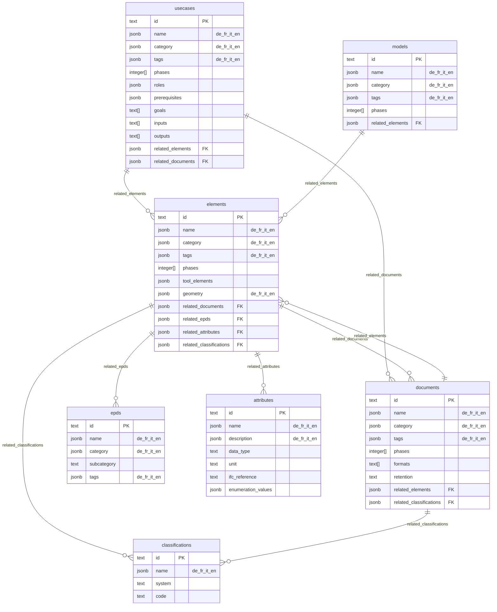

# KBOB Fachdatenkatalog – Database Schema Design

## Project Overview

**Repository**: [kbob-fdk](https://github.com/davras5/kbob-fdk)
**Database**: PostgreSQL on Supabase
**Purpose**: Interactive catalog for BIM requirements, classifications, and information specifications for building elements and documents in Switzerland.
**Validation Sources**: VDI 2552 Blatt 12.1/12.2, ISO 19650, KBOB/IPB Bauwerksdokumentation, IFC 4.3

---

## Entity Relationship Overview

### Core Tables

| Entity | Primary Key | Has Phases | Description |
|--------|-------------|------------|-------------|
| `elements` | `id` (text) | ✓ | Physical building components with LOG requirements |
| `documents` | `id` (text) | ✓ | Project documentation types per KBOB/IPB standard |
| `usecases` | `id` (text) | ✓ | Standardized BIM processes per VDI 2552 |
| `models` | `id` (text) | ✓ | BIM discipline and coordination model definitions |
| `epds` | `id` (text) | ✗ | Environmental impact data (KBOB Ökobilanzdaten) |
| `attributes` | `id` (text) | ✗ | Reusable property definitions (length, fire rating, material, etc.) |
| `classifications` | `id` (text) | ✗ | Classification codes (eBKP-H, DIN 276, Uniformat II, etc.) |

> **Note on phases:** EPD, attributes, and classifications are phase-neutral reference data. Phase applicability is defined in the relationship.

### Relationships (JSONB)

Relationships between entities are stored as JSONB arrays on the parent entity. This keeps queries simple and avoids junction tables.

| Entity | Field | References | Structure |
|--------|-------|------------|-----------|
| `usecases` | `related_elements` | elements | `[{"id": "e1", "phases": [2,3]}]` |
| `usecases` | `related_documents` | documents | `[{"id": "O01001", "required": true}]` |
| `elements` | `related_documents` | documents | `[{"id": "O01001", "phases": [3,4,5]}]` |
| `elements` | `related_epds` | epds | `[{"id": "kbob-01-042"}]` |
| `elements` | `related_attributes` | attributes | `[{"id": "attr-fire-rating", "phases": [3,4,5]}]` |
| `elements` | `related_classifications` | classifications | `[{"id": "ebkp-c02"}]` |
| `documents` | `related_elements` | elements | `[{"id": "e1"}]` |
| `documents` | `related_classifications` | classifications | `[{"id": "ebkp-c02"}]` |
| `models` | `related_elements` | (embedded) | `[{"name": "Wand", "phases": [2,3,4]}]` |



---

## Shared Attributes

All five core entities share a common set of attributes for identification, versioning, and discoverability.

### Common Attributes (All Entities)

| Column | Type | Constraints | Description |
|--------|------|-------------|-------------|
| `id` | `text` | `PRIMARY KEY` | Unique identifier (entity-specific pattern) |
| `version` | `text` | `NOT NULL` | Version indicator for change tracking |
| `last_change` | `date` | `NOT NULL` | Date of last modification (ISO 8601) |
| `name` | `jsonb` | `NOT NULL` | Human-readable display name (i18n: de, fr, it, en) |
| `image` | `text` | | Visual representation reference (URL or path) |
| `category` | `jsonb` | `NOT NULL` | Primary grouping (i18n: de, fr, it, en) |
| `description` | `text` | | Detailed explanation of purpose and scope |
| `tags` | `jsonb` | `NOT NULL DEFAULT '[]'` | Anwendungsfeld keywords (i18n array: de, fr, it, en) |
| `created_at` | `timestamptz` | `NOT NULL DEFAULT now()` | Record creation timestamp |
| `updated_at` | `timestamptz` | `NOT NULL DEFAULT now()` | Record last update timestamp (auto-updated) |

### Phase-Dependent Entities

All entities **except EPD** include lifecycle phases:

| Column | Type | Constraints | Description |
|--------|------|-------------|-------------|
| `phases` | `integer[]` | `CHECK (phases <@ ARRAY[1,2,3,4,5])` | Applicable lifecycle phases (1-5) |

> **Note:** EPD contains phase-neutral reference data (environmental indicators don't vary by project phase).

### ID Patterns

| Entity | Pattern | Example | Regex |
|--------|---------|---------|-------|
| elements | `e{n}` | e1, e81 | `^e[0-9]+$` |
| documents | `{O\|K\|B\|V}{nnnnn}` | O01001, K02003 | `^[OKBV][0-9]{5}$` |
| usecases | `uc{nnn}` | uc000, uc280 | `^uc[0-9]{3}$` |
| models | `m{n}` | m1, m10 | `^m[0-9]+$` |
| epds | `kbob-{nn}-{nnn}` | kbob-01-042 | `^kbob-[0-9]{2}-[0-9]{3}$` |
| attributes | `attr-{name}` | attr-fire-rating | `^attr-[a-z0-9-]+$` |
| classifications | `{system}-{code}` | ebkp-c02, din276-kg466 | varies by system |

---

## Entity-Specific Attributes

### elements

Physical building components with geometry (LOG) requirements.

| Column | Type | Constraints | Description |
|--------|------|-------------|-------------|
| `geometry` | `jsonb` | `NOT NULL DEFAULT '[]'` | LOG specifications per phase (i18n: de, fr, it, en) |
| `tool_elements` | `jsonb` | `DEFAULT '[]'` | Mappings to IFC classes and authoring tools (Revit, ArchiCAD, etc.) |
| `related_documents` | `jsonb` | `DEFAULT '[]'` | Links to documents `[{"id": "O01001", "phases": [3,4,5]}]` |
| `related_epds` | `jsonb` | `DEFAULT '[]'` | Links to EPDs `[{"id": "kbob-01-042"}]` |
| `related_attributes` | `jsonb` | `DEFAULT '[]'` | Links to attributes `[{"id": "attr-fire-rating", "phases": [3,4,5]}]` |
| `related_classifications` | `jsonb` | `DEFAULT '[]'` | Links to classifications `[{"id": "ebkp-c02"}]` |

**Category values:** Architektur, Tragwerk, Gebäudetechnik HLKS, Gebäudetechnik Elektro, Ausbau, Umgebung, Brandschutz, Transportanlagen

---

### documents

Project documentation types with format requirements and retention policies per KBOB/IPB Bauwerksdokumentation.

| Column | Type | Constraints | Description |
|--------|------|-------------|-------------|
| `formats` | `text[]` | `NOT NULL` | Acceptable file formats (PDF-A, Office-Format, DWG, IFC, etc.) |
| `retention` | `text` | | Retention policy (5 Jahre, 12 Jahre, bis Ersatz, etc.) |
| `related_elements` | `jsonb` | `DEFAULT '[]'` | Links to elements `[{"id": "e1"}]` |
| `related_classifications` | `jsonb` | `DEFAULT '[]'` | Links to classifications `[{"id": "ebkp-c02"}]` |

**Category values:** Organisation, Verträge und Kosten, Konzepte und Beschriebe, Visualisierungen

---

### usecases

Standardized BIM processes with roles, responsibilities, and quality criteria per VDI 2552 Blatt 12.1/12.2.

| Column | Type | Constraints | Description |
|--------|------|-------------|-------------|
| `definition` | `text` | `NOT NULL` | Formal definition of the use case |
| `goals` | `text[]` | `NOT NULL, min. 1` | Objectives |
| `inputs` | `text[]` | `NOT NULL DEFAULT '{}'` | Required inputs and preconditions |
| `outputs` | `text[]` | `NOT NULL DEFAULT '{}'` | Deliverables and results |
| `roles` | `jsonb` | `NOT NULL DEFAULT '[]'` | RACI responsibility matrix |
| `prerequisites` | `jsonb` | `NOT NULL DEFAULT '{}'` | Requirements for client and contractor |
| `implementation` | `text[]` | `NOT NULL DEFAULT '{}'` | Implementation steps |
| `quality_criteria` | `text[]` | `NOT NULL DEFAULT '{}'` | Acceptance and quality criteria |
| `standards` | `text[]` | `DEFAULT '{}'` | Referenced standards (SIA, ISO, VDI) |
| `process_url` | `text` | | Link to BPMN process diagram |
| `examples` | `jsonb` | `DEFAULT '[]'` | Example implementations |
| `practice_example` | `jsonb` | | Real-world practice example |
| `related_elements` | `jsonb` | `DEFAULT '[]'` | Required elements `[{"id": "e1", "phases": [2,3]}]` |
| `related_documents` | `jsonb` | `DEFAULT '[]'` | Required documents `[{"id": "O01001", "required": true}]` |

**Category values:** Per VDI 2552 Blatt 12.2 Anwendungsfeld (22 values – see Enumerations)

---

### models

BIM model types including discipline models, coordination models, and special-purpose models.

| Column | Type | Constraints | Description |
|--------|------|-------------|-------------|
| `related_elements` | `jsonb` | `NOT NULL DEFAULT '[]'` | Element types contained in model |

**Category values:** Fachmodelle, Koordination, Spezialmodelle, Bestand

---

### epds

Environmental impact data for construction materials per KBOB Ökobilanzdaten.

> **Note:** No `phases` column – EPD data is phase-neutral reference data.

| Column | Type | Constraints | Description |
|--------|------|-------------|-------------|
| `subcategory` | `text` | `NOT NULL` | Specific material group |
| `unit` | `text` | `NOT NULL` | Functional/reference unit (kg, m², m³, kWh, etc.) |
| `gwp` | `numeric` | `NOT NULL, >= 0` | Global Warming Potential (kg CO₂-eq) |
| `ubp` | `numeric` | `NOT NULL, >= 0` | Umweltbelastungspunkte / Swiss ecological scarcity (Points) |
| `penrt` | `numeric` | `NOT NULL, >= 0` | Primary Energy Non-Renewable Total (MJ) |
| `pert` | `numeric` | `NOT NULL, >= 0` | Primary Energy Renewable Total (MJ) |
| `density` | `text` | | Material density |
| `biogenic_carbon` | `numeric` | | Biogenic carbon content |

**Category values:** Baumaterialien, Energie, Gebäudetechnik, Transporte

---

## JSONB Structures

### Element: geometry (LOG)

```json
[
  {
    "name": { "de": "Symbol", "fr": "Symbole", "it": "Simbolo", "en": "Symbol" },
    "desc": { "de": "Schematische Darstellung des Elements zur Visualisierung in Plänen", "fr": "Représentation schématique", "it": "Rappresentazione schematica", "en": "Schematic representation" },
    "phases": [3]
  },
  {
    "name": { "de": "Länge", "fr": "Longueur", "it": "Lunghezza", "en": "Length" },
    "desc": { "de": "Ausdehnung des Elements in Längsrichtung in Metern", "fr": "Extension de l'élément en direction longitudinale", "it": "Estensione dell'elemento in direzione longitudinale", "en": "Element extension in longitudinal direction in meters" },
    "phases": [4, 5]
  }
]
```

| Field | Type | Required | Description |
|-------|------|----------|-------------|
| `name` | jsonb | ✓ | Geometry property name (i18n: de, fr, it, en) |
| `desc` | jsonb | ✓ | Description of the requirement (i18n: de, fr, it, en) |
| `phases` | integer[] | ✓ | Phases where this geometry is required (1-5) |

### Element: tool_elements

Mappings to authoring tools and exchange formats. Extensible for additional tools.

```json
[
  {
    "element": "Rollladenmotor",
    "ifc": "IfcActuator.ELECTRICACTUATOR",
    "revit": "Revit: Spezialisierte Ausrüstung",
    "archicad": null
  }
]
```

| Field | Type | Required | Description |
|-------|------|----------|-------------|
| `element` | string | ✓ | Element variant description |
| `ifc` | string | ✓ | IFC class and predefined type (IFC 4.3 schema) |
| `revit` | string | | Revit family/category mapping |
| `archicad` | string | | ArchiCAD object mapping |
| `...` | string | | Additional authoring tools as needed |

### Classifications Table

Classification codes from multiple systems, with i18n support. Referenced by elements and documents via `related_classifications`.

```json
{
  "id": "ebkp-c02",
  "name": { "de": "Wandkonstruktion", "fr": "Construction de mur", "it": "Costruzione del muro", "en": "Wall construction" },
  "system": "eBKP-H",
  "code": "C02"
}
```

| Field | Type | Required | Description |
|-------|------|----------|-------------|
| `id` | string | ✓ | Unique identifier (e.g., "ebkp-c02", "din276-kg466") |
| `name` | jsonb | ✓ | Classification name (i18n: de, fr, it, en) |
| `system` | string | ✓ | Classification system (eBKP-H, DIN276, Uniformat II, KBOB) |
| `code` | string | ✓ | Classification code within the system |

**Supported systems:**

| System | Description |
|--------|-------------|
| `eBKP-H` | Swiss cost planning codes (SN 506 511:2020) |
| `DIN276` | German cost classification (DIN 276:2018) |
| `Uniformat II` | International elemental cost classification |
| `KBOB` | Swiss federal building classification |

### UseCase: roles (RACI)

```json
[
  {
    "actor": "BIM-Manager",
    "responsible": ["Erstellung AIA und BAP"],
    "contributing": ["Abstimmung mit Stakeholdern"],
    "informed": ["Projektänderungen"]
  }
]
```

| Field | Type | Required | Description |
|-------|------|----------|-------------|
| `actor` | string | ✓ | Role name (e.g., BIM-Manager, Projektleiter) |
| `responsible` | string[] | | Tasks this role performs (R) |
| `contributing` | string[] | | Tasks this role contributes to (A/C) |
| `informed` | string[] | | Information this role receives (I) |

### UseCase: prerequisites

```json
{
  "client": [
    "Grundsatzentscheid zur digitalen Projektabwicklung",
    "Bereitstellung von Ressourcen für die BIM-Koordination"
  ],
  "contractor": [
    "Grundkenntnisse in digitaler Zusammenarbeit",
    "Bereitschaft zur strukturierten Informationslieferung"
  ]
}
```

### Model: elements

```json
[
  {
    "name": "Wand",
    "description": "Tragende und nichttragende Wände inkl. Innenwände",
    "phases": [2, 3, 4]
  }
]
```

---

## Reference Values

> **Note:** Categories and tags are stored as JSONB with i18n support. The values below are the standard vocabulary managed by administrators.

### element_category — Discipline Grouping

```json
{ "de": "Architektur", "fr": "Architecture", "it": "Architettura", "en": "Architecture" }
```

| Value (DE) | Value (EN) | Description |
|------------|------------|-------------|
| Architektur | Architecture | Architectural elements (windows, doors, walls, roofs) |
| Tragwerk | Structure | Structural elements (columns, beams, slabs, foundations) |
| Gebäudetechnik HLKS | MEP HVAC | HVAC and plumbing elements |
| Gebäudetechnik Elektro | MEP Electrical | Electrical elements (power, lighting, automation) |
| Ausbau | Interior Finishes | Interior finishing (floors, ceilings, partitions) |
| Umgebung | Site | Site elements (landscaping, paving) |
| Brandschutz | Fire Protection | Fire protection elements |
| Transportanlagen | Vertical Transport | Elevators, escalators, lifts |

### document_category — KBOB/IPB Dokumenttypenkatalog

| Code | Value (DE) | Value (EN) | Description |
|------|------------|------------|-------------|
| O | Organisation | Organisation | Project and operations organization documents |
| K | Verträge und Kosten | Contracts and Costs | Commercial and contractual documents |
| B | Konzepte und Beschriebe | Concepts and Descriptions | Planning concepts and technical descriptions |
| V | Visualisierungen | Visualizations | Plans, drawings, and visual representations |

### usecase_category — VDI 2552 Blatt 12.2 Anwendungsfeld

| Value (DE) | Value (EN) |
|------------|------------|
| Abnahme | Acceptance |
| Änderungsmanagement | Change Management |
| Ausschreibung und Vergabe | Tendering and Procurement |
| Bedarfsplanung | Requirements Planning |
| Bestandserfassung | Asset Capture |
| Betrieb | Operations |
| Dokumentation | Documentation |
| Genehmigung | Approval |
| Inbetriebnahme | Commissioning |
| Koordination | Coordination |
| Kosten | Costs |
| Logistik | Logistics |
| Machbarkeit | Feasibility |
| Nachhaltigkeit | Sustainability |
| Nachweise | Verification |
| Qualitätssicherung | Quality Assurance |
| Risikomanagement | Risk Management |
| Termine | Scheduling |
| Variantenvergleich | Variant Comparison |
| Versicherung | Insurance |
| Visualisierung | Visualization |
| Sonstiges | Other |

### model_category — BIM Model Types

| Value (DE) | Value (EN) | Description |
|------------|------------|-------------|
| Fachmodelle | Discipline Models | Single-discipline BIM models |
| Koordination | Coordination | Merged coordination models |
| Spezialmodelle | Special Models | Purpose-specific models |
| Bestand | As-Built | Digital twin for operations |

### epd_category — KBOB Material Categories

| Value (DE) | Value (EN) | Typical Subcategories |
|------------|------------|----------------------|
| Baumaterialien | Building Materials | Beton, Mauerwerk, Holz, Metall, Dämmstoffe |
| Energie | Energy | Strom, Wärme, Kälte, Brennstoffe |
| Gebäudetechnik | Building Services | Heizung, Lüftung, Sanitär, Elektro |
| Transporte | Transport | LKW, Bahn, Schiff |

### Tag Values (Anwendungsfeld) — VDI 2552 Blatt 12.2

The tagging system uses a controlled vocabulary derived from VDI 2552 Blatt 12.2 Anhang B1. Tags are stored as JSONB arrays with i18n support:

```json
[
  { "de": "Koordination", "fr": "Coordination", "it": "Coordinamento", "en": "Coordination" },
  { "de": "Dokumentation", "fr": "Documentation", "it": "Documentazione", "en": "Documentation" }
]
```

Standard tag values:

| Value (DE) | Value (EN) | Description |
|------------|------------|-------------|
| Abnahme | Acceptance | Acceptance and handover processes |
| Änderungsmanagement | Change Management | Change tracking and billing |
| Ausschreibung und Vergabe | Tendering and Procurement | Tender preparation and award |
| Bedarfsplanung | Requirements Planning | Project requirements and variant studies |
| Bestandserfassung | Asset Capture | Capturing existing conditions |
| Betrieb | Operations | Building operations and optimization |
| Dokumentation | Documentation | Documentation and archiving |
| Genehmigung | Approval | Approval and permit processes |
| Inbetriebnahme | Commissioning | Commissioning processes |
| Koordination | Coordination | Coordination of deliverables and models |
| Kosten | Costs | Cost estimation and optimization |
| Logistik | Logistics | Logistics processes |
| Machbarkeit | Feasibility | Feasibility studies |
| Nachhaltigkeit | Sustainability | Sustainability assessment |
| Nachweise | Verification | Analysis and expert reports |
| Qualitätssicherung | Quality Assurance | Quality assurance and control |
| Risikomanagement | Risk Management | Risk identification and tracking |
| Termine | Scheduling | Schedule planning and verification |
| Variantenvergleich | Variant Comparison | Comparing design alternatives |
| Versicherung | Insurance | Insurance processes |
| Visualisierung | Visualization | Graphical representation |
| Sonstiges | Other | Other application fields |

---

## Lifecycle Phases — VDI 2552 Blatt 12.2

| Phase | English | German | French | Italian | Description |
|-------|---------|--------|--------|---------|-------------|
| 1 | Development | Entwicklung | Développement | Sviluppo | Project development and feasibility |
| 2 | Planning | Planung | Planification | Progettazione | Basic evaluation through execution planning |
| 3 | Construction | Realisierung | Réalisation | Realizzazione | Tendering, construction, acceptance |
| 4 | Operations | Betrieb | Exploitation | Gestione | Operations and maintenance |
| 5 | Demolition | Abbruch | Déconstruction | Decostruzione | Demolition and deconstruction |

---

## SQL Schema

```sql
-- =============================================================================
-- KBOB Fachdatenkatalog - Database Schema
-- PostgreSQL on Supabase
-- Version: 2.1.0
-- =============================================================================

-- Note: Categories and tags are stored as JSONB with i18n support.
-- No SQL ENUM types are used - see "Reference Values" section for vocabulary.

-- =============================================================================
-- ELEMENTS
-- Physical building components with LOG requirements
-- =============================================================================

CREATE TABLE public.elements (
    -- Common attributes
    id text PRIMARY KEY,
    version text NOT NULL,
    last_change date NOT NULL,
    name jsonb NOT NULL,
    image text,
    category jsonb NOT NULL,
    description text,
    tags jsonb NOT NULL DEFAULT '[]',
    phases integer[],

    -- Entity-specific attributes
    geometry jsonb NOT NULL DEFAULT '[]',
    tool_elements jsonb DEFAULT '[]',
    related_documents jsonb DEFAULT '[]',
    related_epds jsonb DEFAULT '[]',
    related_attributes jsonb DEFAULT '[]',
    related_classifications jsonb DEFAULT '[]',

    -- System
    created_at timestamptz NOT NULL DEFAULT now(),
    updated_at timestamptz NOT NULL DEFAULT now(),

    -- Constraints
    CONSTRAINT elements_id_format CHECK (id ~ '^e[0-9]+$'),
    CONSTRAINT elements_phases_valid CHECK (phases IS NULL OR phases <@ ARRAY[1,2,3,4,5])
);

-- =============================================================================
-- DOCUMENTS
-- Project documentation types per KBOB/IPB Bauwerksdokumentation
-- =============================================================================

CREATE TABLE public.documents (
    -- Common attributes
    id text PRIMARY KEY,
    version text NOT NULL,
    last_change date NOT NULL,
    name jsonb NOT NULL,
    image text,
    category jsonb NOT NULL,
    description text,
    tags jsonb NOT NULL DEFAULT '[]',
    phases integer[],

    -- Entity-specific attributes
    formats text[] NOT NULL,
    retention text,
    related_elements jsonb DEFAULT '[]',
    related_classifications jsonb DEFAULT '[]',

    -- System
    created_at timestamptz NOT NULL DEFAULT now(),
    updated_at timestamptz NOT NULL DEFAULT now(),

    -- Constraints
    CONSTRAINT documents_id_format CHECK (id ~ '^[OKBV][0-9]{5}$'),
    CONSTRAINT documents_phases_valid CHECK (phases IS NULL OR phases <@ ARRAY[1,2,3,4,5])
);

-- =============================================================================
-- USECASES
-- Standardized BIM processes per VDI 2552 Blatt 12.1/12.2
-- =============================================================================

CREATE TABLE public.usecases (
    -- Common attributes
    id text PRIMARY KEY,
    version text NOT NULL,
    last_change date NOT NULL,
    name jsonb NOT NULL,
    image text,
    category jsonb NOT NULL,
    description text,
    tags jsonb NOT NULL DEFAULT '[]',
    phases integer[],

    -- Entity-specific attributes
    definition text NOT NULL,
    goals text[] NOT NULL,
    inputs text[] NOT NULL DEFAULT '{}',
    outputs text[] NOT NULL DEFAULT '{}',
    roles jsonb NOT NULL DEFAULT '[]',
    prerequisites jsonb NOT NULL DEFAULT '{}',
    implementation text[] NOT NULL DEFAULT '{}',
    quality_criteria text[] NOT NULL DEFAULT '{}',
    standards text[] DEFAULT '{}',
    process_url text,
    examples jsonb DEFAULT '[]',
    practice_example jsonb,
    related_elements jsonb DEFAULT '[]',
    related_documents jsonb DEFAULT '[]',

    -- System
    created_at timestamptz NOT NULL DEFAULT now(),
    updated_at timestamptz NOT NULL DEFAULT now(),

    -- Constraints
    CONSTRAINT usecases_id_format CHECK (id ~ '^uc[0-9]{3}$'),
    CONSTRAINT usecases_goals_not_empty CHECK (array_length(goals, 1) >= 1),
    CONSTRAINT usecases_phases_valid CHECK (phases IS NULL OR phases <@ ARRAY[1,2,3,4,5])
);

-- =============================================================================
-- MODELS
-- BIM discipline and coordination model definitions
-- =============================================================================

CREATE TABLE public.models (
    -- Common attributes
    id text PRIMARY KEY,
    version text NOT NULL,
    last_change date NOT NULL,
    name jsonb NOT NULL,
    image text,
    category jsonb NOT NULL,
    description text,
    tags jsonb NOT NULL DEFAULT '[]',
    phases integer[],

    -- Entity-specific attributes
    related_elements jsonb NOT NULL DEFAULT '[]',

    -- System
    created_at timestamptz NOT NULL DEFAULT now(),
    updated_at timestamptz NOT NULL DEFAULT now(),

    -- Constraints
    CONSTRAINT models_id_format CHECK (id ~ '^m[0-9]+$'),
    CONSTRAINT models_phases_valid CHECK (phases IS NULL OR phases <@ ARRAY[1,2,3,4,5])
);

-- =============================================================================
-- EPDS
-- Environmental impact data (KBOB Ökobilanzdaten)
-- Note: No phases - EPD data is phase-neutral reference data
-- =============================================================================

CREATE TABLE public.epds (
    -- Common attributes
    id text PRIMARY KEY,
    version text NOT NULL,
    last_change date NOT NULL,
    name jsonb NOT NULL,
    image text,
    category jsonb NOT NULL,
    description text,
    tags jsonb NOT NULL DEFAULT '[]',

    -- Entity-specific attributes
    subcategory text NOT NULL,
    unit text NOT NULL,
    gwp numeric NOT NULL,
    ubp numeric NOT NULL,
    penrt numeric NOT NULL,
    pert numeric NOT NULL,
    density text,
    biogenic_carbon numeric,

    -- System
    created_at timestamptz NOT NULL DEFAULT now(),
    updated_at timestamptz NOT NULL DEFAULT now(),

    -- Constraints
    CONSTRAINT epds_id_format CHECK (id ~ '^kbob-[0-9]{2}-[0-9]{3}$'),
    CONSTRAINT epds_gwp_positive CHECK (gwp >= 0),
    CONSTRAINT epds_ubp_positive CHECK (ubp >= 0),
    CONSTRAINT epds_penrt_positive CHECK (penrt >= 0),
    CONSTRAINT epds_pert_positive CHECK (pert >= 0)
);

-- =============================================================================
-- ATTRIBUTES
-- Reusable property definitions (phase-neutral reference data)
-- =============================================================================

CREATE TABLE public.attributes (
    id text PRIMARY KEY,
    name jsonb NOT NULL,
    description jsonb,
    data_type text NOT NULL,
    unit text,
    ifc_reference text,
    enumeration_values jsonb DEFAULT '[]',

    -- System
    created_at timestamptz NOT NULL DEFAULT now(),
    updated_at timestamptz NOT NULL DEFAULT now(),

    -- Constraints
    CONSTRAINT attributes_id_format CHECK (id ~ '^attr-[a-z0-9-]+$')
);

-- =============================================================================
-- CLASSIFICATIONS
-- Classification codes from multiple systems (phase-neutral reference data)
-- =============================================================================

CREATE TABLE public.classifications (
    id text PRIMARY KEY,
    name jsonb NOT NULL,
    system text NOT NULL,
    code text NOT NULL,

    -- System
    created_at timestamptz NOT NULL DEFAULT now(),
    updated_at timestamptz NOT NULL DEFAULT now(),

    -- Constraints
    CONSTRAINT classifications_system_valid CHECK (system IN ('eBKP-H', 'DIN276', 'Uniformat II', 'KBOB'))
);

-- =============================================================================
-- INDEXES
-- =============================================================================

-- Full-text search indexes (using German name from JSONB)
CREATE INDEX elements_name_idx ON elements USING gin(to_tsvector('german', name->>'de'));
CREATE INDEX documents_name_idx ON documents USING gin(to_tsvector('german', name->>'de'));
CREATE INDEX usecases_name_idx ON usecases USING gin(to_tsvector('german', name->>'de'));
CREATE INDEX models_name_idx ON models USING gin(to_tsvector('german', name->>'de'));
CREATE INDEX epds_name_idx ON epds USING gin(to_tsvector('german', name->>'de'));
CREATE INDEX attributes_name_idx ON attributes USING gin(to_tsvector('german', name->>'de'));
CREATE INDEX classifications_name_idx ON classifications USING gin(to_tsvector('german', name->>'de'));

-- Category filters (using German text for filtering)
CREATE INDEX elements_category_idx ON elements((category->>'de'));
CREATE INDEX documents_category_idx ON documents((category->>'de'));
CREATE INDEX usecases_category_idx ON usecases((category->>'de'));
CREATE INDEX models_category_idx ON models((category->>'de'));
CREATE INDEX epds_category_idx ON epds((category->>'de'));

-- Classification system filter
CREATE INDEX classifications_system_idx ON classifications(system);

-- Tag filters (GIN for JSONB containment)
CREATE INDEX elements_tags_idx ON elements USING gin(tags);
CREATE INDEX documents_tags_idx ON documents USING gin(tags);
CREATE INDEX usecases_tags_idx ON usecases USING gin(tags);
CREATE INDEX models_tags_idx ON models USING gin(tags);
CREATE INDEX epds_tags_idx ON epds USING gin(tags);

-- Phase filters (GIN for array containment)
CREATE INDEX elements_phases_idx ON elements USING gin(phases);
CREATE INDEX documents_phases_idx ON documents USING gin(phases);
CREATE INDEX usecases_phases_idx ON usecases USING gin(phases);
CREATE INDEX models_phases_idx ON models USING gin(phases);

-- =============================================================================
-- TRIGGERS - Auto-update updated_at
-- =============================================================================

CREATE OR REPLACE FUNCTION update_updated_at()
RETURNS TRIGGER AS $$
BEGIN
    NEW.updated_at = now();
    RETURN NEW;
END;
$$ LANGUAGE plpgsql;

CREATE TRIGGER elements_updated_at BEFORE UPDATE ON elements
    FOR EACH ROW EXECUTE FUNCTION update_updated_at();

CREATE TRIGGER documents_updated_at BEFORE UPDATE ON documents
    FOR EACH ROW EXECUTE FUNCTION update_updated_at();

CREATE TRIGGER usecases_updated_at BEFORE UPDATE ON usecases
    FOR EACH ROW EXECUTE FUNCTION update_updated_at();

CREATE TRIGGER models_updated_at BEFORE UPDATE ON models
    FOR EACH ROW EXECUTE FUNCTION update_updated_at();

CREATE TRIGGER epds_updated_at BEFORE UPDATE ON epds
    FOR EACH ROW EXECUTE FUNCTION update_updated_at();

CREATE TRIGGER attributes_updated_at BEFORE UPDATE ON attributes
    FOR EACH ROW EXECUTE FUNCTION update_updated_at();

CREATE TRIGGER classifications_updated_at BEFORE UPDATE ON classifications
    FOR EACH ROW EXECUTE FUNCTION update_updated_at();

-- =============================================================================
-- ROW LEVEL SECURITY
-- =============================================================================

ALTER TABLE elements ENABLE ROW LEVEL SECURITY;
ALTER TABLE documents ENABLE ROW LEVEL SECURITY;
ALTER TABLE usecases ENABLE ROW LEVEL SECURITY;
ALTER TABLE models ENABLE ROW LEVEL SECURITY;
ALTER TABLE epds ENABLE ROW LEVEL SECURITY;
ALTER TABLE attributes ENABLE ROW LEVEL SECURITY;
ALTER TABLE classifications ENABLE ROW LEVEL SECURITY;

-- Public read access
CREATE POLICY "Public read access" ON elements FOR SELECT USING (true);
CREATE POLICY "Public read access" ON documents FOR SELECT USING (true);
CREATE POLICY "Public read access" ON usecases FOR SELECT USING (true);
CREATE POLICY "Public read access" ON models FOR SELECT USING (true);
CREATE POLICY "Public read access" ON epds FOR SELECT USING (true);
CREATE POLICY "Public read access" ON attributes FOR SELECT USING (true);
CREATE POLICY "Public read access" ON classifications FOR SELECT USING (true);
```

---

## Data Migration

### JSON to SQL Field Mapping

| JSON Field | SQL Column | Transformation |
|------------|------------|----------------|
| `id` | `id` | Direct |
| `version` | `version` | Direct |
| `lastChange` | `last_change` | camelCase → snake_case |
| `title` | `name` | String → JSONB i18n object |
| `image` | `image` | Direct |
| `category` | `category` | String → JSONB i18n object |
| `description` | `description` | Direct |
| `tags` | `tags` | Array → JSONB i18n array |
| `phases` | `phases` | Array → PostgreSQL array |
| `classifications` | `classifications` | Object → JSONB |
| `ifcMapping` | `tool_elements` | camelCase → snake_case, Array → JSONB |
| `geometry` | `geometry` | Array → JSONB (add i18n: name/desc become JSONB objects) |
| `documentation` | `related_documents` | Rename to `related_documents`, Array → JSONB |
| `practiceExample` | `practice_example` | camelCase → snake_case |
| `qualityCriteria` | `quality_criteria` | camelCase → snake_case |
| `processUrl` | `process_url` | camelCase → snake_case |
| `biogenicCarbon` | `biogenic_carbon` | camelCase → snake_case |

### Migration Script Example

```javascript
// Supabase migration script
const { createClient } = require('@supabase/supabase-js');
const elements = require('./elements.json');

const supabase = createClient(SUPABASE_URL, SUPABASE_KEY);

async function migrateElements() {
  const transformed = elements.map(el => ({
    id: el.id,
    version: el.version,
    last_change: el.lastChange,
    name: { de: el.title, fr: null, it: null, en: null }, // i18n: translate later
    image: el.image || null,
    category: { de: el.category, fr: null, it: null, en: null }, // i18n: translate later
    description: el.description || null,
    tags: (el.tags || []).map(t => ({ de: t, fr: null, it: null, en: null })), // i18n array
    phases: el.phases || null,
    geometry: (el.geometry || []).map(g => ({
      name: { de: g.name, fr: null, it: null, en: null },
      desc: { de: g.desc, fr: null, it: null, en: null },
      phases: g.phases
    })),
    tool_elements: el.ifcMapping || [],
    related_documents: el.documentation || []
  }));

  const { error } = await supabase
    .from('elements')
    .upsert(transformed, { onConflict: 'id' });

  if (error) console.error('Migration error:', error);
}
```

---

## Key Documentation

### Primary Standards

| Document | URL | Referenced in Schema |
|----------|-----|---------------------|
| VDI 2552 Blatt 12.1 | VDI | Use case structure (usecases) |
| VDI 2552 Blatt 12.2 | VDI | Anwendungsfeld metadata, lifecycle phases (all entities) |
| ISO 19650-1:2018 | ISO | Information management concepts |
| IFC 4.3 | buildingSMART | IFC mapping (elements.tool_elements) |
| KBOB/IPB Bauwerksdokumentation | KBOB | Document categories (documents) |
| KBOB Ökobilanzdaten | KBOB | Environmental indicators (epds) |
| SN 506 511:2020 (eBKP-H) | CRB | Swiss cost classification |
| DIN 276:2018 | DIN | German cost classification |

### API Endpoints

| Endpoint | Description |
|----------|-------------|
| `/rest/v1/elements` | Building elements with LOG |
| `/rest/v1/documents` | Document types per KBOB/IPB |
| `/rest/v1/usecases` | BIM use cases per VDI 2552 |
| `/rest/v1/models` | BIM model definitions |
| `/rest/v1/epds` | Environmental product data |
| `/rest/v1/attributes` | Reusable property definitions |
| `/rest/v1/classifications` | Classification codes (eBKP-H, DIN 276, etc.) |

---

## Appendix A: Glossary

| Acronym | Term (EN) | Term (DE) | Description |
|---------|-----------|-----------|-------------|
| AIA | Client Information Requirements | Auftraggeber-Informationsanforderungen | Client information requirements document |
| BAP | BIM Execution Plan | BIM-Abwicklungsplan | BIM execution plan |
| EPD | Environmental Product Declaration | Umweltproduktdeklaration | Environmental Product Declaration |
| GWP | Global Warming Potential | Treibhauspotenzial | Climate change impact indicator |
| IFC | Industry Foundation Classes | Industry Foundation Classes | Open standard for BIM data exchange |
| KBOB | Coordination Conference of Swiss Public Sector Construction | Koordinationskonferenz der Bau- und Liegenschaftsorgane | Swiss federal building coordination body |
| LOG | Level of Geometry | Level of Geometry | Geometric detail requirements |
| LOI | Level of Information | Level of Information | Attribute/property requirements |
| RACI | Responsible, Accountable, Consulted, Informed | Responsible, Accountable, Consulted, Informed | Responsibility assignment matrix |
| UBP | Environmental Impact Points | Umweltbelastungspunkte | Swiss ecological scarcity method indicator |

---

## Appendix B: Changelog

| Version | Date | Changes |
|---------|------|---------|
| 2.1.0 | 2025-12 | Added i18n support (JSONB `name` field with de/fr/it/en); added `attributes` table for reusable property definitions; added `classifications` table for multi-system classification codes; renamed `title` → `name`, `ifc_mapping` → `tool_elements`; added `related_*` prefix to all relationship fields for consistency |
| 2.0.0 | 2025-01 | Complete restructure for SQL/Supabase migration; added column category concept; comprehensive SQL DDL with constraints, indexes, RLS, and triggers; JSONB structure documentation; data migration guide |
| 1.x | 2024 | JSON file-based data model documentation |
