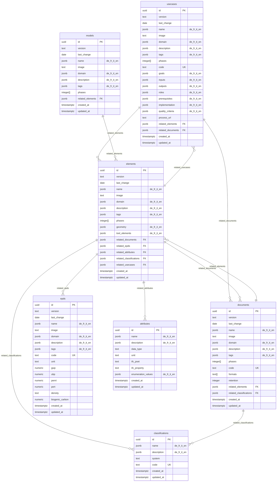

# KBOB Fachdatenkatalog – Database Schema Design

## Project Overview

**Repository**: [kbob-fdk](https://github.com/davras5/kbob-fdk)
**Database**: PostgreSQL on Supabase
**Purpose**: Interactive catalog for BIM requirements, classifications, and information specifications for building elements and documents in Switzerland.
**Validation Sources**: VDI 2552 Blatt 12.1/12.2, ISO 19650, KBOB/IPB Bauwerksdokumentation, IFC 4.3

---

## Entity Relationship Overview

### Core Tables

| Entity | Primary Key | Has Phases | Has Code | Description |
|--------|-------------|------------|----------|-------------|
| `elements` | `id` (uuid) | ✓ | ✗ | Physical building components with LOG requirements |
| `documents` | `id` (uuid) | ✓ | ✓ | Project documentation types per KBOB/IPB standard |
| `usecases` | `id` (uuid) | ✓ | ✓ | Standardized BIM processes per VDI 2552 |
| `models` | `id` (uuid) | ✓ | ✗ | BIM discipline and coordination model definitions |
| `epds` | `id` (uuid) | ✗ | ✓ | Environmental impact data (KBOB Ökobilanzdaten) |
| `attributes` | `id` (uuid) | ✗ | ✗ | Reusable property definitions (length, fire rating, material, etc.) |
| `classifications` | `id` (uuid) | ✗ | ✓ | Classification codes (eBKP-H, DIN 276, Uniformat II, etc.) |

> **Note on phases:** EPD, attributes, and classifications are phase-neutral reference data. Phase applicability is defined in the relationship.

### Relationships (JSONB)

Relationships between entities are stored as JSONB arrays on the parent entity. This keeps queries simple and avoids junction tables.

> **Referential Integrity Note:** JSONB relationships do not enforce foreign key constraints. Orphaned references may occur when a referenced entity is deleted. This is intentional—the application layer handles validation, and a scheduled cleanup function can detect orphaned references:
> ```sql
> -- Example: Find orphaned document references in elements
> SELECT e.id, ref->>'id' AS orphaned_doc_id
> FROM elements e, jsonb_array_elements(e.related_documents) AS ref
> WHERE NOT EXISTS (SELECT 1 FROM documents d WHERE d.id = ref->>'id');
> ```

| Entity | Field | References | Structure |
|--------|-------|------------|-----------|
| `usecases` | `related_elements` | elements | `[{"id": "550e8400-...", "phases": [2,3]}]` |
| `usecases` | `related_documents` | documents | `[{"id": "550e8400-...", "required": true}]` |
| `elements` | `related_documents` | documents | `[{"id": "550e8400-...", "phases": [3,4,5]}]` |
| `elements` | `related_epds` | epds | `[{"id": "550e8400-..."}]` |
| `elements` | `related_attributes` | attributes | `[{"id": "550e8400-...", "phases": [3,4,5]}]` |
| `elements` | `related_classifications` | classifications | `[{"id": "550e8400-..."}]` |
| `elements` | `related_usecases` | usecases | `[{"id": "550e8400-..."}]` |
| `documents` | `related_elements` | elements | `[{"id": "550e8400-..."}]` |
| `documents` | `related_classifications` | classifications | `[{"id": "550e8400-..."}]` |
| `models` | `related_elements` | (embedded) | `[{"name": "Wand", "phases": [2,3,4]}]` |

> **Note:** `attributes` and `classifications` are simplified reference tables with fewer common attributes.



---

## Shared Attributes

All core entities share a common set of attributes for identification, versioning, and discoverability.

> **Note:** `attributes` and `classifications` are simplified reference tables with a subset of common attributes (id, name, description, created_at, updated_at).

### Common Attributes (All Entities)

| Column | Type | Constraints | Description |
|--------|------|-------------|-------------|
| `id` | `uuid` | `PRIMARY KEY DEFAULT gen_random_uuid()` | Unique identifier (UUID v4) |
| `version` | `text` | `NOT NULL` | Version indicator for change tracking |
| `last_change` | `date` | `NOT NULL` | Date of last modification (ISO 8601) |
| `name` | `jsonb` | `NOT NULL` | Human-readable display name (i18n: de, fr, it, en) |
| `image` | `text` | | Visual representation reference (URL or path) |
| `domain` | `jsonb` | `NOT NULL` | Primary grouping (i18n: de, fr, it, en) |
| `description` | `jsonb` | | Detailed explanation of purpose and scope (i18n: de, fr, it, en) |
| `tags` | `jsonb` | `NOT NULL DEFAULT '[]'` | Anwendungsfeld keywords (i18n array: de, fr, it, en) |
| `created_at` | `timestamptz` | `NOT NULL DEFAULT now()` | Record creation timestamp |
| `updated_at` | `timestamptz` | `NOT NULL DEFAULT now()` | Record last update timestamp (auto-updated) |

### Phase-Dependent Entities

All entities **except EPD, attributes, and classifications** include lifecycle phases:

| Column | Type | Constraints | Description |
|--------|------|-------------|-------------|
| `phases` | `integer[]` | `CHECK (phases <@ ARRAY[1,2,3,4,5])` | Applicable lifecycle phases (1-5) |

> **Note:** EPD, attributes, and classifications contain phase-neutral reference data. Phase applicability is defined in the relationship (e.g., `related_attributes` includes phases).

### ID Patterns

All entities use UUID v4 as the primary key (`id`). Entities that require human-readable codes have an additional `code` field.

| Entity | ID Type | Code Field | Code Example |
|--------|---------|------------|--------------|
| elements | UUID | – | – |
| documents | UUID | `code` | O01001, K02003 |
| usecases | UUID | `code` | uc000, uc280 |
| models | UUID | – | – |
| epds | UUID | `code` | kbob-01-042 |
| attributes | UUID | – | – |
| classifications | UUID | `code` | C02, KG466 |

---

## Entity-Specific Attributes

### elements

Physical building components with geometry (LOG) requirements.

| Column | Type | Constraints | Description |
|--------|------|-------------|-------------|
| `geometry` | `jsonb` | `NOT NULL DEFAULT '[]'` | LOG specifications per phase (i18n: de, fr, it, en) |
| `tool_elements` | `jsonb` | `DEFAULT '[]'` | Mappings to IFC classes and authoring tools (Revit, ArchiCAD, etc.) |
| `related_documents` | `jsonb` | `DEFAULT '[]'` | Links to documents `[{"id": "<uuid>", "phases": [3,4,5]}]` |
| `related_epds` | `jsonb` | `DEFAULT '[]'` | Links to EPDs `[{"id": "<uuid>"}]` |
| `related_attributes` | `jsonb` | `DEFAULT '[]'` | Links to attributes `[{"id": "<uuid>", "phases": [3,4,5]}]` |
| `related_classifications` | `jsonb` | `DEFAULT '[]'` | Links to classifications `[{"id": "<uuid>"}]` |
| `related_usecases` | `jsonb` | `DEFAULT '[]'` | Links to usecases `[{"id": "<uuid>"}]` |

**Domain values:** Architektur, Tragwerk, Gebäudetechnik HLKS, Gebäudetechnik Elektro, Ausbau, Umgebung, Brandschutz, Transportanlagen

---

### documents

Project documentation types with format requirements and retention policies per KBOB/IPB Bauwerksdokumentation.

| Column | Type | Constraints | Description |
|--------|------|-------------|-------------|
| `code` | `text` | `NOT NULL, UNIQUE` | Human-readable code (e.g., O01001, K02003) |
| `formats` | `text[]` | `NOT NULL` | Acceptable file formats (PDF-A, Office-Format, DWG, IFC, etc.) |
| `retention` | `integer` | | Retention period in years (0 = indefinitely) |
| `related_elements` | `jsonb` | `DEFAULT '[]'` | Links to elements `[{"id": "<uuid>"}]` |
| `related_classifications` | `jsonb` | `DEFAULT '[]'` | Links to classifications `[{"id": "<uuid>"}]` |

**Domain values:** Organisation, Verträge und Kosten, Konzepte und Beschriebe, Visualisierungen

---

### usecases

Standardized BIM processes with roles, responsibilities, and quality criteria per VDI 2552 Blatt 12.1/12.2.

| Column | Type | Constraints | Description |
|--------|------|-------------|-------------|
| `code` | `text` | `NOT NULL, UNIQUE` | Human-readable code (e.g., uc000, uc280) |
| `goals` | `jsonb` | `NOT NULL DEFAULT '[]'` | Objectives (i18n array: de, fr, it, en) |
| `inputs` | `jsonb` | `NOT NULL DEFAULT '[]'` | Required inputs and preconditions (i18n array) |
| `outputs` | `jsonb` | `NOT NULL DEFAULT '[]'` | Deliverables and results (i18n array) |
| `roles` | `jsonb` | `NOT NULL DEFAULT '[]'` | RACI responsibility matrix (i18n) |
| `prerequisites` | `jsonb` | `NOT NULL DEFAULT '{}'` | Requirements for client and contractor (i18n) |
| `implementation` | `jsonb` | `NOT NULL DEFAULT '[]'` | Implementation steps (i18n array: de, fr, it, en) |
| `quality_criteria` | `jsonb` | `NOT NULL DEFAULT '[]'` | Acceptance and quality criteria (i18n array: de, fr, it, en) |
| `process_url` | `text` | | Link to BPMN process diagram |
| `related_elements` | `jsonb` | `DEFAULT '[]'` | Required elements `[{"id": "<uuid>", "phases": [2,3]}]` |
| `related_documents` | `jsonb` | `DEFAULT '[]'` | Required documents `[{"id": "<uuid>", "required": true}]` |

**Domain values:** Per VDI 2552 Blatt 12.2 Anwendungsfeld (22 values – see Reference Values)

---

### models

BIM model types including discipline models, coordination models, and special-purpose models.

| Column | Type | Constraints | Description |
|--------|------|-------------|-------------|
| `related_elements` | `jsonb` | `NOT NULL DEFAULT '[]'` | Element types contained in model |

**Domain values:** Fachmodelle, Koordination, Spezialmodelle, Bestand

---

### epds

Environmental impact data for construction materials per KBOB Ökobilanzdaten.

> **Note:** No `phases` column – EPD data is phase-neutral reference data.

| Column | Type | Constraints | Description |
|--------|------|-------------|-------------|
| `code` | `text` | `NOT NULL, UNIQUE` | Human-readable KBOB code (e.g., kbob-01-042) |
| `unit` | `text` | `NOT NULL` | Functional/reference unit (e.g., `kg`, `m²`, `m³`) |
| `gwp` | `numeric` | `NOT NULL` | Global Warming Potential (kg CO₂-eq); can be negative for carbon-sequestering materials (timber, bio-based) per EN 15804 |
| `ubp` | `numeric` | `NOT NULL, >= 0` | Umweltbelastungspunkte / Swiss ecological scarcity (Points) |
| `penrt` | `numeric` | `NOT NULL, >= 0` | Primary Energy Non-Renewable Total (MJ) |
| `pert` | `numeric` | `NOT NULL, >= 0` | Primary Energy Renewable Total (MJ) |
| `density` | `text` | | Material density |
| `biogenic_carbon` | `numeric` | | Biogenic carbon content |

**Domain values:** Baumaterialien, Energie, Gebäudetechnik, Transporte

---

### attributes

Reusable property definitions for LOI (Level of Information) requirements. Phase-neutral reference data.

| Column | Type | Constraints | Description |
|--------|------|-------------|-------------|
| `data_type` | `text` | `NOT NULL` | Property data type (string, number, boolean, enum) |
| `unit` | `text` | | Unit of measurement (m, kg, °C, etc.) |
| `ifc_pset` | `text` | | IFC property set name |
| `ifc_property` | `text` | | IFC property name within the pset |
| `enumeration_values` | `jsonb` | `DEFAULT '[]'` | Allowed values for enum types (i18n array) |

---

### classifications

Classification codes from multiple systems. Phase-neutral reference data.

| Column | Type | Constraints | Description |
|--------|------|-------------|-------------|
| `system` | `text` | `NOT NULL`, constrained | Classification system: `eBKP-H`, `DIN276`, `Uniformat II`, `KBOB` |
| `code` | `text` | `NOT NULL, UNIQUE` | Classification code within the system |

**Supported systems:** eBKP-H (SN 506 511:2020), DIN 276:2018, Uniformat II, KBOB

---

## JSONB Structures

### Element: geometry (LOG)

```json
[
  {
    "name": { "de": "Symbol", "fr": "Symbole", "it": "Simbolo", "en": "Symbol" },
    "desc": { "de": "Schematische Darstellung des Elements zur Visualisierung in Plänen", "fr": "Représentation schématique", "it": "Rappresentazione schematica", "en": "Schematic representation" },
    "phases": [3]
  },
  {
    "name": { "de": "Länge", "fr": "Longueur", "it": "Lunghezza", "en": "Length" },
    "desc": { "de": "Ausdehnung des Elements in Längsrichtung in Metern", "fr": "Extension de l'élément en direction longitudinale", "it": "Estensione dell'elemento in direzione longitudinale", "en": "Element extension in longitudinal direction in meters" },
    "phases": [4, 5]
  }
]
```

| Field | Type | Required | Description |
|-------|------|----------|-------------|
| `name` | jsonb | ✓ | Geometry property name (i18n: de, fr, it, en) |
| `desc` | jsonb | ✓ | Description of the requirement (i18n: de, fr, it, en) |
| `phases` | integer[] | ✓ | Phases where this geometry is required (1-5) |

### Element: tool_elements

Mappings to authoring tools and exchange formats. Extensible for additional tools. Element names support i18n.

```json
[
  {
    "element": { "de": "Rollladenmotor", "fr": "Moteur de volet roulant", "it": "Motore per tapparella", "en": "Roller shutter motor" },
    "ifc": "IfcActuator.ELECTRICACTUATOR",
    "revit": "Revit: Spezialisierte Ausrüstung",
    "archicad": null
  }
]
```

| Field | Type | Required | Description |
|-------|------|----------|-------------|
| `element` | jsonb | ✓ | Element variant description (i18n: de, fr, it, en) |
| `ifc` | string | ✓ | IFC class and predefined type (IFC 4.3 schema) |
| `revit` | string | | Revit family/category mapping |
| `archicad` | string | | ArchiCAD object mapping |
| `...` | string | | Additional authoring tools as needed |

### Classifications Table

Classification codes from multiple systems, with i18n support. Referenced by elements and documents via `related_classifications`.

```json
{
  "id": "550e8400-e29b-41d4-a716-446655440000",
  "name": { "de": "Wandkonstruktion", "fr": "Construction de mur", "it": "Costruzione del muro", "en": "Wall construction" },
  "system": "eBKP-H",
  "code": "C02"
}
```

| Field | Type | Required | Description |
|-------|------|----------|-------------|
| `id` | uuid | ✓ | Unique identifier (UUID v4) |
| `name` | jsonb | ✓ | Classification name (i18n: de, fr, it, en) |
| `system` | string | ✓ | Classification system (eBKP-H, DIN276, Uniformat II, KBOB) |
| `code` | string | ✓ | Classification code within the system (unique) |

**Supported systems:**

| System | Description |
|--------|-------------|
| `eBKP-H` | Swiss cost planning codes (SN 506 511:2020) |
| `DIN276` | German cost classification (DIN 276:2018) |
| `Uniformat II` | International elemental cost classification |
| `KBOB` | Swiss federal building classification |

### UseCase: roles (RACI)

```json
[
  {
    "actor": { "de": "BIM-Manager", "fr": "Gestionnaire BIM", "it": "Responsabile BIM", "en": "BIM Manager" },
    "responsible": [
      { "de": "Erstellung AIA und BAP", "fr": "Création AIA et PAB", "it": "Creazione AIA e PAB", "en": "Creation of EIR and BEP" }
    ],
    "contributing": [
      { "de": "Abstimmung mit Stakeholdern", "fr": "Coordination avec les parties prenantes", "it": "Coordinamento con gli stakeholder", "en": "Coordination with stakeholders" }
    ],
    "informed": [
      { "de": "Projektänderungen", "fr": "Modifications du projet", "it": "Modifiche al progetto", "en": "Project changes" }
    ]
  }
]
```

| Field | Type | Required | Description |
|-------|------|----------|-------------|
| `actor` | jsonb | ✓ | Role name (i18n: de, fr, it, en) |
| `responsible` | jsonb[] | | Tasks this role performs (R) - i18n array |
| `contributing` | jsonb[] | | Tasks this role contributes to (A/C) - i18n array |
| `informed` | jsonb[] | | Information this role receives (I) - i18n array |

### UseCase: prerequisites

```json
{
  "client": [
    { "de": "Grundsatzentscheid zur digitalen Projektabwicklung", "fr": "Décision de principe pour l'exécution numérique du projet", "it": "Decisione di principio per l'esecuzione digitale del progetto", "en": "Decision for digital project execution" },
    { "de": "Bereitstellung von Ressourcen für die BIM-Koordination", "fr": "Mise à disposition de ressources pour la coordination BIM", "it": "Fornitura di risorse per il coordinamento BIM", "en": "Provision of resources for BIM coordination" }
  ],
  "contractor": [
    { "de": "Grundkenntnisse in digitaler Zusammenarbeit", "fr": "Connaissances de base en collaboration numérique", "it": "Conoscenze di base nella collaborazione digitale", "en": "Basic knowledge in digital collaboration" },
    { "de": "Bereitschaft zur strukturierten Informationslieferung", "fr": "Volonté de livrer des informations structurées", "it": "Disponibilità a fornire informazioni strutturate", "en": "Willingness to deliver structured information" }
  ]
}
```

### UseCase: goals, inputs, outputs

These are stored as JSONB arrays with i18n support:

```json
{
  "goals": [
    { "de": "Digitale Koordination", "fr": "Coordination numérique", "it": "Coordinamento digitale", "en": "Digital coordination" }
  ],
  "inputs": [
    { "de": "Fachmodelle", "fr": "Modèles de discipline", "it": "Modelli disciplinari", "en": "Discipline models" }
  ],
  "outputs": [
    { "de": "Koordinationsmodell", "fr": "Modèle de coordination", "it": "Modello di coordinamento", "en": "Coordination model" }
  ]
}
```

### Model: elements

```json
[
  {
    "name": "Wand",
    "description": "Tragende und nichttragende Wände inkl. Innenwände",
    "phases": [2, 3, 4]
  }
]
```

---

## Reference Values

> **Note:** Domains, tags, and other controlled vocabularies are stored as JSONB with i18n support. The values below are the standard vocabulary managed by administrators.

### Lifecycle Phases — VDI 2552 Blatt 12.2

| Phase | English | German | French | Italian | Description |
|-------|---------|--------|--------|---------|-------------|
| 1 | Development | Entwicklung | Développement | Sviluppo | Project development and feasibility |
| 2 | Planning | Planung | Planification | Progettazione | Basic evaluation through execution planning |
| 3 | Construction | Realisierung | Réalisation | Realizzazione | Tendering, construction, acceptance |
| 4 | Operations | Betrieb | Exploitation | Gestione | Operations and maintenance |
| 5 | Demolition | Abbruch | Déconstruction | Decostruzione | Demolition and deconstruction |

### element_domain — Discipline Grouping

```json
{ "de": "Architektur", "fr": "Architecture", "it": "Architettura", "en": "Architecture" }
```

| Value (DE) | Value (EN) | Description |
|------------|------------|-------------|
| Architektur | Architecture | Architectural elements (windows, doors, walls, roofs) |
| Tragwerk | Structure | Structural elements (columns, beams, slabs, foundations) |
| Gebäudetechnik HLKS | MEP HVAC | HVAC and plumbing elements |
| Gebäudetechnik Elektro | MEP Electrical | Electrical elements (power, lighting, automation) |
| Ausbau | Interior Finishes | Interior finishing (floors, ceilings, partitions) |
| Umgebung | Site | Site elements (landscaping, paving) |
| Brandschutz | Fire Protection | Fire protection elements |
| Transportanlagen | Vertical Transport | Elevators, escalators, lifts |

### document_domain — KBOB/IPB Dokumenttypenkatalog

| Code | Value (DE) | Value (EN) | Description |
|------|------------|------------|-------------|
| O | Organisation | Organisation | Project and operations organization documents |
| K | Verträge und Kosten | Contracts and Costs | Commercial and contractual documents |
| B | Konzepte und Beschriebe | Concepts and Descriptions | Planning concepts and technical descriptions |
| V | Visualisierungen | Visualizations | Plans, drawings, and visual representations |

### usecase_domain — VDI 2552 Blatt 12.2 Anwendungsfeld

| Value (DE) | Value (EN) |
|------------|------------|
| Abnahme | Acceptance |
| Änderungsmanagement | Change Management |
| Ausschreibung und Vergabe | Tendering and Procurement |
| Bedarfsplanung | Requirements Planning |
| Bestandserfassung | Asset Capture |
| Betrieb | Operations |
| Dokumentation | Documentation |
| Genehmigung | Approval |
| Inbetriebnahme | Commissioning |
| Koordination | Coordination |
| Kosten | Costs |
| Logistik | Logistics |
| Machbarkeit | Feasibility |
| Nachhaltigkeit | Sustainability |
| Nachweise | Verification |
| Qualitätssicherung | Quality Assurance |
| Risikomanagement | Risk Management |
| Termine | Scheduling |
| Variantenvergleich | Variant Comparison |
| Versicherung | Insurance |
| Visualisierung | Visualization |
| Sonstiges | Other |

### model_domain — BIM Model Types

| Value (DE) | Value (EN) | Description |
|------------|------------|-------------|
| Fachmodelle | Discipline Models | Single-discipline BIM models |
| Koordination | Coordination | Merged coordination models |
| Spezialmodelle | Special Models | Purpose-specific models |
| Bestand | As-Built | Digital twin for operations |

### epd_domain — KBOB Material Categories

| Value (DE) | Value (EN) | Typical Subcategories |
|------------|------------|----------------------|
| Baumaterialien | Building Materials | Beton, Mauerwerk, Holz, Metall, Dämmstoffe |
| Energie | Energy | Strom, Wärme, Kälte, Brennstoffe |
| Gebäudetechnik | Building Services | Heizung, Lüftung, Sanitär, Elektro |
| Transporte | Transport | LKW, Bahn, Schiff |

### epd_unit — Functional Units (Examples)

Common functional/reference units for EPD data. Not constrained in database.

| Value | Description |
|-------|-------------|
| `kg` | Mass (kilogram) |
| `m²` | Area (square meter) |
| `m³` | Volume (cubic meter) |
| `m` | Length (meter) |
| `kWh` | Energy (kilowatt-hour) |
| `MJ` | Energy (megajoule) |
| `Stk` | Piece (Stück) |
| `tkm` | Transport (tonne-kilometer) |

### classification_system — Classification Standards

| Value | Standard | Description |
|-------|----------|-------------|
| `eBKP-H` | SN 506 511:2020 | Swiss cost planning codes (Elementarten-Gliederung) |
| `DIN276` | DIN 276:2018 | German cost classification (Kostengruppen) |
| `Uniformat II` | ASTM E1557 | International elemental cost classification |
| `KBOB` | KBOB | Swiss federal building classification |

### Tag Values (Anwendungsfeld) — VDI 2552 Blatt 12.2

The tagging system uses a controlled vocabulary derived from VDI 2552 Blatt 12.2 Anhang B1. Tags are stored as JSONB arrays with i18n support:

```json
[
  { "de": "Koordination", "fr": "Coordination", "it": "Coordinamento", "en": "Coordination" },
  { "de": "Dokumentation", "fr": "Documentation", "it": "Documentazione", "en": "Documentation" }
]
```

Standard tag values:

| Value (DE) | Value (EN) | Description |
|------------|------------|-------------|
| Abnahme | Acceptance | Acceptance and handover processes |
| Änderungsmanagement | Change Management | Change tracking and billing |
| Ausschreibung und Vergabe | Tendering and Procurement | Tender preparation and award |
| Bedarfsplanung | Requirements Planning | Project requirements and variant studies |
| Bestandserfassung | Asset Capture | Capturing existing conditions |
| Betrieb | Operations | Building operations and optimization |
| Dokumentation | Documentation | Documentation and archiving |
| Genehmigung | Approval | Approval and permit processes |
| Inbetriebnahme | Commissioning | Commissioning processes |
| Koordination | Coordination | Coordination of deliverables and models |
| Kosten | Costs | Cost estimation and optimization |
| Logistik | Logistics | Logistics processes |
| Machbarkeit | Feasibility | Feasibility studies |
| Nachhaltigkeit | Sustainability | Sustainability assessment |
| Nachweise | Verification | Analysis and expert reports |
| Qualitätssicherung | Quality Assurance | Quality assurance and control |
| Risikomanagement | Risk Management | Risk identification and tracking |
| Termine | Scheduling | Schedule planning and verification |
| Variantenvergleich | Variant Comparison | Comparing design alternatives |
| Versicherung | Insurance | Insurance processes |
| Visualisierung | Visualization | Graphical representation |
| Sonstiges | Other | Other application fields |

---

## SQL Schema

```sql
-- =============================================================================
-- KBOB Fachdatenkatalog - Database Schema
-- PostgreSQL on Supabase
-- Version: 2.1.11
-- =============================================================================

-- Note: Domains and tags are stored as JSONB with i18n support.
-- No SQL ENUM types are used - see "Reference Values" section for vocabulary.

-- =============================================================================
-- ELEMENTS
-- Physical building components with LOG requirements
-- =============================================================================

CREATE TABLE public.elements (
    -- Common attributes
    id uuid PRIMARY KEY DEFAULT gen_random_uuid(),
    version text NOT NULL,
    last_change date NOT NULL,
    name jsonb NOT NULL,
    image text,
    domain jsonb NOT NULL,
    description jsonb,
    tags jsonb NOT NULL DEFAULT '[]',
    phases integer[],

    -- Entity-specific attributes
    geometry jsonb NOT NULL DEFAULT '[]',
    tool_elements jsonb DEFAULT '[]',
    related_documents jsonb DEFAULT '[]',
    related_epds jsonb DEFAULT '[]',
    related_attributes jsonb DEFAULT '[]',
    related_classifications jsonb DEFAULT '[]',
    related_usecases jsonb DEFAULT '[]',

    -- System
    created_at timestamptz NOT NULL DEFAULT now(),
    updated_at timestamptz NOT NULL DEFAULT now(),

    -- Constraints
    CONSTRAINT elements_phases_valid CHECK (phases IS NULL OR phases <@ ARRAY[1,2,3,4,5])
);

-- =============================================================================
-- DOCUMENTS
-- Project documentation types per KBOB/IPB Bauwerksdokumentation
-- =============================================================================

CREATE TABLE public.documents (
    -- Common attributes
    id uuid PRIMARY KEY DEFAULT gen_random_uuid(),
    version text NOT NULL,
    last_change date NOT NULL,
    name jsonb NOT NULL,
    image text,
    domain jsonb NOT NULL,
    description jsonb,
    tags jsonb NOT NULL DEFAULT '[]',
    phases integer[],

    -- Entity-specific attributes
    code text NOT NULL UNIQUE,
    formats text[] NOT NULL,
    retention integer,
    related_elements jsonb DEFAULT '[]',
    related_classifications jsonb DEFAULT '[]',

    -- System
    created_at timestamptz NOT NULL DEFAULT now(),
    updated_at timestamptz NOT NULL DEFAULT now(),

    -- Constraints
    CONSTRAINT documents_phases_valid CHECK (phases IS NULL OR phases <@ ARRAY[1,2,3,4,5]),
    CONSTRAINT documents_retention_valid CHECK (retention IS NULL OR retention >= 0)
);

-- =============================================================================
-- USECASES
-- Standardized BIM processes per VDI 2552 Blatt 12.1/12.2
-- =============================================================================

CREATE TABLE public.usecases (
    -- Common attributes
    id uuid PRIMARY KEY DEFAULT gen_random_uuid(),
    version text NOT NULL,
    last_change date NOT NULL,
    name jsonb NOT NULL,
    image text,
    domain jsonb NOT NULL,
    description jsonb,
    tags jsonb NOT NULL DEFAULT '[]',
    phases integer[],

    -- Entity-specific attributes
    code text NOT NULL UNIQUE,
    goals jsonb NOT NULL DEFAULT '[]',
    inputs jsonb NOT NULL DEFAULT '[]',
    outputs jsonb NOT NULL DEFAULT '[]',
    roles jsonb NOT NULL DEFAULT '[]',
    prerequisites jsonb NOT NULL DEFAULT '{}',
    implementation jsonb NOT NULL DEFAULT '[]',
    quality_criteria jsonb NOT NULL DEFAULT '[]',
    process_url text,
    related_elements jsonb DEFAULT '[]',
    related_documents jsonb DEFAULT '[]',

    -- System
    created_at timestamptz NOT NULL DEFAULT now(),
    updated_at timestamptz NOT NULL DEFAULT now(),

    -- Constraints
    CONSTRAINT usecases_phases_valid CHECK (phases IS NULL OR phases <@ ARRAY[1,2,3,4,5])
);

-- =============================================================================
-- MODELS
-- BIM discipline and coordination model definitions
-- =============================================================================

CREATE TABLE public.models (
    -- Common attributes
    id uuid PRIMARY KEY DEFAULT gen_random_uuid(),
    version text NOT NULL,
    last_change date NOT NULL,
    name jsonb NOT NULL,
    image text,
    domain jsonb NOT NULL,
    description jsonb,
    tags jsonb NOT NULL DEFAULT '[]',
    phases integer[],

    -- Entity-specific attributes
    related_elements jsonb NOT NULL DEFAULT '[]',

    -- System
    created_at timestamptz NOT NULL DEFAULT now(),
    updated_at timestamptz NOT NULL DEFAULT now(),

    -- Constraints
    CONSTRAINT models_phases_valid CHECK (phases IS NULL OR phases <@ ARRAY[1,2,3,4,5])
);

-- =============================================================================
-- EPDS
-- Environmental impact data (KBOB Ökobilanzdaten)
-- Note: No phases - EPD data is phase-neutral reference data
-- =============================================================================

CREATE TABLE public.epds (
    -- Common attributes
    id uuid PRIMARY KEY DEFAULT gen_random_uuid(),
    version text NOT NULL,
    last_change date NOT NULL,
    name jsonb NOT NULL,
    image text,
    domain jsonb NOT NULL,
    description jsonb,
    tags jsonb NOT NULL DEFAULT '[]',

    -- Entity-specific attributes
    code text NOT NULL UNIQUE,
    unit text NOT NULL,
    gwp numeric NOT NULL,
    ubp numeric NOT NULL,
    penrt numeric NOT NULL,
    pert numeric NOT NULL,
    density text,
    biogenic_carbon numeric,

    -- System
    created_at timestamptz NOT NULL DEFAULT now(),
    updated_at timestamptz NOT NULL DEFAULT now(),

    -- Constraints
    -- Note: GWP can be negative for carbon-sequestering materials (timber, bio-based) per EN 15804
    CONSTRAINT epds_ubp_positive CHECK (ubp >= 0),
    CONSTRAINT epds_penrt_positive CHECK (penrt >= 0),
    CONSTRAINT epds_pert_positive CHECK (pert >= 0)
);

-- =============================================================================
-- ATTRIBUTES
-- Reusable property definitions (phase-neutral reference data)
-- =============================================================================

CREATE TABLE public.attributes (
    -- Simplified common attributes
    id uuid PRIMARY KEY DEFAULT gen_random_uuid(),
    name jsonb NOT NULL,
    description jsonb,

    -- Entity-specific attributes
    data_type text NOT NULL,
    unit text,
    ifc_pset text,
    ifc_property text,
    enumeration_values jsonb DEFAULT '[]',

    -- System
    created_at timestamptz NOT NULL DEFAULT now(),
    updated_at timestamptz NOT NULL DEFAULT now()
);

-- =============================================================================
-- CLASSIFICATIONS
-- Classification codes from multiple systems (phase-neutral reference data)
-- =============================================================================

CREATE TABLE public.classifications (
    -- Simplified common attributes
    id uuid PRIMARY KEY DEFAULT gen_random_uuid(),
    name jsonb NOT NULL,
    description jsonb,

    -- Entity-specific attributes
    system text NOT NULL,
    code text NOT NULL UNIQUE,

    -- System
    created_at timestamptz NOT NULL DEFAULT now(),
    updated_at timestamptz NOT NULL DEFAULT now(),

    -- Constraints
    CONSTRAINT classifications_system_valid CHECK (system IN ('eBKP-H', 'DIN276', 'Uniformat II', 'KBOB'))
);

-- =============================================================================
-- INDEXES
-- =============================================================================

-- Full-text search indexes (multi-language support for Swiss official languages)
-- German
CREATE INDEX elements_name_de_idx ON elements USING gin(to_tsvector('german', name->>'de'));
CREATE INDEX documents_name_de_idx ON documents USING gin(to_tsvector('german', name->>'de'));
CREATE INDEX usecases_name_de_idx ON usecases USING gin(to_tsvector('german', name->>'de'));
CREATE INDEX models_name_de_idx ON models USING gin(to_tsvector('german', name->>'de'));
CREATE INDEX epds_name_de_idx ON epds USING gin(to_tsvector('german', name->>'de'));
CREATE INDEX attributes_name_de_idx ON attributes USING gin(to_tsvector('german', name->>'de'));
CREATE INDEX classifications_name_de_idx ON classifications USING gin(to_tsvector('german', name->>'de'));

-- French
CREATE INDEX elements_name_fr_idx ON elements USING gin(to_tsvector('french', name->>'fr'));
CREATE INDEX documents_name_fr_idx ON documents USING gin(to_tsvector('french', name->>'fr'));
CREATE INDEX usecases_name_fr_idx ON usecases USING gin(to_tsvector('french', name->>'fr'));
CREATE INDEX models_name_fr_idx ON models USING gin(to_tsvector('french', name->>'fr'));
CREATE INDEX epds_name_fr_idx ON epds USING gin(to_tsvector('french', name->>'fr'));
CREATE INDEX attributes_name_fr_idx ON attributes USING gin(to_tsvector('french', name->>'fr'));
CREATE INDEX classifications_name_fr_idx ON classifications USING gin(to_tsvector('french', name->>'fr'));

-- Italian
CREATE INDEX elements_name_it_idx ON elements USING gin(to_tsvector('italian', name->>'it'));
CREATE INDEX documents_name_it_idx ON documents USING gin(to_tsvector('italian', name->>'it'));
CREATE INDEX usecases_name_it_idx ON usecases USING gin(to_tsvector('italian', name->>'it'));
CREATE INDEX models_name_it_idx ON models USING gin(to_tsvector('italian', name->>'it'));
CREATE INDEX epds_name_it_idx ON epds USING gin(to_tsvector('italian', name->>'it'));
CREATE INDEX attributes_name_it_idx ON attributes USING gin(to_tsvector('italian', name->>'it'));
CREATE INDEX classifications_name_it_idx ON classifications USING gin(to_tsvector('italian', name->>'it'));

-- English (using simple config for international users)
CREATE INDEX elements_name_en_idx ON elements USING gin(to_tsvector('english', name->>'en'));
CREATE INDEX documents_name_en_idx ON documents USING gin(to_tsvector('english', name->>'en'));
CREATE INDEX usecases_name_en_idx ON usecases USING gin(to_tsvector('english', name->>'en'));
CREATE INDEX models_name_en_idx ON models USING gin(to_tsvector('english', name->>'en'));
CREATE INDEX epds_name_en_idx ON epds USING gin(to_tsvector('english', name->>'en'));
CREATE INDEX attributes_name_en_idx ON attributes USING gin(to_tsvector('english', name->>'en'));
CREATE INDEX classifications_name_en_idx ON classifications USING gin(to_tsvector('english', name->>'en'));

-- Domain filters (using German text for filtering)
CREATE INDEX elements_domain_idx ON elements((domain->>'de'));
CREATE INDEX documents_domain_idx ON documents((domain->>'de'));
CREATE INDEX usecases_domain_idx ON usecases((domain->>'de'));
CREATE INDEX models_domain_idx ON models((domain->>'de'));
CREATE INDEX epds_domain_idx ON epds((domain->>'de'));

-- Classification system filter
CREATE INDEX classifications_system_idx ON classifications(system);
CREATE INDEX classifications_code_idx ON classifications(code);

-- Code lookup indexes (human-readable identifiers)
CREATE INDEX documents_code_idx ON documents(code);
CREATE INDEX usecases_code_idx ON usecases(code);
CREATE INDEX epds_code_idx ON epds(code);

-- Tag filters (GIN for JSONB containment)
CREATE INDEX elements_tags_idx ON elements USING gin(tags);
CREATE INDEX documents_tags_idx ON documents USING gin(tags);
CREATE INDEX usecases_tags_idx ON usecases USING gin(tags);
CREATE INDEX models_tags_idx ON models USING gin(tags);
CREATE INDEX epds_tags_idx ON epds USING gin(tags);

-- Phase filters (GIN for array containment)
CREATE INDEX elements_phases_idx ON elements USING gin(phases);
CREATE INDEX documents_phases_idx ON documents USING gin(phases);
CREATE INDEX usecases_phases_idx ON usecases USING gin(phases);
CREATE INDEX models_phases_idx ON models USING gin(phases);

-- Relationship filters (GIN for JSONB containment queries)
-- Enables queries like: "find all elements related to document O01001"
CREATE INDEX elements_related_documents_idx ON elements USING gin(related_documents);
CREATE INDEX elements_related_epds_idx ON elements USING gin(related_epds);
CREATE INDEX elements_related_attributes_idx ON elements USING gin(related_attributes);
CREATE INDEX elements_related_classifications_idx ON elements USING gin(related_classifications);
CREATE INDEX elements_related_usecases_idx ON elements USING gin(related_usecases);
CREATE INDEX documents_related_elements_idx ON documents USING gin(related_elements);
CREATE INDEX documents_related_classifications_idx ON documents USING gin(related_classifications);
CREATE INDEX usecases_related_elements_idx ON usecases USING gin(related_elements);
CREATE INDEX usecases_related_documents_idx ON usecases USING gin(related_documents);
CREATE INDEX models_related_elements_idx ON models USING gin(related_elements);

-- =============================================================================
-- TRIGGERS - Auto-update updated_at
-- =============================================================================

CREATE OR REPLACE FUNCTION update_updated_at()
RETURNS TRIGGER AS $$
BEGIN
    NEW.updated_at = now();
    RETURN NEW;
END;
$$ LANGUAGE plpgsql;

CREATE TRIGGER elements_updated_at BEFORE UPDATE ON elements
    FOR EACH ROW EXECUTE FUNCTION update_updated_at();

CREATE TRIGGER documents_updated_at BEFORE UPDATE ON documents
    FOR EACH ROW EXECUTE FUNCTION update_updated_at();

CREATE TRIGGER usecases_updated_at BEFORE UPDATE ON usecases
    FOR EACH ROW EXECUTE FUNCTION update_updated_at();

CREATE TRIGGER models_updated_at BEFORE UPDATE ON models
    FOR EACH ROW EXECUTE FUNCTION update_updated_at();

CREATE TRIGGER epds_updated_at BEFORE UPDATE ON epds
    FOR EACH ROW EXECUTE FUNCTION update_updated_at();

CREATE TRIGGER attributes_updated_at BEFORE UPDATE ON attributes
    FOR EACH ROW EXECUTE FUNCTION update_updated_at();

CREATE TRIGGER classifications_updated_at BEFORE UPDATE ON classifications
    FOR EACH ROW EXECUTE FUNCTION update_updated_at();

-- =============================================================================
-- ROW LEVEL SECURITY
-- =============================================================================
-- Access model:
--   - SELECT: Public (anonymous) read access for all tables
--   - INSERT/UPDATE/DELETE: Service role only (bypasses RLS)
--
-- Write operations are performed via Supabase service_role key in admin
-- interfaces. No INSERT/UPDATE/DELETE policies are defined; RLS blocks
-- these operations for anon/authenticated roles by default.
-- =============================================================================

ALTER TABLE elements ENABLE ROW LEVEL SECURITY;
ALTER TABLE documents ENABLE ROW LEVEL SECURITY;
ALTER TABLE usecases ENABLE ROW LEVEL SECURITY;
ALTER TABLE models ENABLE ROW LEVEL SECURITY;
ALTER TABLE epds ENABLE ROW LEVEL SECURITY;
ALTER TABLE attributes ENABLE ROW LEVEL SECURITY;
ALTER TABLE classifications ENABLE ROW LEVEL SECURITY;

-- Public read access (anon and authenticated users)
CREATE POLICY "Public read access" ON elements FOR SELECT USING (true);
CREATE POLICY "Public read access" ON documents FOR SELECT USING (true);
CREATE POLICY "Public read access" ON usecases FOR SELECT USING (true);
CREATE POLICY "Public read access" ON models FOR SELECT USING (true);
CREATE POLICY "Public read access" ON epds FOR SELECT USING (true);
CREATE POLICY "Public read access" ON attributes FOR SELECT USING (true);
CREATE POLICY "Public read access" ON classifications FOR SELECT USING (true);

-- Note: No INSERT/UPDATE/DELETE policies - writes require service_role

-- =============================================================================
-- TABLE AND COLUMN COMMENTS
-- =============================================================================

COMMENT ON TABLE elements IS 'Physical building components with LOG (Level of Geometry) requirements';
COMMENT ON TABLE documents IS 'Project documentation types per KBOB/IPB Bauwerksdokumentation standard';
COMMENT ON TABLE usecases IS 'Standardized BIM processes per VDI 2552 Blatt 12.1/12.2';
COMMENT ON TABLE models IS 'BIM discipline, coordination, and special-purpose model definitions';
COMMENT ON TABLE epds IS 'Environmental Product Declarations - KBOB Ökobilanzdaten';
COMMENT ON TABLE attributes IS 'Reusable property definitions (LOI attributes)';
COMMENT ON TABLE classifications IS 'Classification codes from eBKP-H, DIN 276, Uniformat II, KBOB';

COMMENT ON COLUMN elements.geometry IS 'LOG specifications per lifecycle phase (JSONB array with i18n)';
COMMENT ON COLUMN elements.tool_elements IS 'Mappings to IFC classes and authoring tools (Revit, ArchiCAD)';
COMMENT ON COLUMN epds.gwp IS 'Global Warming Potential in kg CO₂-eq; can be negative for bio-based materials';
COMMENT ON COLUMN epds.ubp IS 'Umweltbelastungspunkte - Swiss ecological scarcity method';
COMMENT ON COLUMN usecases.roles IS 'RACI responsibility matrix with i18n support';
```

---

## Key Documentation

### Primary Standards

| Document | URL | Referenced in Schema |
|----------|-----|---------------------|
| VDI 2552 Blatt 12.1 | VDI | Use case structure (usecases) |
| VDI 2552 Blatt 12.2 | VDI | Anwendungsfeld metadata, lifecycle phases (all entities) |
| ISO 19650-1:2018 | ISO | Information management concepts |
| IFC 4.3 | buildingSMART | IFC mapping (elements.tool_elements) |
| KBOB/IPB Bauwerksdokumentation | KBOB | Document categories (documents) |
| KBOB Ökobilanzdaten | KBOB | Environmental indicators (epds) |
| SN 506 511:2020 (eBKP-H) | CRB | Swiss cost classification |
| DIN 276:2018 | DIN | German cost classification |

### API Endpoints

| Endpoint | Description |
|----------|-------------|
| `/rest/v1/elements` | Building elements with LOG |
| `/rest/v1/documents` | Document types per KBOB/IPB |
| `/rest/v1/usecases` | BIM use cases per VDI 2552 |
| `/rest/v1/models` | BIM model definitions |
| `/rest/v1/epds` | Environmental product data |
| `/rest/v1/attributes` | Reusable property definitions |
| `/rest/v1/classifications` | Classification codes (eBKP-H, DIN 276, etc.) |

---

## Appendix A: Glossary

| Acronym | Term (EN) | Term (DE) | Description |
|---------|-----------|-----------|-------------|
| AIA | Client Information Requirements | Auftraggeber-Informationsanforderungen | Client information requirements document |
| BAP | BIM Execution Plan | BIM-Abwicklungsplan | BIM execution plan |
| EPD | Environmental Product Declaration | Umweltproduktdeklaration | Environmental Product Declaration |
| GWP | Global Warming Potential | Treibhauspotenzial | Climate change impact indicator |
| IFC | Industry Foundation Classes | Industry Foundation Classes | Open standard for BIM data exchange |
| KBOB | Coordination Conference of Swiss Public Sector Construction | Koordinationskonferenz der Bau- und Liegenschaftsorgane | Swiss federal building coordination body |
| LOG | Level of Geometry | Level of Geometry | Geometric detail requirements |
| LOI | Level of Information | Level of Information | Attribute/property requirements |
| RACI | Responsible, Accountable, Consulted, Informed | Responsible, Accountable, Consulted, Informed | Responsibility assignment matrix |
| UBP | Environmental Impact Points | Umweltbelastungspunkte | Swiss ecological scarcity method indicator |

---

## Appendix B: Changelog

| Version | Date | Changes |
|---------|------|---------|
| 2.1.11 | 2025-12 | Restructured Reference Values: moved Lifecycle Phases as first subsection; added `epd_unit` and `classification_system` reference tables |
| 2.1.10 | 2025-12 | Added `Has Code` column to Core Tables; fixed `classifications.code` UK marker in mermaid and UNIQUE constraint in docs; updated Classifications Table JSON example to UUID |
| 2.1.9 | 2025-12 | Changed all IDs to UUID v4; added `code` field to documents, usecases, and epds for human-readable identifiers; added code indexes |
| 2.1.8 | 2025-12 | Removed `standards` from usecases; changed "All seven entities" to "All core entities" |
| 2.1.7 | 2025-12 | Reverted `attributes` and `classifications` to simplified reference tables (id, name, description only); expanded mermaid chart with all entity attributes for verification |
| 2.1.6 | 2025-12 | Consistency QS: fixed entity count ("All seven entities"); added attributes/classifications to Phase-Dependent section |
| 2.1.5 | 2025-12 | Added `attributes` and `classifications` to Entity-Specific Attributes section; added note to mermaid diagram about simplified view |
| 2.1.4 | 2025-12 | Removed `definition` from usecases (use `description` instead) |
| 2.1.3 | 2025-12 | Changed `description` from text to JSONB with i18n on all tables; removed phases sorting/uniqueness constraint (containment only); added index on `classifications.code` |
| 2.1.2 | 2025-12 | Added `related_usecases` to elements; changed usecases `implementation` and `quality_criteria` from text[] to JSONB with i18n; removed `examples` and `practice_example` from usecases |
| 2.1.1 | 2025-12 | Schema review fixes: added ID format constraint to `classifications`; removed GWP >= 0 constraint (allows negative for carbon-sequestering materials per EN 15804); added multi-language full-text indexes (de/fr/it/en); added GIN indexes on `related_*` fields; added phases uniqueness constraint; added `epds.unit` CHECK constraint; added table/column comments; documented RLS write policy and JSONB referential integrity |
| 2.1.0 | 2025-12 | Added i18n support (JSONB `name` field with de/fr/it/en); added `attributes` table for reusable property definitions; added `classifications` table for multi-system classification codes; renamed `title` → `name`, `ifc_mapping` → `tool_elements`; added `related_*` prefix to all relationship fields for consistency |
| 2.0.0 | 2025-01 | Complete restructure for SQL/Supabase migration; added column category concept; comprehensive SQL DDL with constraints, indexes, RLS, and triggers; JSONB structure documentation; data migration guide |
| 1.x | 2024 | JSON file-based data model documentation |
